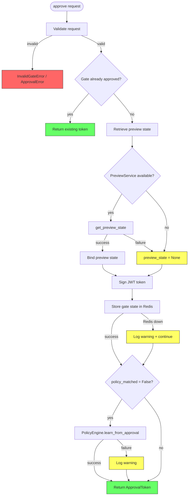
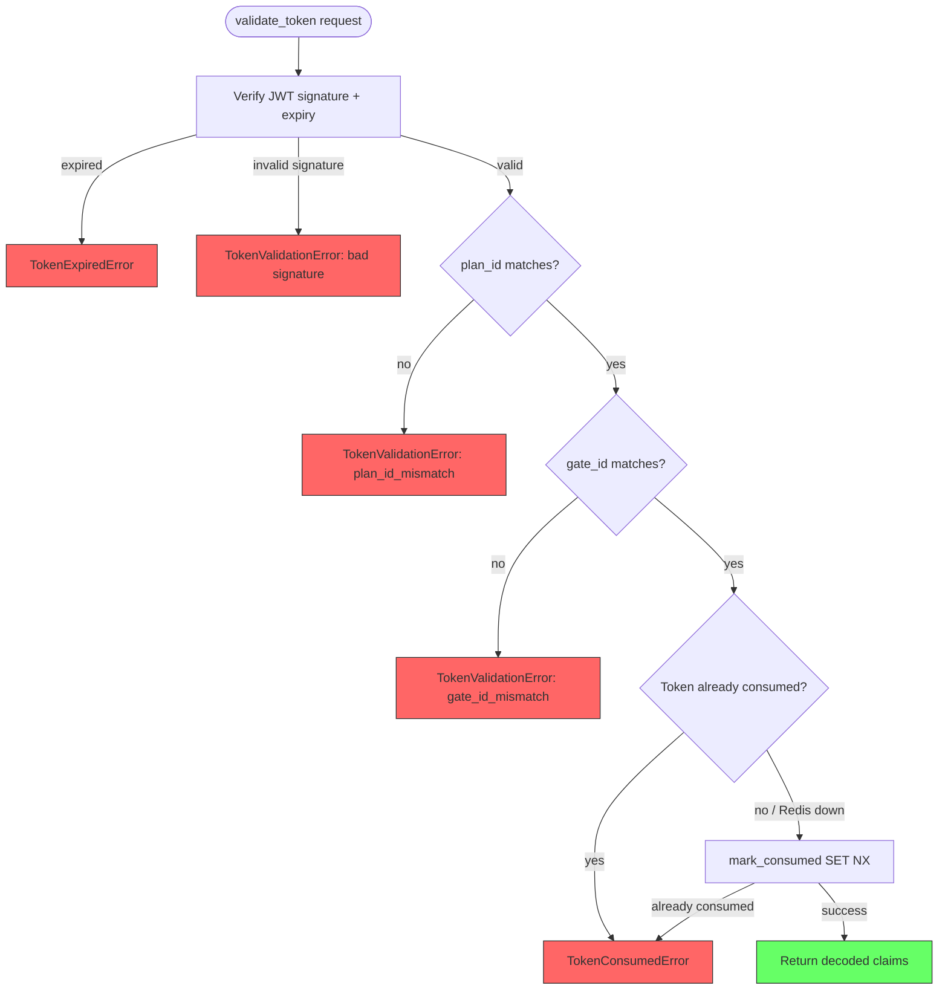
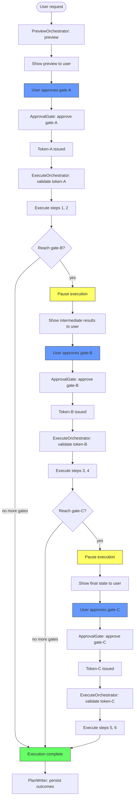
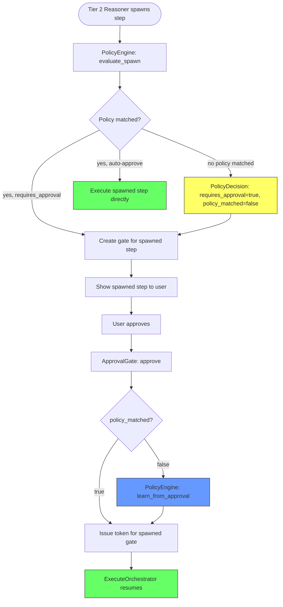
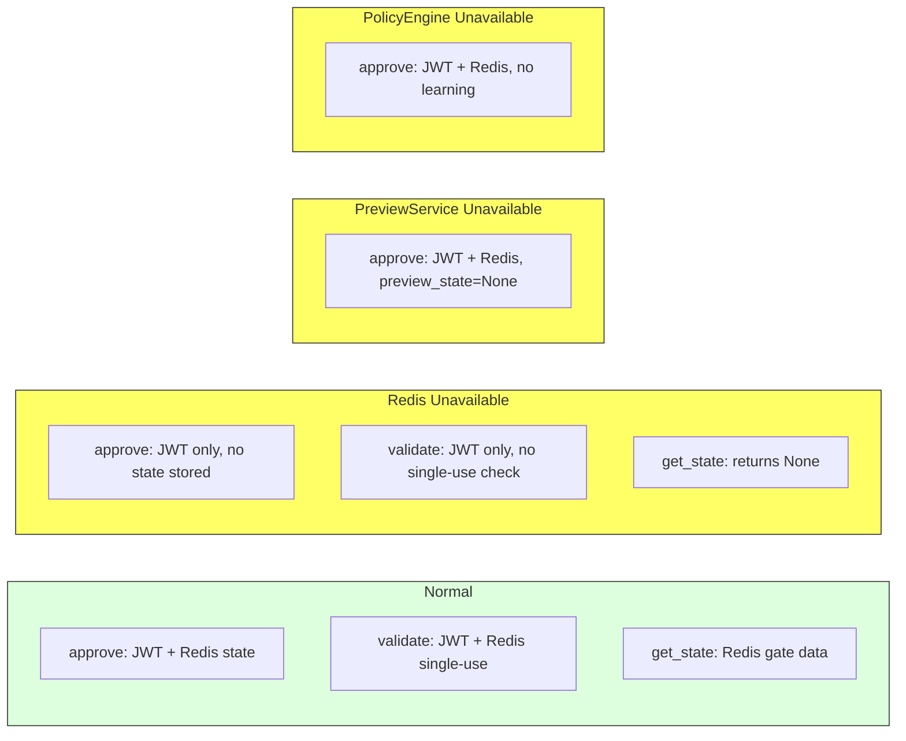

# ApprovalGate — Flow Diagrams

## 1. Main Approval Flow

---

## 2. Token Validation Flow

---

## 3. Multi-Gate Execution Flow

---

## 4. Spawned Step Gate Flow (Learn from Approval)

---

## 5. Graceful Degradation States

