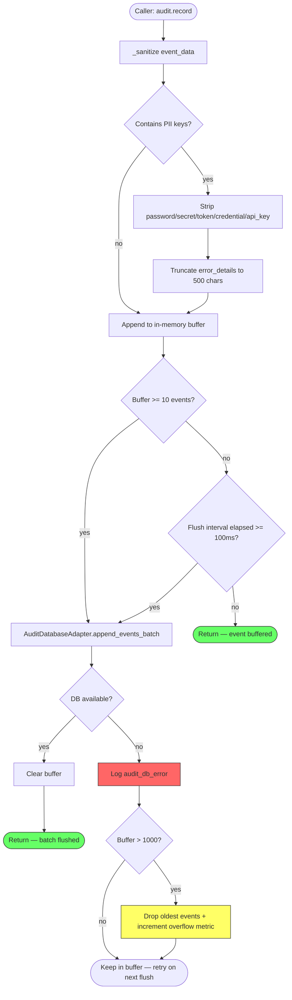
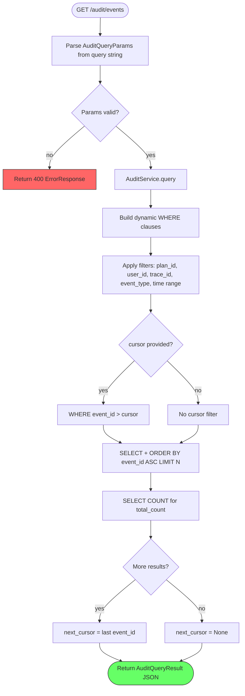
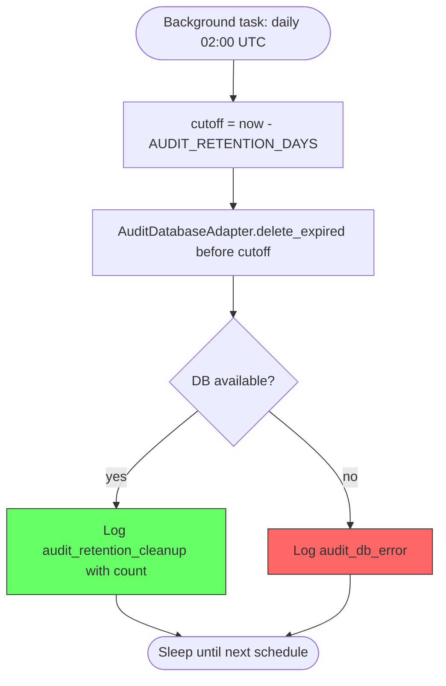
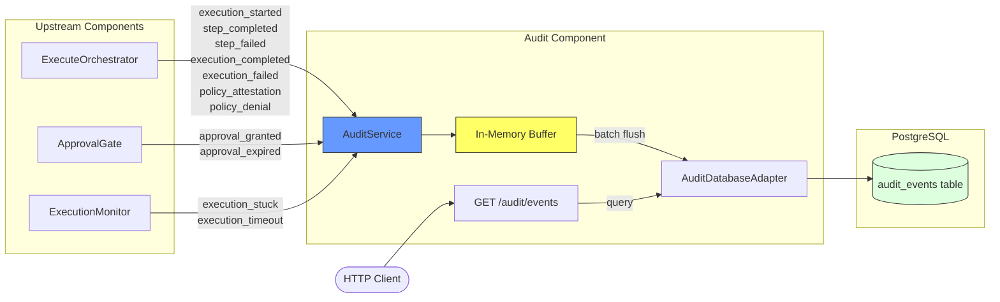
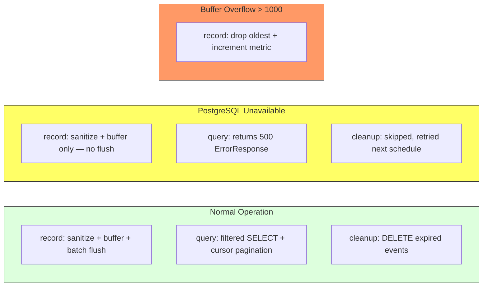

# Audit — Flow Diagrams

## 1. Record Event Flow

```mermaid
flowchart TD
    START([Caller: audit.record]) --> SANITIZE[_sanitize event_data]
    SANITIZE --> STRIP{Contains PII keys?}
    STRIP -->|yes| REMOVE[Strip password/secret/token/credential/api_key]
    STRIP -->|no| BUFFER
    REMOVE --> TRUNCATE[Truncate error_details to 500 chars]
    TRUNCATE --> BUFFER

    BUFFER[Append to in-memory buffer] --> CHECK_SIZE{Buffer >= 10 events?}
    CHECK_SIZE -->|yes| FLUSH
    CHECK_SIZE -->|no| CHECK_TIMER{Flush interval elapsed >= 100ms?}
    CHECK_TIMER -->|yes| FLUSH
    CHECK_TIMER -->|no| DONE_BUFFERED([Return — event buffered])

    FLUSH[AuditDatabaseAdapter.append_events_batch] --> DB_OK{DB available?}
    DB_OK -->|yes| CLEAR[Clear buffer] --> DONE_FLUSHED([Return — batch flushed])
    DB_OK -->|no| DB_ERROR[Log audit_db_error]
    DB_ERROR --> OVERFLOW{Buffer > 1000?}
    OVERFLOW -->|yes| DROP[Drop oldest events + increment overflow metric]
    OVERFLOW -->|no| KEEP([Keep in buffer — retry on next flush])
    DROP --> KEEP

    style DONE_FLUSHED fill:#6f6,stroke:#333
    style DONE_BUFFERED fill:#6f6,stroke:#333
    style DB_ERROR fill:#f66,stroke:#333
    style DROP fill:#ff6,stroke:#333
```

---

## 2. Query Flow

```mermaid
flowchart TD
    START([GET /audit/events]) --> PARSE[Parse AuditQueryParams from query string]
    PARSE --> VALIDATE{Params valid?}
    VALIDATE -->|no| ERROR_400[Return 400 ErrorResponse]
    VALIDATE -->|yes| SERVICE[AuditService.query]

    SERVICE --> BUILD_WHERE[Build dynamic WHERE clauses]
    BUILD_WHERE --> FILTERS[Apply filters: plan_id, user_id, trace_id, event_type, time range]
    FILTERS --> CURSOR{cursor provided?}
    CURSOR -->|yes| ADD_CURSOR[WHERE event_id > cursor]
    CURSOR -->|no| NO_CURSOR[No cursor filter]

    ADD_CURSOR --> EXECUTE
    NO_CURSOR --> EXECUTE

    EXECUTE[SELECT + ORDER BY event_id ASC LIMIT N] --> COUNT[SELECT COUNT for total_count]
    COUNT --> HAS_MORE{More results?}
    HAS_MORE -->|yes| SET_CURSOR[next_cursor = last event_id]
    HAS_MORE -->|no| NO_NEXT[next_cursor = None]

    SET_CURSOR --> RESPONSE
    NO_NEXT --> RESPONSE
    RESPONSE([Return AuditQueryResult JSON])

    style ERROR_400 fill:#f66,stroke:#333
    style RESPONSE fill:#6f6,stroke:#333
```

---

## 3. Retention Cleanup Flow

```mermaid
flowchart TD
    START([Background task: daily 02:00 UTC]) --> CALC[cutoff = now - AUDIT_RETENTION_DAYS]
    CALC --> DELETE[AuditDatabaseAdapter.delete_expired before cutoff]
    DELETE --> DB_OK{DB available?}
    DB_OK -->|yes| LOG_SUCCESS[Log audit_retention_cleanup with count]
    DB_OK -->|no| LOG_ERROR[Log audit_db_error]
    LOG_SUCCESS --> DONE([Sleep until next schedule])
    LOG_ERROR --> DONE

    style LOG_SUCCESS fill:#6f6,stroke:#333
    style LOG_ERROR fill:#f66,stroke:#333
```

---

## 4. Integration Overview

```mermaid
flowchart LR
    subgraph Callers[Upstream Components]
        EO[ExecuteOrchestrator]
        AG[ApprovalGate]
        EM[ExecutionMonitor]
    end

    subgraph Audit[Audit Component]
        AS[AuditService]
        BUF[In-Memory Buffer]
        ADB[AuditDatabaseAdapter]
        API[GET /audit/events]
    end

    subgraph Storage[PostgreSQL]
        TBL[(audit_events table)]
    end

    EO -->|execution_started\nstep_completed\nstep_failed\nexecution_completed\nexecution_failed\npolicy_attestation\npolicy_denial| AS
    AG -->|approval_granted\napproval_expired| AS
    EM -->|execution_stuck\nexecution_timeout| AS

    AS --> BUF
    BUF -->|batch flush| ADB
    ADB --> TBL
    API -->|query| ADB

    CLIENT([HTTP Client]) --> API

    style AS fill:#69f,stroke:#333
    style BUF fill:#ff6,stroke:#333
    style TBL fill:#dfd,stroke:#333
```

---

## 5. Graceful Degradation States

```mermaid
flowchart LR
    subgraph Normal[Normal Operation]
        N_RECORD[record: sanitize + buffer + batch flush]
        N_QUERY[query: filtered SELECT + cursor pagination]
        N_CLEANUP[cleanup: DELETE expired events]
    end

    subgraph DB_Down[PostgreSQL Unavailable]
        D_RECORD[record: sanitize + buffer only — no flush]
        D_QUERY[query: returns 500 ErrorResponse]
        D_CLEANUP[cleanup: skipped, retried next schedule]
    end

    subgraph Buffer_Full[Buffer Overflow > 1000]
        B_RECORD[record: drop oldest + increment metric]
    end

    style Normal fill:#dfd,stroke:#333
    style DB_Down fill:#ff6,stroke:#333
    style Buffer_Full fill:#f96,stroke:#333
```
