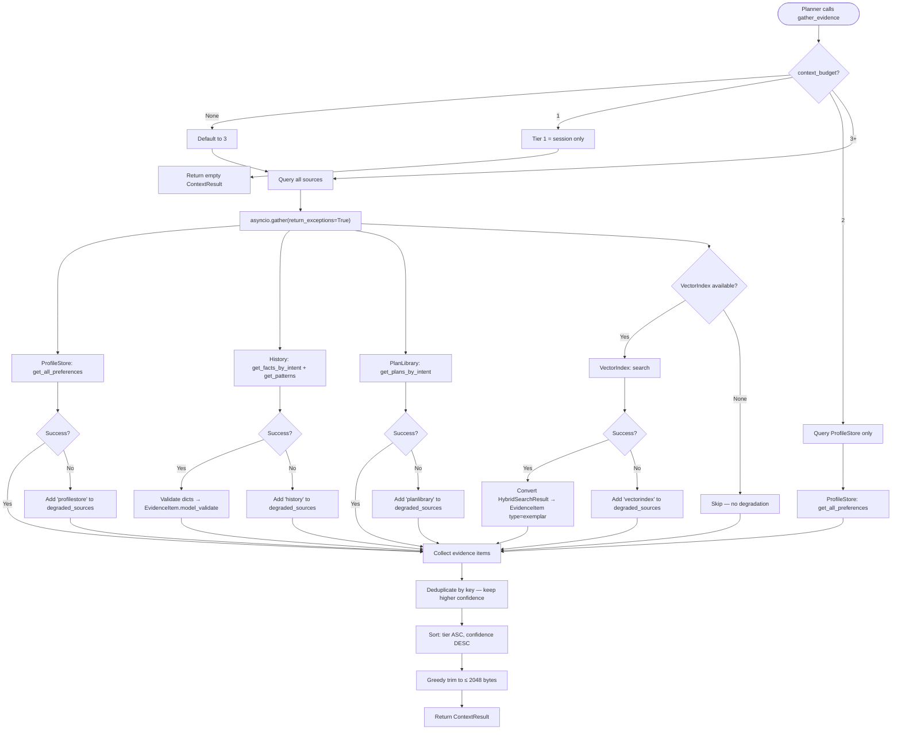
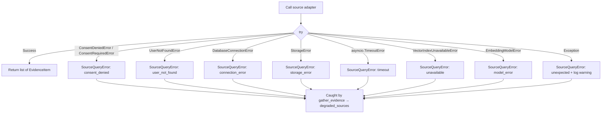
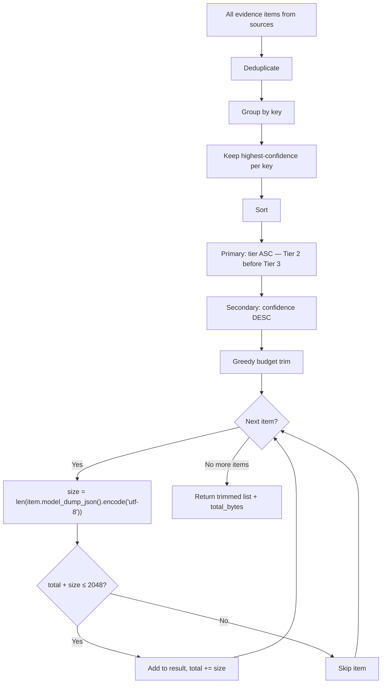

# ContextRAG — Flow Diagrams

## 1. Primary Flow: `gather_evidence()`

```mermaid
flowchart TD
    START([Planner calls gather_evidence]) --> BUDGET{context_budget?}

    BUDGET -->|None| DEFAULT[Default to 3]
    BUDGET -->|1| TIER1[Tier 1 = session only]
    BUDGET -->|2| TIER2[Query ProfileStore only]
    BUDGET -->|3+| TIER3[Query all sources]

    TIER1 --> EMPTY_RETURN[Return empty ContextResult]

    DEFAULT --> TIER3

    TIER2 --> PS_QUERY[ProfileStore: get_all_preferences]
    PS_QUERY --> COLLECT

    TIER3 --> PARALLEL["asyncio.gather(return_exceptions=True)"]
    PARALLEL --> PS[ProfileStore: get_all_preferences]
    PARALLEL --> HS[History: get_facts_by_intent + get_patterns]
    PARALLEL --> PL[PlanLibrary: get_plans_by_intent]
    PARALLEL --> VI{VectorIndex available?}

    VI -->|Yes| VI_SEARCH[VectorIndex: search]
    VI -->|None| VI_SKIP[Skip — no degradation]

    PS --> PS_OK{Success?}
    HS --> HS_OK{Success?}
    PL --> PL_OK{Success?}
    VI_SEARCH --> VI_OK{Success?}

    PS_OK -->|Yes| COLLECT[Collect evidence items]
    PS_OK -->|No| PS_DEG[Add 'profilestore' to degraded_sources]
    HS_OK -->|Yes| HS_CONVERT[Validate dicts → EvidenceItem.model_validate]
    HS_OK -->|No| HS_DEG[Add 'history' to degraded_sources]
    PL_OK -->|Yes| COLLECT
    PL_OK -->|No| PL_DEG[Add 'planlibrary' to degraded_sources]
    VI_OK -->|Yes| VI_CONVERT[Convert HybridSearchResult → EvidenceItem type=exemplar]
    VI_OK -->|No| VI_DEG[Add 'vectorindex' to degraded_sources]

    HS_CONVERT --> COLLECT
    VI_CONVERT --> COLLECT
    VI_SKIP --> COLLECT
    PS_DEG --> COLLECT
    HS_DEG --> COLLECT
    PL_DEG --> COLLECT
    VI_DEG --> COLLECT

    COLLECT --> DEDUP[Deduplicate by key — keep higher confidence]
    DEDUP --> SORT[Sort: tier ASC, confidence DESC]
    SORT --> TRIM[Greedy trim to ≤ 2048 bytes]
    TRIM --> RESULT[Return ContextResult]
```

## 2. Error Handling Per Source

```mermaid
flowchart TD
    CALL[Call source adapter] --> TRY{try}

    TRY -->|Success| EVIDENCE[Return list of EvidenceItem]

    TRY -->|ConsentDeniedError / ConsentRequiredError| CONSENT[SourceQueryError: consent_denied]
    TRY -->|UserNotFoundError| USER[SourceQueryError: user_not_found]
    TRY -->|DatabaseConnectionError| DB[SourceQueryError: connection_error]
    TRY -->|StorageError| STORAGE[SourceQueryError: storage_error]
    TRY -->|asyncio.TimeoutError| TIMEOUT[SourceQueryError: timeout]
    TRY -->|VectorIndexUnavailableError| UNAVAIL[SourceQueryError: unavailable]
    TRY -->|EmbeddingModelError| MODEL[SourceQueryError: model_error]
    TRY -->|Exception| UNEXPECTED[SourceQueryError: unexpected + log warning]

    CONSENT --> DEGRADED[Caught by gather_evidence → degraded_sources]
    USER --> DEGRADED
    DB --> DEGRADED
    STORAGE --> DEGRADED
    TIMEOUT --> DEGRADED
    UNAVAIL --> DEGRADED
    MODEL --> DEGRADED
    UNEXPECTED --> DEGRADED
```

## 3. Budget Manager Flow

```mermaid
flowchart TD
    INPUT[All evidence items from sources] --> DEDUP_START[Deduplicate]

    DEDUP_START --> GROUP[Group by key]
    GROUP --> PICK[Keep highest-confidence per key]
    PICK --> SORT_START[Sort]

    SORT_START --> TIER_SORT[Primary: tier ASC — Tier 2 before Tier 3]
    TIER_SORT --> CONF_SORT[Secondary: confidence DESC]
    CONF_SORT --> TRIM_START[Greedy budget trim]

    TRIM_START --> LOOP{Next item?}
    LOOP -->|Yes| MEASURE["size = len(item.model_dump_json().encode('utf-8'))"]
    MEASURE --> FIT{total + size ≤ 2048?}
    FIT -->|Yes| ADD[Add to result, total += size]
    FIT -->|No| SKIP[Skip item]
    ADD --> LOOP
    SKIP --> LOOP
    LOOP -->|No more items| DONE[Return trimmed list + total_bytes]
```
