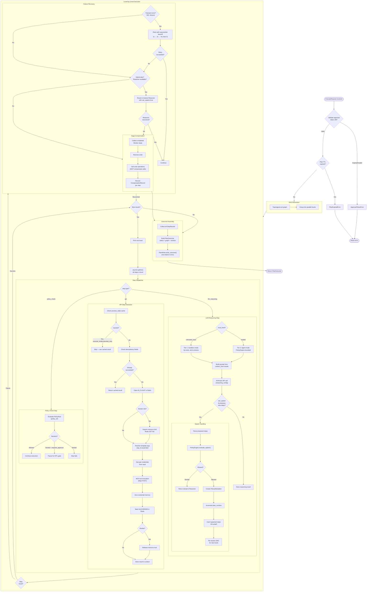

```mermaid
flowchart TD
    START([ExecuteRequest received]) --> VERIFY_TOKEN{Validate approval\ntoken JWT}
    VERIFY_TOKEN -->|Expired/Invalid| REJECT_TOKEN[ApprovalTokenError]
    VERIFY_TOKEN -->|Valid| CHECK_TTL{Plan TTL\nexpired?}
    CHECK_TTL -->|Yes| REJECT_TTL[PlanExpiredError]
    CHECK_TTL -->|No| DAG_RESOLVE

    subgraph DAG_RESOLVE [DAG Resolution]
        TOPO[Topological sort graph] --> LEVELS[Group into parallel levels]
    end

    DAG_RESOLVE --> EXEC_LOOP

    subgraph EXEC_LOOP [Level-by-Level Execution]
        NEXT_LEVEL[Pick next level] --> PARALLEL["asyncio.gather()\nall steps in level"]
        PARALLEL --> DISPATCH

        subgraph DISPATCH [Step Dispatcher]
            direction TB
            CHECK_TYPE{step.type?}
            CHECK_TYPE -->|api| API_STEP
            CHECK_TYPE -->|llm_reasoning| LLM_STEP
            CHECK_TYPE -->|policy_check| POLICY_STEP

            subgraph API_STEP [API Step Execution]
                direction TB
                A1[Check preview_state cache] --> A2{Cached?}
                A2 -->|Yes, execute_mode=preview_only| A_SKIP[Skip — use cached result]
                A2 -->|No| A3[Check idempotency Redis]
                A3 --> A4{Already\nsucceeded?}
                A4 -->|Yes| A_DEDUP[Return cached result]
                A4 -->|No| A5[Claim IN_FLIGHT in Redis]
                A5 --> A6{Booker role?}
                A6 -->|Yes| A7[Acquire resource lock\nRedis SET NX]
                A6 -->|No| A8[Resolve template args\nstep_N.result.field]
                A7 --> A8
                A8 --> A9[Decrypt credentials\nfrom vault]
                A9 --> A10["MCP tool invocation\n(httpx POST)"]
                A10 --> A11[Zero credential memory]
                A11 --> A12[Mark SUCCEEDED in Redis]
                A12 --> A13{Booker?}
                A13 -->|Yes| A14[Release resource lock]
                A13 -->|No| A15[Store result in context]
                A14 --> A15
            end

            subgraph LLM_STEP [LLM Reasoning Step]
                direction TB
                L1{trust_level?}
                L1 -->|untrusted_input| L2[Tier 1: Sandbox mode\nNo tools, strict schema]
                L1 -->|trusted| L3[Tier 2: Agent mode\nPolicyEngine-bounded]
                L2 --> L4[Build prompt from\ncontext_from results]
                L3 --> L4
                L4 --> L5["Anthropic API call\n(reasoning_config)"]
                L5 --> L6{can_spawn\n& proposes\nnew steps?}
                L6 -->|Yes| SPAWN
                L6 -->|No| L7[Store reasoning result]
            end

            subgraph SPAWN [Spawn Handling]
                direction TB
                SP1[Parse proposed steps] --> SP2["PolicyEngine.evaluate_spawn()"]
                SP2 --> SP3{Allowed?}
                SP3 -->|Denied| SP4[Return denial to Reasoner]
                SP3 -->|Allowed| SP5[Create PolicyAttestation]
                SP5 --> SP6[Increment plan_revision]
                SP6 --> SP7[Insert spawned steps\ninto graph]
                SP7 --> SP8[Re-resolve DAG\nfor new levels]
            end

            subgraph POLICY_STEP [Policy Check Step]
                direction TB
                PC1["Evaluate PolicyRule\n(policy_ref)"] --> PC2{Decision?}
                PC2 -->|Allowed| PC3[Continue execution]
                PC2 -->|Denied + requires_approval| PC4[Pause for HITL gate]
                PC2 -->|Denied| PC5[Step fails]
            end
        end

        DISPATCH --> STEP_RESULT{Step\nresult?}
        STEP_RESULT -->|Success| CHECK_MORE{More levels?}
        STEP_RESULT -->|Failure| RECOVERY

        subgraph RECOVERY [Failure Recovery]
            direction TB
            R1{Transient error?\n503, timeout}
            R1 -->|Yes| R2["Retry with exponential backoff\n1s → 2s → 4s (max 3)"]
            R2 --> R3{Retry\nsucceeded?}
            R3 -->|Yes| R_OK[Continue]
            R3 -->|No| R4{Hybrid plan?\nReasoner available?}
            R1 -->|No| R4
            R4 -->|Yes| R5[Route to nearest Reasoner\nwith can_spawn=true]
            R5 --> R6{Reasoner\nrecovered?}
            R6 -->|Yes| R_OK
            R6 -->|No| COMPENSATE
            R4 -->|No| COMPENSATE
        end

        subgraph COMPENSATE [Saga Compensation]
            direction TB
            C1[Collect completed\nBooker steps] --> C2[Reverse order]
            C2 --> C3["Call undo operations\n(MCP compensate calls)"]
            C3 --> C4[Record CompensationRecord\nper step]
        end

        CHECK_MORE -->|Yes| NEXT_LEVEL
        CHECK_MORE -->|No| BUILD_OUTCOME
    end

    RECOVERY --> |Recovered| CHECK_MORE
    COMPENSATE --> BUILD_OUTCOME

    subgraph BUILD_OUTCOME [Outcome Assembly]
        direction TB
        O1[Collect all StepResults] --> O2[Build PlanOutcome\nstatus + graph + revision]
        O2 --> O3["PlanWriter.write_outcome()\n(non-fatal on error)"]
    end

    BUILD_OUTCOME --> DONE([Return PlanOutcome])
    REJECT_TOKEN --> FAIL([Raise error])
    REJECT_TTL --> FAIL
```
