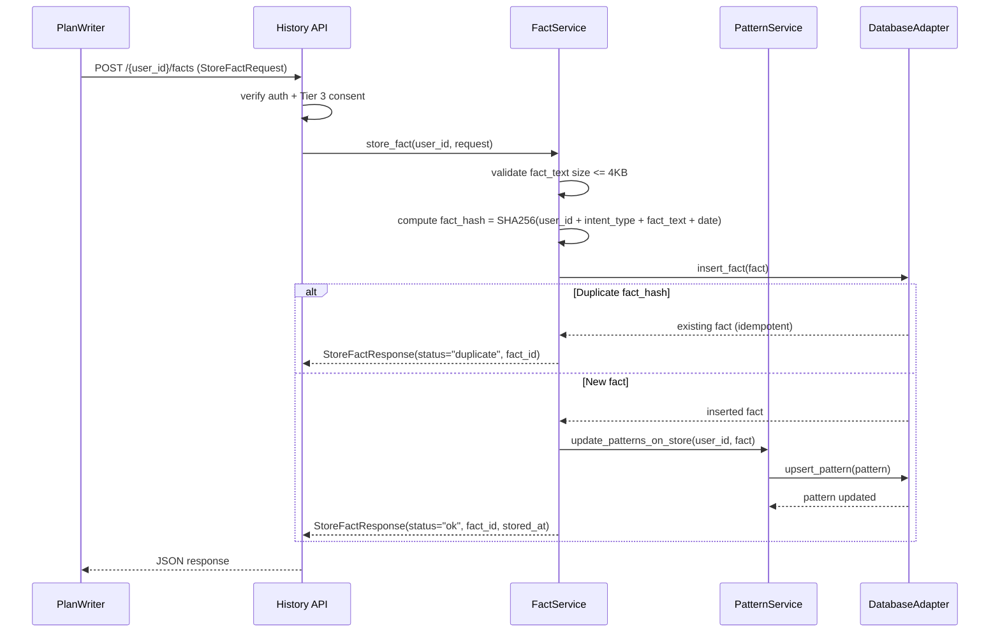
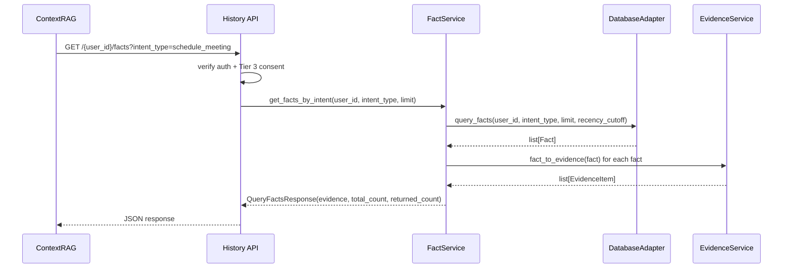
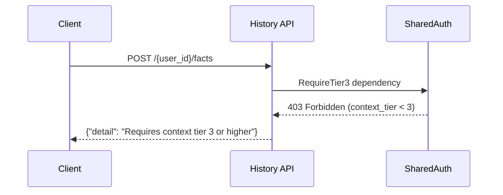
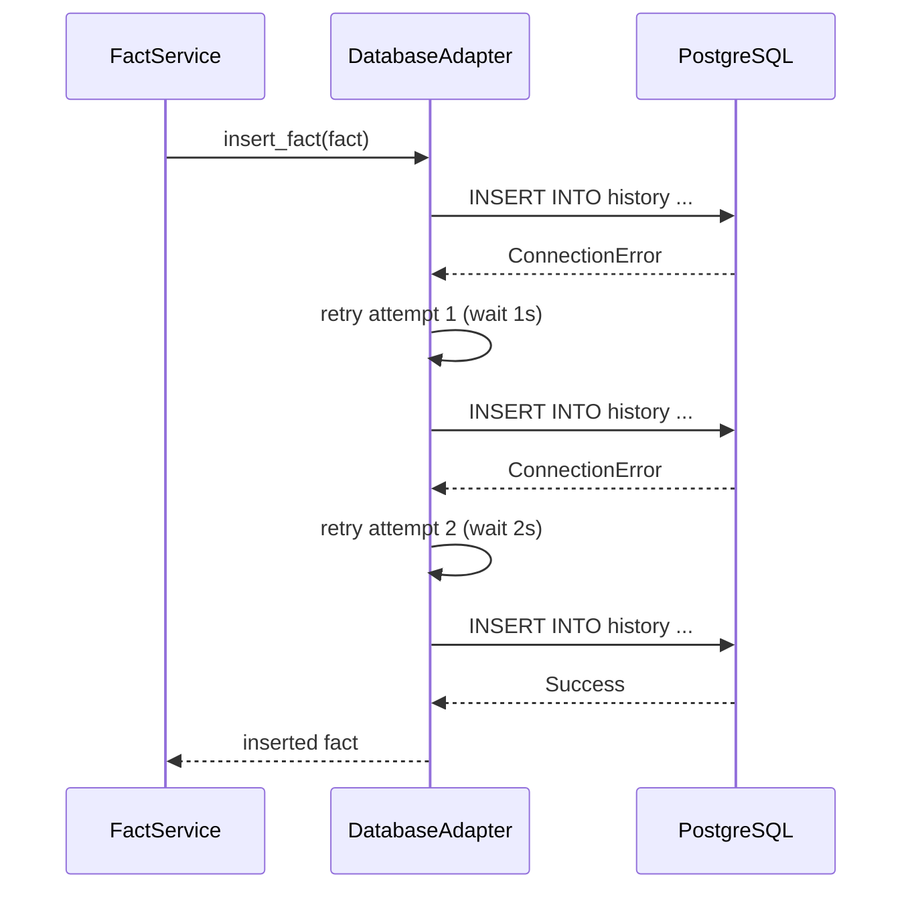
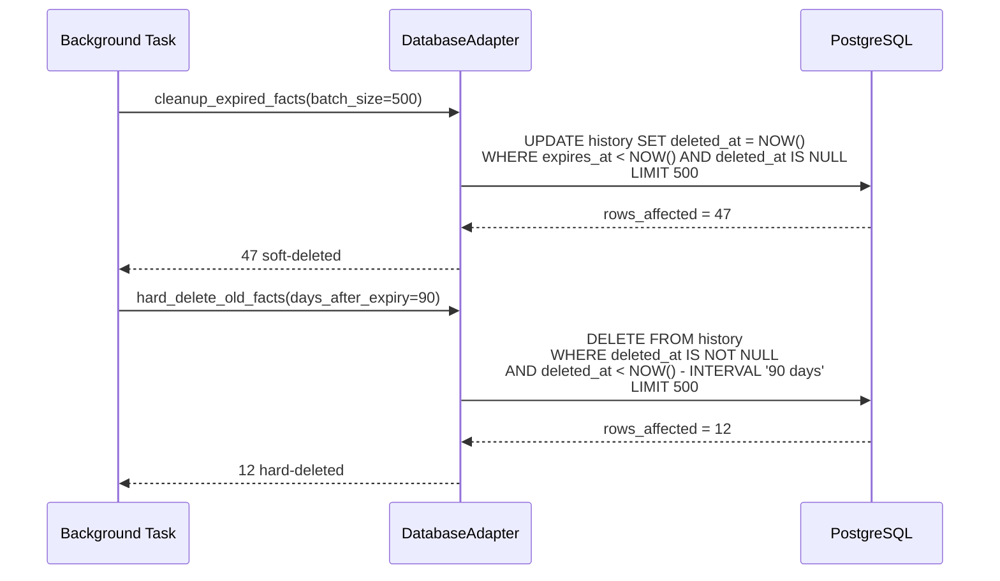

# History -- Low-Level Design (LLD)

**Component**: History (Memory Layer)
**Version**: 1.0
**Status**: Implemented ✅ (PR #5)
**Conforms to**: GLOBAL_SPEC.md v2, Project_HLD.md v4.3, MODULAR_ARCHITECTURE.md v1.1

---

## Purpose & Scope

### Component Purpose
History is a Memory Layer component that stores normalized, PII-light facts derived from plan execution outcomes. It enables system learning by recording structured facts (meeting bookings, task completions, usage patterns) and surfacing recurring behavioral patterns. The component supports:

- **Fact Storage**: Append-only storage of derived facts with SHA256 deduplication
- **Fact Retrieval**: Query by user, intent type, entity, and time range; returns Evidence Items
- **Pattern Detection**: Identify recurring user behaviors (e.g., "usually meets Alice on Tuesdays")
- **TTL Enforcement**: Automatic 30-day expiration with soft-delete and deferred hard-delete
- **Evidence Integration**: Return facts as GLOBAL_SPEC section 2.2 Evidence Items (type="history") for ContextRAG

> **Note**: History is an internal component. It does NOT use the Preview/Execute safety model (GLOBAL_SPEC section 1). PlanWriter stores facts; ContextRAG and Planner query them.

### Layer Placement
**Memory Layer** -- Direct database interactions with no business logic orchestration. Provides data persistence and retrieval services to upper layers. Foundation component with zero upstream component dependencies.

### Blast Radius Analysis
**Contained Impact**: History failure affects:
- Historical context assembly (ContextRAG returns fewer Evidence Items)
- Pattern-based plan optimization (Planner loses behavioral signals)
- Fact storage from PlanWriter (facts lost until recovery, but plan execution unaffected)

**System Resilience**: Does NOT affect:
- Active plan execution (ExecuteOrchestrator operates independently)
- Real-time planning (Planner falls back to ProfileStore preferences + PlanLibrary patterns)
- User-facing operations (component is internal-only)
- Preference storage (ProfileStore independent)
- Plan storage (PlanLibrary independent)

---

## Conformance

This component conforms to:
- **GLOBAL_SPEC.md v2**: Evidence Item format (section 2.2), context tier policy (section 7, Tier 3), NFR baselines (section 3)
- **Project_HLD.md v4.3**: Memory Layer component responsibilities, History as Tier 3 data source
- **MODULAR_ARCHITECTURE.md v1.1**: Memory Layer patterns, database ownership isolation, component boundaries
- **Constitution.md v1.0.0**: Component-first architecture, test-driven development, DRY principles

### Deltas from GLOBAL_SPEC
- **No Preview/Execute**: Internal component per GLOBAL_SPEC section 1 ("applies to user-facing plans, NOT internal component operations")
- **Stricter latency**: Fact storage p95 <100ms, fact query p95 <80ms (tighter than general targets because ContextRAG has <150ms budget and History is one of multiple sources queried)
- **TTL enforcement**: 30-day default with configurable overrides (GLOBAL_SPEC section 7 Tier 3)

---

## Architecture Overview

### High-Level Structure
```
+-----------------------------------------------------+
|                     History                          |
|                  (Memory Layer)                      |
+-----------------------------------------------------+
| API Layer                                            |
|  +-- /history/facts (storage + query endpoints)      |
|  +-- /history/patterns (pattern query endpoints)     |
|  +-- /health (health check)                          |
+-----------------------------------------------------+
| Service Layer                                        |
|  +-- FactService (storage, deduplication, consent)   |
|  +-- PatternService (detection, confidence scoring)  |
|  +-- EvidenceService (Evidence Item conversion)      |
+-----------------------------------------------------+
| Adapter Layer                                        |
|  +-- DatabaseAdapter (SQLAlchemy async, shared infra)|
+-----------------------------------------------------+
| Data Layer                                           |
|  +-- PostgreSQL 16 (history, fact_patterns tables)   |
+-----------------------------------------------------+
```

### Component Boundaries and Isolation Strategy
- **Database Ownership**: Exclusive ownership of `history` and `fact_patterns` tables
- **External Dependencies**: None (pure database component)
- **Component Dependencies**: None (foundation Memory Layer component)
- **Failure Isolation**: Database connection pooling, retry logic

---

## Interfaces

### API Handlers (Thin Wrappers)

#### Store Fact Endpoint
```python
# api/routes.py
@router.post(
    "/{user_id}/facts",
    response_model=StoreFactResponse,
    summary="Store a derived fact from plan execution"
)
async def store_fact_endpoint(
    user_id: UUID,
    request: StoreFactRequest,
    auth_context: dict = Depends(get_auth_context),
    _: None = Depends(RequireTier3),
    fact_service: FactService = Depends(get_fact_service),
) -> StoreFactResponse:
    verify_user_access(user_id, auth_context)
    return await fact_service.store_fact(user_id=user_id, request=request)
```

#### Query Facts Endpoint
```python
@router.get(
    "/{user_id}/facts",
    response_model=QueryFactsResponse,
    summary="Query facts for a user"
)
async def query_facts_endpoint(
    user_id: UUID,
    intent_type: str | None = None,
    limit: int = Query(default=50, le=500, ge=1),
    recency_days: int | None = Query(default=None, ge=1),
    auth_context: dict = Depends(get_auth_context),
    _: None = Depends(RequireTier3),
    fact_service: FactService = Depends(get_fact_service),
) -> QueryFactsResponse:
    verify_user_access(user_id, auth_context)
    return await fact_service.get_facts_by_intent(
        user_id=user_id,
        intent_type=intent_type,
        limit=limit,
        recency_days=recency_days,
    )
```

#### Query Patterns Endpoint
```python
@router.get(
    "/{user_id}/patterns",
    response_model=PatternsResponse,
    summary="Get detected recurring patterns"
)
async def query_patterns_endpoint(
    user_id: UUID,
    intent_type: str | None = None,
    min_confidence: float = Query(default=0.5, ge=0.0, le=1.0),
    auth_context: dict = Depends(get_auth_context),
    _: None = Depends(RequireTier3),
    pattern_service: PatternService = Depends(get_pattern_service),
) -> PatternsResponse:
    verify_user_access(user_id, auth_context)
    return await pattern_service.get_patterns(
        user_id=user_id,
        intent_type=intent_type,
        min_confidence=min_confidence,
    )
```

### Service Layer Signatures

#### FactService Interface
```python
# service/fact_service.py
class FactService:
    def __init__(
        self,
        db_adapter: DatabaseAdapter,
        evidence_service: EvidenceService,
        pattern_service: PatternService,
    ):
        ...

    async def store_fact(
        self,
        user_id: UUID,
        request: StoreFactRequest,
    ) -> StoreFactResponse:
        """
        Store a derived fact. Idempotent: duplicate fact_hash returns
        the existing fact without error.
        """

    async def get_facts_by_intent(
        self,
        user_id: UUID,
        intent_type: str | None = None,
        limit: int = 50,
        recency_days: int | None = None,
    ) -> QueryFactsResponse:
        """
        Query facts filtered by intent, returning Evidence Items
        sorted by recency (newest first). Excludes expired facts.
        """
```

#### PatternService Interface
```python
# service/pattern_service.py
class PatternService:
    def __init__(self, db_adapter: DatabaseAdapter):
        ...

    async def get_patterns(
        self,
        user_id: UUID,
        intent_type: str | None = None,
        min_confidence: float = 0.5,
    ) -> PatternsResponse:
        """Get recurring patterns with confidence filtering."""

    async def update_patterns_on_store(
        self,
        user_id: UUID,
        fact: Fact,
    ) -> None:
        """Incrementally update patterns when a new fact is stored."""
```

#### EvidenceService Interface
```python
# service/evidence_service.py
class EvidenceService:
    def fact_to_evidence(self, fact: Fact) -> EvidenceItem:
        """
        Convert a Fact to an Evidence Item (GLOBAL_SPEC section 2.2).
        Confidence decays linearly over the fact's TTL.
        """
```

### Consumer Contracts

| Consumer | Operation | Input | Output |
|----------|-----------|-------|--------|
| PlanWriter | Store fact | `StoreFactRequest` (user_id, fact_text, intent_type, entities, outcome, source_plan_id, ttl_days) | `StoreFactResponse` (fact_id, stored_at, status) |
| ContextRAG | Query facts | user_id, intent_type, limit, recency_days | `List[EvidenceItem]` (type="history", tier=3) |
| Planner | Query patterns | user_id, intent_type, min_confidence | `List[FactPattern]` (pattern_description, confidence) |

---

## Data Model

### Core Entities (Pydantic v2)

#### Fact Entity
```python
from datetime import datetime, timezone
from uuid import UUID, uuid4
from pydantic import BaseModel, Field

class Fact(BaseModel):
    """Immutable record of a past action. Append-only with soft-delete."""
    fact_id: UUID = Field(default_factory=uuid4)
    user_id: UUID
    fact_text: str = Field(..., max_length=4096)
    intent_type: str = Field(..., max_length=64)
    entities: dict = Field(default_factory=dict)
    outcome: bool
    source_plan_id: str | None = Field(
        default=None, pattern=r"^[0-9A-HJKMNP-TV-Z]{26}$"
    )
    fact_hash: str = Field(..., max_length=64)  # SHA256 hex
    ttl_days: int = Field(default=30, ge=1)
    created_at: datetime = Field(
        default_factory=lambda: datetime.now(timezone.utc)
    )
    expires_at: datetime
    deleted_at: datetime | None = None
```

#### FactPattern Entity
```python
class FactPattern(BaseModel):
    """Detected recurring behavioral pattern. Derived from Facts."""
    pattern_id: UUID = Field(default_factory=uuid4)
    user_id: UUID
    intent_type: str = Field(..., max_length=64)
    pattern_key: str = Field(..., max_length=128)
    pattern_description: str = Field(..., max_length=512)
    entity_pattern: dict = Field(default_factory=dict)
    occurrence_count: int = Field(default=1, ge=1)
    last_seen: datetime
    confidence: float = Field(default=0.0, ge=0.0, le=1.0)
```

#### Request/Response Models
```python
class StoreFactRequest(BaseModel):
    """Request body for storing a fact."""
    fact_text: str = Field(..., min_length=1, max_length=4096)
    intent_type: str = Field(..., min_length=1, max_length=64)
    entities: dict = Field(default_factory=dict)
    outcome: bool
    source_plan_id: str | None = None
    ttl_days: int = Field(default=30, ge=1, le=365)

class StoreFactResponse(BaseModel):
    """Response from storing a fact."""
    status: str  # "ok" or "duplicate"
    fact_id: UUID
    stored_at: datetime

class QueryFactsResponse(BaseModel):
    """Response containing queried facts as Evidence Items."""
    evidence: list  # List[EvidenceItem]
    total_count: int
    returned_count: int
```

### Confidence Decay Formula
Confidence decays linearly from 1.0 at creation to 0.0 at expiry:
```
confidence = max(0.0, 1.0 - (age_days / ttl_days))
```

---

## Database Schema

### DDL: `history` Table

```sql
CREATE TABLE history (
    fact_id       UUID PRIMARY KEY DEFAULT gen_random_uuid(),
    user_id       UUID NOT NULL
                  REFERENCES users(user_id) ON DELETE CASCADE,
    fact_text     TEXT NOT NULL,
    intent_type   VARCHAR(64) NOT NULL,
    entities      JSONB NOT NULL DEFAULT '{}',
    outcome       BOOLEAN NOT NULL,
    source_plan_id VARCHAR(26),          -- ULID, nullable
    fact_hash     VARCHAR(64) NOT NULL,  -- SHA256 hex
    ttl_days      INTEGER NOT NULL DEFAULT 30,
    created_at    TIMESTAMP WITH TIME ZONE NOT NULL
                  DEFAULT NOW(),
    expires_at    TIMESTAMP WITH TIME ZONE NOT NULL,
    deleted_at    TIMESTAMP WITH TIME ZONE
);

-- Primary query path: user + intent + active + recency
CREATE INDEX idx_history_user_intent_active
    ON history (user_id, intent_type, created_at DESC)
    WHERE deleted_at IS NULL;

-- Deduplication: unique fact_hash per user (active only)
CREATE UNIQUE INDEX idx_history_user_fact_hash
    ON history (user_id, fact_hash)
    WHERE deleted_at IS NULL;

-- TTL cleanup: find expired facts
CREATE INDEX idx_history_expires_at
    ON history (expires_at)
    WHERE deleted_at IS NULL;

-- Pattern detection queries
CREATE INDEX idx_history_user_entities
    ON history USING GIN (entities)
    WHERE deleted_at IS NULL;

-- Source plan correlation
CREATE INDEX idx_history_source_plan
    ON history (source_plan_id)
    WHERE source_plan_id IS NOT NULL;
```

### DDL: `fact_patterns` Table

```sql
CREATE TABLE fact_patterns (
    pattern_id          UUID PRIMARY KEY DEFAULT gen_random_uuid(),
    user_id             UUID NOT NULL
                        REFERENCES users(user_id) ON DELETE CASCADE,
    intent_type         VARCHAR(64) NOT NULL,
    pattern_key         VARCHAR(128) NOT NULL,
    pattern_description VARCHAR(512) NOT NULL,
    entity_pattern      JSONB NOT NULL DEFAULT '{}',
    occurrence_count    INTEGER NOT NULL DEFAULT 1,
    last_seen           TIMESTAMP WITH TIME ZONE NOT NULL,
    confidence          REAL NOT NULL DEFAULT 0.0,

    -- One pattern per user + intent + key
    CONSTRAINT uq_fact_patterns_user_intent_key
        UNIQUE (user_id, intent_type, pattern_key)
);

-- Query patterns by user and intent
CREATE INDEX idx_fact_patterns_user_intent
    ON fact_patterns (user_id, intent_type, confidence DESC);

-- Stale pattern cleanup
CREATE INDEX idx_fact_patterns_last_seen
    ON fact_patterns (last_seen);
```

### SQLAlchemy Models (in `shared/database/models.py`)

```python
class HistoryTable(Base):
    """History facts table -- owned by History component."""
    __tablename__ = "history"

    fact_id = Column(
        SQLAlchemy_UUID(as_uuid=True),
        primary_key=True,
        server_default=text("gen_random_uuid()"),
    )
    user_id = Column(
        SQLAlchemy_UUID(as_uuid=True),
        ForeignKey("users.user_id", ondelete="CASCADE"),
        nullable=False,
    )
    fact_text = Column(String, nullable=False)
    intent_type = Column(String(64), nullable=False)
    entities = Column(JSONB, nullable=False, server_default=text("'{}'::jsonb"))
    outcome = Column(Boolean, nullable=False)
    source_plan_id = Column(String(26), nullable=True)
    fact_hash = Column(String(64), nullable=False)
    ttl_days = Column(Integer, nullable=False, default=30)
    created_at = Column(DateTime(timezone=True), nullable=False, server_default=text("NOW()"))
    expires_at = Column(DateTime(timezone=True), nullable=False)
    deleted_at = Column(DateTime(timezone=True), nullable=True)

    __table_args__ = (
        Index(
            "idx_history_user_intent_active",
            user_id, intent_type, created_at.desc(),
            postgresql_where=deleted_at.is_(None),
        ),
        Index(
            "idx_history_user_fact_hash",
            user_id, fact_hash,
            unique=True,
            postgresql_where=deleted_at.is_(None),
        ),
        Index(
            "idx_history_expires_at",
            expires_at,
            postgresql_where=deleted_at.is_(None),
        ),
        Index(
            "idx_history_source_plan",
            source_plan_id,
            postgresql_where=source_plan_id.isnot(None),
        ),
    )


class FactPatternTable(Base):
    """Detected recurring patterns -- owned by History component."""
    __tablename__ = "fact_patterns"

    pattern_id = Column(
        SQLAlchemy_UUID(as_uuid=True),
        primary_key=True,
        server_default=text("gen_random_uuid()"),
    )
    user_id = Column(
        SQLAlchemy_UUID(as_uuid=True),
        ForeignKey("users.user_id", ondelete="CASCADE"),
        nullable=False,
    )
    intent_type = Column(String(64), nullable=False)
    pattern_key = Column(String(128), nullable=False)
    pattern_description = Column(String(512), nullable=False)
    entity_pattern = Column(JSONB, nullable=False, server_default=text("'{}'::jsonb"))
    occurrence_count = Column(Integer, nullable=False, default=1)
    last_seen = Column(DateTime(timezone=True), nullable=False)
    confidence = Column(Float, nullable=False, default=0.0)

    __table_args__ = (
        UniqueConstraint(
            user_id, intent_type, pattern_key,
            name="uq_fact_patterns_user_intent_key",
        ),
        Index(
            "idx_fact_patterns_user_intent",
            user_id, intent_type, confidence.desc(),
        ),
        Index("idx_fact_patterns_last_seen", last_seen),
    )
```

---

## Adapters

### DatabaseAdapter

```python
# adapters/db.py
class DatabaseAdapter:
    """Database operations for History component. Uses shared infrastructure."""

    def __init__(self):
        self.shared_db = get_database_adapter()

    @with_db_error_handling
    async def insert_fact(self, fact: Fact) -> Fact:
        """
        Insert a fact. On conflict (duplicate fact_hash for user),
        return the existing fact (idempotent).
        """
        async with self.shared_db.get_session() as session:
            # INSERT ... ON CONFLICT (user_id, fact_hash)
            #   WHERE deleted_at IS NULL DO NOTHING RETURNING *
            ...

    @with_db_error_handling
    async def query_facts(
        self,
        user_id: UUID,
        intent_type: str | None,
        limit: int,
        recency_cutoff: datetime | None,
    ) -> list[Fact]:
        """
        Query active, non-expired facts for a user.
        Sorted by created_at DESC.
        """
        async with self.shared_db.get_session() as session:
            # SELECT ... WHERE user_id = :uid
            #   AND deleted_at IS NULL
            #   AND expires_at > NOW()
            #   AND (intent_type = :it OR :it IS NULL)
            #   ORDER BY created_at DESC LIMIT :limit
            ...

    @with_db_error_handling
    async def upsert_pattern(self, pattern: FactPattern) -> None:
        """Upsert a pattern (increment count, update last_seen)."""
        ...

    @with_db_error_handling
    async def query_patterns(
        self,
        user_id: UUID,
        intent_type: str | None,
        min_confidence: float,
    ) -> list[FactPattern]:
        """Query patterns above confidence threshold."""
        ...

    @with_db_error_handling
    async def cleanup_expired_facts(self, batch_size: int = 500) -> int:
        """Soft-delete facts past expires_at. Returns count affected."""
        ...

    @with_db_error_handling
    async def hard_delete_old_facts(
        self, days_after_expiry: int = 90, batch_size: int = 500
    ) -> int:
        """Hard-delete facts soft-deleted more than N days ago."""
        ...
```

### Shared Infrastructure Usage

| Infrastructure | Location | Usage in History |
|----------------|----------|------------------|
| Database adapter | `shared/database/adapter.py` | `get_database_adapter()` for connection management |
| Error handling | `shared/database/error_handler.py` | `@with_db_error_handling` decorator on all DB ops |
| User check | `shared/database/error_handler.py` | `@with_user_existence_check()` on storage ops |
| Auth context | `shared/api/auth.py` | `get_auth_context`, `verify_user_access`, `RequireTier3` |
| Error responses | `shared/api/error_handlers.py` | `ErrorHandlerMixin` for API error formatting |
| Evidence schema | `shared/schemas/evidence.py` | `EvidenceItem` model for query responses |
| DB models | `shared/database/models.py` | `HistoryTable`, `FactPatternTable` table definitions |

### Dependency Injection Setup

```python
# In shared/dependencies.py (add)
def get_fact_service(request: Request) -> Any:
    """Get FactService singleton from app state."""
    return request.app.state.fact_service

def get_pattern_service(request: Request) -> Any:
    """Get PatternService singleton from app state."""
    return request.app.state.pattern_service
```

```python
# In shared/app.py lifespan (add)
from components.History.adapters.db import DatabaseAdapter as HistoryDBAdapter
from components.History.service.evidence_service import EvidenceService
from components.History.service.pattern_service import PatternService
from components.History.service.fact_service import FactService

history_db = HistoryDBAdapter()
evidence_service = EvidenceService()
pattern_service = PatternService(db_adapter=history_db)
app.state.fact_service = FactService(
    db_adapter=history_db,
    evidence_service=evidence_service,
    pattern_service=pattern_service,
)
app.state.pattern_service = pattern_service
```

---

## Sequences

### Happy Path: Fact Storage Flow



### Happy Path: Fact Query Flow



### Error Path: Consent Denied



### Error Path: Database Failure with Retry



### TTL Cleanup Flow



---

## Dependencies & External Integrations

### Python Packages

| Package | Version | Justification |
|---------|---------|---------------|
| `sqlalchemy` | `>=2.0,<3.0` | Async ORM for PostgreSQL |
| `asyncpg` | `>=0.28.0` | High-performance async PostgreSQL driver |
| `pydantic` | `>=2.0,<3.0` | Data validation, domain models |
| `fastapi` | `>=0.104.0` | API framework with async support |

### External APIs/Services
- **PostgreSQL 16**: Primary data store (99.5% availability target)

### Internal Infrastructure Dependencies
- **Shared Database**: `shared/database/adapter.py` -- connection pooling, session management
- **Shared Error Handling**: `shared/database/error_handler.py` -- `@with_db_error_handling`, `@with_user_existence_check`
- **Shared Auth**: `shared/api/auth.py` -- `get_auth_context`, `verify_user_access`, `RequireTier3`
- **Shared API Errors**: `shared/api/error_handlers.py` -- consistent error response formatting
- **Shared Schemas**: `shared/schemas/evidence.py` -- `EvidenceItem` model

### Component Dependencies
**None** -- History is a foundation Memory Layer component with no upstream component dependencies.

### Development and Testing Dependencies
- `pytest>=7.4.0`, `pytest-asyncio>=0.21.0` for async testing
- `httpx>=0.24.0` for API testing
- `pytest-benchmark>=4.0.0` for performance testing

---

## Observability & Safety

### Structured Logging

```python
# All log entries include correlation metadata
logger.info(
    "Fact stored",
    extra={
        "user_id": str(user_id),
        "fact_id": str(fact_id),
        "intent_type": intent_type,
        "outcome": outcome,
        "storage_latency_ms": latency,
        "component": "History",
        "op": "store_fact",
    }
)

logger.info(
    "Facts queried",
    extra={
        "user_id": str(user_id),
        "intent_type": intent_type,
        "result_count": count,
        "query_latency_ms": latency,
        "component": "History",
        "op": "query_facts",
    }
)
```

### No PII in Logs
- `fact_text` NEVER logged (may contain derived personal info)
- `entities` NEVER logged (may contain names, times)
- Only `fact_id`, `intent_type`, `outcome`, and counts are logged
- `user_id` logged as-is (UUID, not PII)

### Error Classes

```python
class HistoryError(Exception):
    """Base exception for History component."""

class FactTooLargeError(HistoryError):
    """Fact text exceeds 4KB limit."""

class InvalidTimestampError(HistoryError):
    """Timestamp is in the future beyond tolerance."""

class ConsentRequiredError(HistoryError):
    """User context_tier < 3."""

class InvalidFactError(HistoryError):
    """Fact text is empty or invalid."""

class StorageError(HistoryError):
    """Database operation failed after retries."""
```

---

## Non-Functional Requirements

### Performance Tables

#### Local Development Environment

| Operation | Target p95 Latency | Expected Throughput |
|-----------|-------------------|---------------------|
| Fact storage | < 100ms | 50 facts/minute |
| Fact query (by intent) | < 80ms | 200 queries/minute |
| Pattern query | < 150ms | 100 queries/minute |
| TTL cleanup (batch) | < 2s | 1 batch/hour |

#### Cloud Production Environment

| Operation | Target p95 Latency | Expected Throughput |
|-----------|-------------------|---------------------|
| Fact storage | < 100ms | 1000 facts/minute |
| Fact query (by intent) | < 80ms | 5000 queries/minute |
| Pattern query | < 150ms | 2000 queries/minute |
| TTL cleanup (batch) | < 5s | 1 batch/10min |

### Availability Targets
- **Local**: Best-effort availability with graceful degradation
- **Cloud**: 99.5% availability for all operations (aligns with Memory Layer SLA)

### Scalability Targets
- **Single-user**: 100,000 facts with linear query performance (SC-006)
- **Multi-user**: Support 1000 concurrent queries without degradation (FR-007)
- **Storage growth**: 30-day TTL naturally limits active dataset size

---

## Architectural Considerations

### Blast Radius Containment
**If History fails:**
- ContextRAG receives fewer Evidence Items (degrades plan quality, does not block planning)
- PlanWriter fact storage fails (facts lost until recovery, plan execution unaffected)
- Pattern queries return empty (Planner uses other signals)
- No impact on ProfileStore, PlanLibrary, or any orchestration component

### Fault Isolation Strategy
- **Database**: Connection pooling with `pool_pre_ping=True` for stale connection detection
- **Retry**: Exponential backoff (1s, 2s, 4s) on transient database errors via `execute_with_retry`
- **No cascading failures**: History does not call other components

### Determinism Guarantees
- **Fact storage**: Same `fact_hash` always produces same idempotent result
- **Query results**: Deterministic ordering by `created_at DESC` for given database state
- **Pattern detection**: Deterministic confidence formula: `min(1.0, occurrence_count / 5)`
- **Hash computation**: SHA256 of `user_id + intent_type + fact_text + date` is deterministic

### State Management
- **Stateless service**: No persistent in-memory state in FactService or PatternService
- **Database persistence**: All state stored in PostgreSQL

### Idempotency
- **Fact storage**: Duplicate `fact_hash` for the same user returns the existing fact without error
- Enforced at database level via `UNIQUE INDEX idx_history_user_fact_hash`
- Callers can safely retry `store_fact` without creating duplicates

---

## Architecture Decision Records

### Relevant ADRs Impacting Design
- **ADR-0001 Component-first**: Self-contained packet structure with `components/History/` layout
- **VectorIndex Deferred** (Project_HLD.md section 12): History stores structured facts only; semantic search is VectorIndex responsibility

### Component Design Adherence
- **Memory Layer Patterns**: Direct database access without orchestration logic
- **DRY Architecture**: Uses shared infrastructure for database, auth, error handling, and schemas
- **Test-First Development**: Comprehensive test coverage with TDD methodology
- **Lifespan DI**: Services created in `shared/app.py` lifespan, injected via `Depends()` in routes

### Design Decisions Made in This LLD

**Pattern Detection: On-Write (Incremental)**
- Decision: Update pattern aggregates when new facts are stored, not at query time
- Rationale: Pattern queries need p95 <150ms; computing patterns over thousands of facts at query time risks exceeding this budget. Incremental updates on each store_fact are O(1) database upserts.
- Trade-off: Slight increase in store_fact latency (~5ms for pattern upsert) in exchange for fast pattern reads.

**Fact Hash Scope**
- Decision: `SHA256(user_id + intent_type + fact_text + date)` -- date granularity is calendar day (not timestamp)
- Rationale: Same fact on the same day from a retried plan execution should deduplicate. Different days producing the same fact text are distinct facts (user repeated the action).

**Soft-Delete + Deferred Hard-Delete**
- Decision: Expired facts are soft-deleted (set `deleted_at`), then hard-deleted 90 days later
- Rationale: Supports audit compliance (90-day retention of expired facts) while keeping the active query set lean.

---

## Risks & Open Questions

### High-Priority Risks

#### 1. PII Leakage in Facts
**Risk**: Upstream PlanWriter normalization fails, causing PII in fact_text
**Mitigation**:
- Validate facts against basic PII regex patterns (email, phone, SSN) before storage
- Reject facts containing detected PII with `INVALID_FACT` error
- Log rejections without logging the fact content
- Defense in depth: History validates even though PlanWriter is responsible for normalization

#### 2. TTL Cleanup Under Load
**Risk**: Large volume of expired facts slows cleanup job, impacts query performance
**Mitigation**:
- Batch cleanup (default 500 rows per batch) with configurable batch size
- Background async task, not blocking request path
- `idx_history_expires_at` index for efficient expired fact lookup
- Soft-delete first (fast), hard-delete separately (can run during low-traffic windows)

### Medium-Priority Risks

#### 3. Pattern Detection Accuracy
**Risk**: False patterns from coincidental data (e.g., met Alice twice on Tuesday by chance)
**Mitigation**:
- Minimum 5 occurrences for full confidence (`min(1.0, count / 5)`)
- 30-day staleness decay: patterns not seen in 30 days have confidence reduced to 0
- Configurable minimum confidence threshold on queries (default 0.5)

#### 4. Concurrent Write Conflicts
**Risk**: Multiple PlanWriter instances store facts simultaneously
**Mitigation**:
- `UNIQUE INDEX idx_history_user_fact_hash` prevents duplicate storage at database level
- `ON CONFLICT DO NOTHING` returns existing fact (idempotent)
- No application-level locking needed

### Open Questions

1. **PII Pattern List**: Which specific PII patterns should History validate? Starting with email, phone, SSN regex. Make list configurable for future expansion.
2. **Bulk Import**: Should History support bulk fact import for backfilling? Deferred to v2. Not needed for initial single-user deployment.
3. **Cleanup Scheduling**: How should the TTL cleanup background task be scheduled? Options: FastAPI BackgroundTasks, periodic n8n workflow, or external cron. Decision deferred to implementation.
4. **Fact Text Structure**: Should fact_text evolve to a more structured format in future versions? Current design uses free-text with structured `entities` JSON. Sufficient for v1.

---

**Next Steps**: Implementation following TDD methodology. Phase 1: Database schema and domain models. Phase 2: DatabaseAdapter with deduplication. Phase 3: FactService and EvidenceService. Phase 4: PatternService. Phase 5: API routes and integration.
