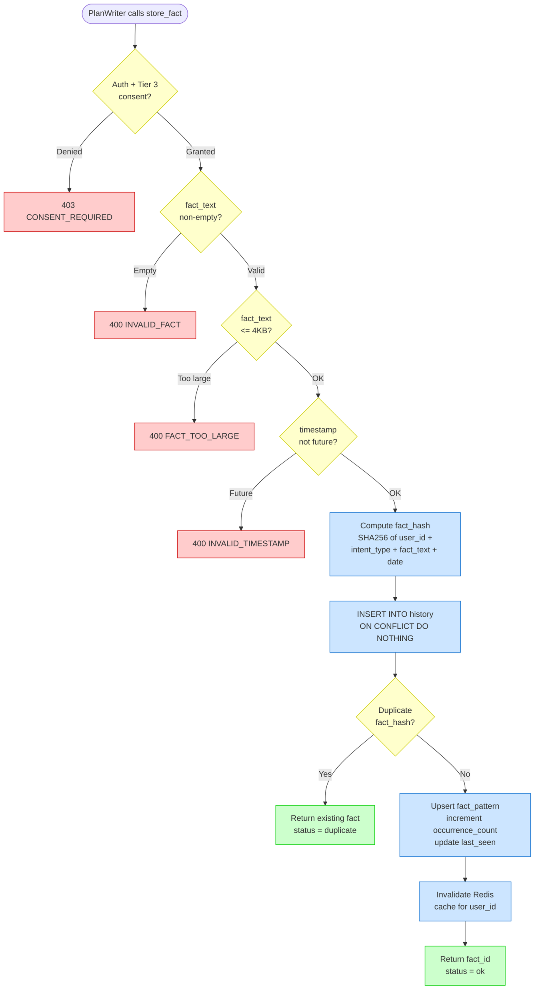
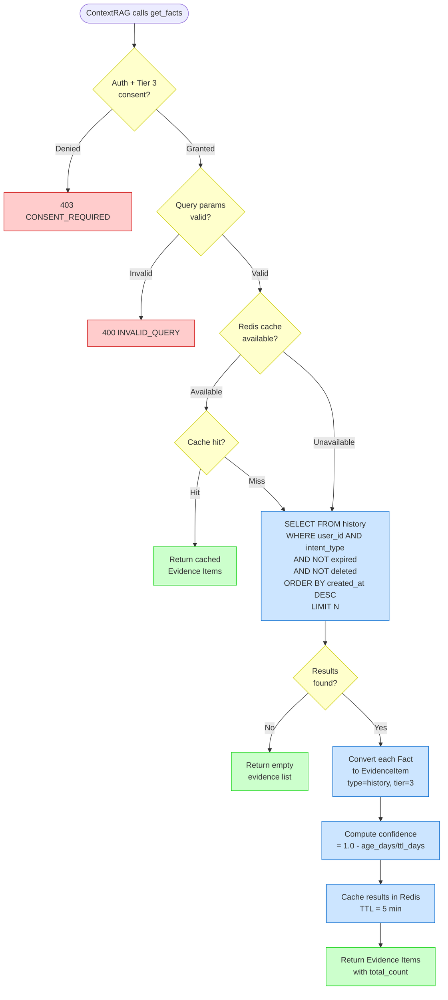
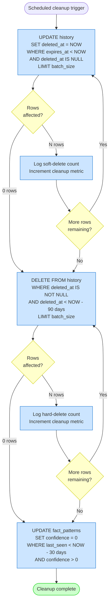
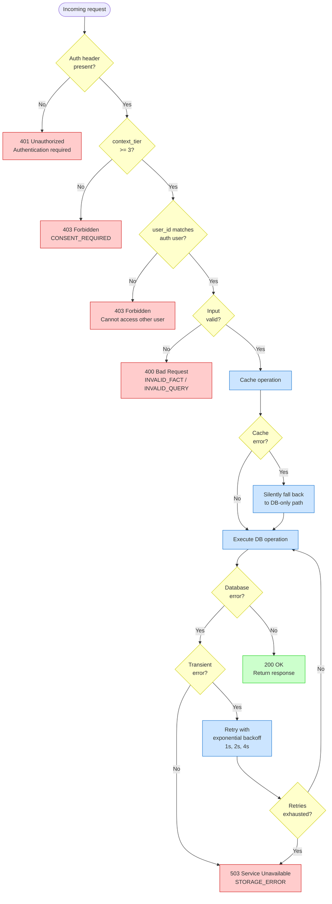

# History Component -- Flow Diagrams

## 1. Fact Storage Flow (PlanWriter -> History -> DB)

---

## 2. Fact Query Flow (ContextRAG -> History -> Evidence Items)

---

## 3. Pattern Detection Flow

```mermaid
graph TD
    subgraph On-Write Path
        NewFact([New fact stored])
        ExtractKey[Extract pattern key<br/>intent_type + entity_key + day_of_week]
        LookupPattern{Existing pattern<br/>for this key?}

        CreatePattern[INSERT fact_pattern<br/>occurrence_count = 1<br/>confidence = 0.2]

        IncrementPattern[UPDATE fact_pattern<br/>SET occurrence_count += 1<br/>last_seen = NOW]

        ComputeConfidence[confidence =<br/>min 1.0, count / 5]

        PatternDone([Pattern updated])
    end

    subgraph On-Read Path
        QueryRequest([Pattern query request])
        AuthGate{Tier 3<br/>consent?}
        Denied[403 CONSENT_REQUIRED]
        QueryPatterns[SELECT FROM fact_patterns<br/>WHERE user_id AND intent_type<br/>AND confidence >= min_confidence]
        FilterStale[Exclude patterns with<br/>last_seen > 30 days ago]
        ReturnPatterns([Return FactPattern list])
    end

    %% On-Write connections
    NewFact --> ExtractKey
    ExtractKey --> LookupPattern
    LookupPattern -->|No| CreatePattern
    LookupPattern -->|Yes| IncrementPattern
    CreatePattern --> ComputeConfidence
    IncrementPattern --> ComputeConfidence
    ComputeConfidence --> PatternDone

    %% On-Read connections
    QueryRequest --> AuthGate
    AuthGate -->|Denied| Denied
    AuthGate -->|Granted| QueryPatterns
    QueryPatterns --> FilterStale
    FilterStale --> ReturnPatterns

    %% Styling
    classDef errorNode fill:#ffcccc,stroke:#cc0000
    classDef successNode fill:#ccffcc,stroke:#00cc00
    classDef decisionNode fill:#ffffcc,stroke:#cccc00
    classDef processNode fill:#cce5ff,stroke:#0066cc

    class Denied errorNode
    class PatternDone,ReturnPatterns successNode
    class LookupPattern,AuthGate decisionNode
    class ExtractKey,CreatePattern,IncrementPattern,ComputeConfidence,QueryPatterns,FilterStale processNode
```

---

## 4. TTL Cleanup Flow

---

## 5. Error Handling Paths

