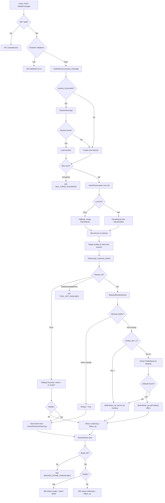
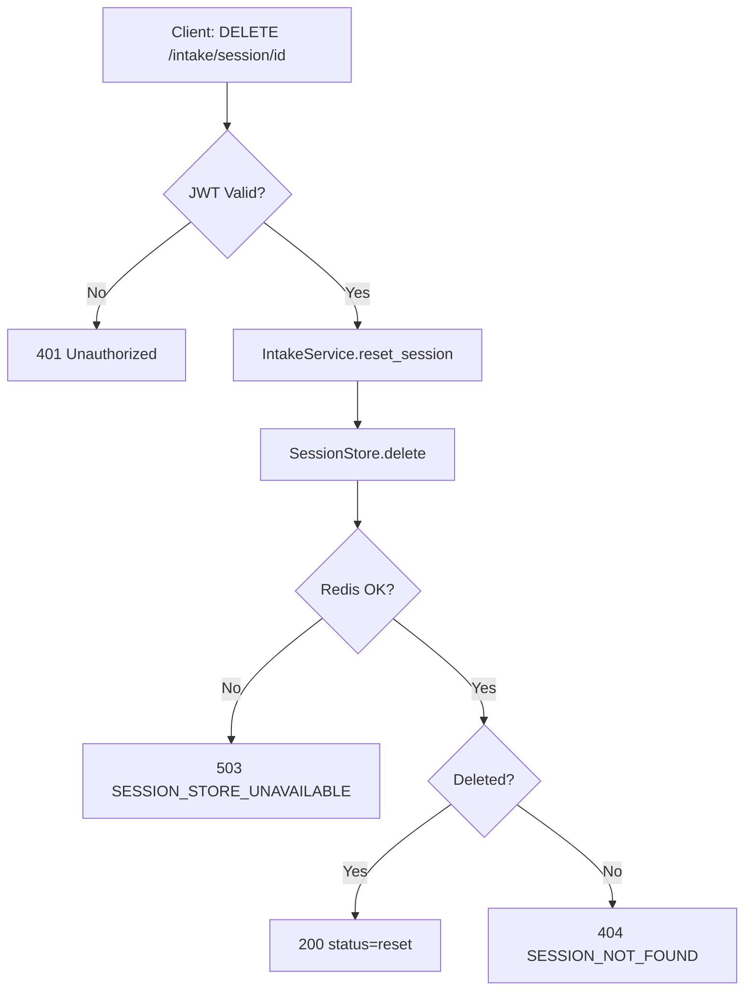
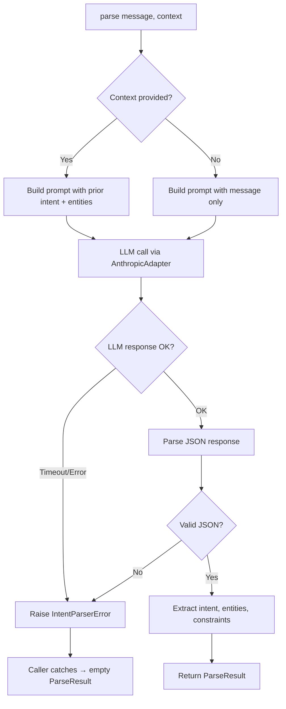
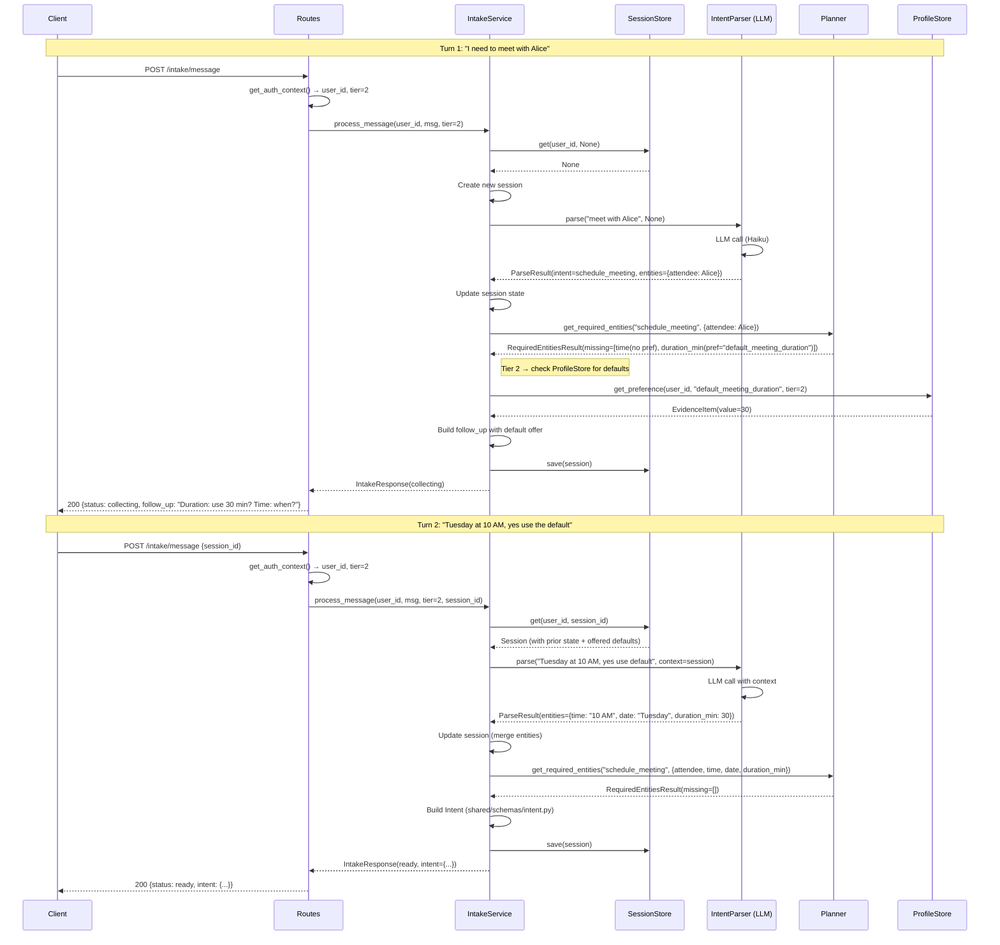

# Intake — Flow Diagrams

## 1. Message Processing Flow (Main)



## 2. Session Reset Flow



## 3. Intent Parser Flow (LLMBasedParser)



## 4. Readiness Check Flow (via Planner)

```mermaid
flowchart TD
    A[Check readiness after parse] --> B{Intent detected?}
    B -- No --> C[Return collecting: "What would you like help with?"]
    B -- Yes --> D[Call Planner.get_required_entities]

    D --> E{Planner available?}
    E -- No --> F[Fallback: intent + ≥1 entity → ready]
    E -- ToolNotAvailableError --> E1[422: No tool for this intent]
    E -- Yes --> G[Get RequiredEntitiesResult]

    G --> H{Missing entities?}
    H -- None --> I[Return ready = True]
    H -- Has missing --> J{User consent tier?}

    J -- Tier 1 --> K[Ask user for all missing entities directly]
    J -- Tier 2+ --> L[Check ProfileStore for each missing entity with pref_key]

    L --> M{Defaults found?}
    M -- Some found --> N[Offer defaults: "Use X or specify different?"]
    M -- None found --> K

    N --> O[Return collecting with follow_up + default offers]
    K --> P[Return collecting with follow_up]

    F --> Q{Heuristic ready?}
    Q -- Yes --> I
    Q -- No --> R[Return collecting with generic prompt]
```

## 5. Multi-Turn Sequence (with Planner + ProfileStore)



## 6. Graceful Degradation Paths

```mermaid
flowchart TD
    subgraph Normal
        A[LLM Parse] --> B[Planner Query] --> C{Tier 2+?}
        C -- Yes --> D[ProfileStore Lookup]
        C -- No --> E[Ask User Directly]
        D --> F[Offer Defaults]
    end

    subgraph LLM Down
        A2[LLM Parse FAILS] --> A3[Empty ParseResult]
        A3 --> A4[Return collecting: generic prompt]
    end

    subgraph Planner Down
        B2[Planner Query FAILS] --> B3[Heuristic: intent + ≥1 entity]
        B3 --> B4{Heuristic ready?}
        B4 -- Yes --> B5[Build Intent]
        B4 -- No --> B6[Return collecting: generic prompt]
    end

    subgraph Tool Not Available
        T1[Planner: ToolNotAvailableError] --> T2[422 TOOL_NOT_AVAILABLE]
        T2 --> T3[User informed: intent cannot be fulfilled]
    end

    subgraph ProfileStore Down
        D2[ProfileStore FAILS] --> D3[Skip defaults]
        D3 --> D4[Ask user for all missing directly]
    end

    subgraph Redis Down
        R1[Redis FAILS] --> R2[503 SESSION_STORE_UNAVAILABLE]
    end
```


