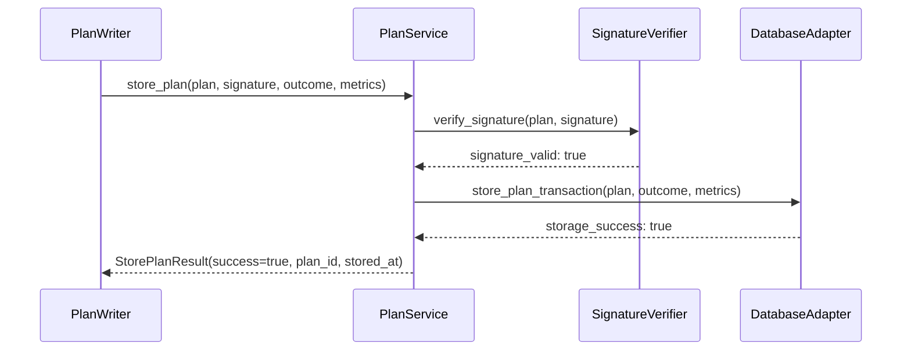
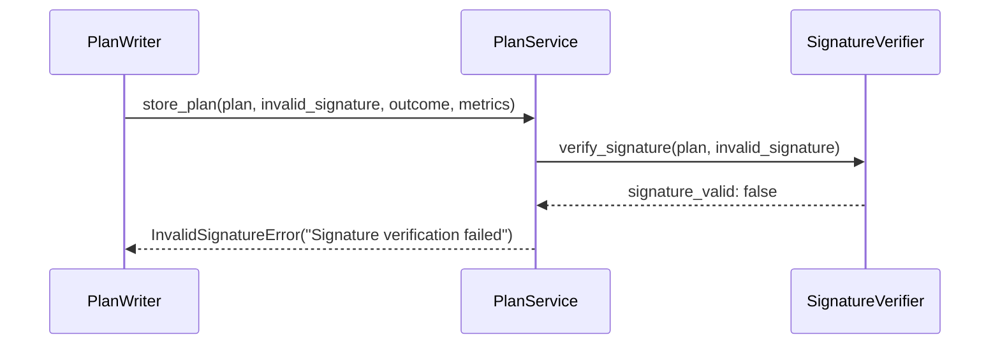

# PlanLibrary — Low-Level Design (LLD)

**Component**: PlanLibrary (Memory Layer)  
**Version**: 1.0  
**Status**: Ready for Implementation  
**Conforms to**: GLOBAL_SPEC.md v2, Project_HLD.md v4.0, MODULAR_ARCHITECTURE.md v1.0  

---

## Purpose & Scope

### Component Purpose
PlanLibrary is a Memory Layer component that stores executed plans with their outcomes and performance metrics, enabling system learning and optimization through plan pattern analysis and reuse. The component supports:

- **Plan Storage**: Immutable storage of executed plans with signature verification
- **Outcome Tracking**: Success rates and failure pattern analysis
- **Evidence Item Generation**: Integration with ContextRAG for plan pattern context
- **Performance Analytics**: Execution metrics for system optimization

> **Note**: Semantic similarity search (embeddings) is handled by the VectorIndex component (hybrid BM25 + semantic via pgvector, ONNX Runtime). PlanLibrary provides structured queries only (by intent_type, plan_id, success rate).

### Layer Placement
**Memory Layer** - Direct database interactions with no business logic orchestration. This component provides data persistence and retrieval services to upper layers without implementing preview/execute patterns (internal component).

### Blast Radius Analysis
**Contained Impact**: PlanLibrary failure affects:
- Plan pattern learning (degraded optimization)
- Historical success rate queries (fallback to basic heuristics)
- New plan storage (temporary loss of audit trail)

**System Resilience**: Does NOT affect:
- Active plan execution (ExecuteOrchestrator operates independently)
- Real-time planning (Planner has fallback modes)
- User-facing operations (component is internal-only)

---

## Conformance

This component conforms to:
- **GLOBAL_SPEC.md v2**: Evidence Item format, NFR requirements (plan retrieval <200ms p95)
- **MODULAR_ARCHITECTURE.md**: Memory Layer patterns with database isolation and component boundaries
- **Constitution.md v1.0.0**: Component-first architecture, test-driven development, DRY principles

---

## Architecture Overview

### High-Level Structure
```
┌─────────────────────────────────────────────────────┐
│                 PlanLibrary                         │
│                (Memory Layer)                       │
├─────────────────────────────────────────────────────┤
│ API Layer                                           │
│  ├── /plans (storage + query endpoints)             │
│  └── /health (health checks)                        │
├─────────────────────────────────────────────────────┤
│ Service Layer                                       │
│  ├── PlanService (storage, canonicalization)        │
│  ├── AnalyticsService (success rates, patterns)     │
│  └── EvidenceService (Evidence Item conversion)     │
├─────────────────────────────────────────────────────┤
│ Adapter Layer                                       │
│  ├── DatabaseAdapter (SQLAlchemy async)             │
│  └── SignatureVerifier (Ed25519)                    │
├─────────────────────────────────────────────────────┤
│ Data Layer                                          │
│  └── PostgreSQL 16                                  │
└─────────────────────────────────────────────────────┘
```

### Component Boundaries and Isolation Strategy
- **Database Ownership**: Exclusive ownership of `plans`, `plan_outcomes`, `plan_metrics` tables
- **External Dependencies**: None (pure database component)
- **Component Dependencies**: None (foundation Memory Layer component)
- **Failure Isolation**: Database connection pooling and retry logic

---

## Interfaces

### API Handlers (Thin Wrappers)

#### Plan Storage Endpoint
```python
# api/routes.py
@router.post("/plans", response_model=StorePlanResponse)
async def store_plan_endpoint(
    request: StorePlanRequest,
    plan_service: PlanService = Depends(get_plan_service)
) -> StorePlanResponse:
    """Store executed plan with outcome and metrics"""
    return await plan_service.store_plan(
        plan=request.plan,
        signature=request.signature,
        outcome=request.outcome,
        metrics=request.metrics
    )
```

### Service Layer Signatures

#### PlanService Interface
```python
# service/plan_service.py
class PlanService:
    async def store_plan(
        self,
        plan: Plan,
        signature: Signature,
        outcome: PlanOutcome,
        metrics: PlanMetrics
    ) -> StorePlanResult:
        """Store plan with signature verification"""
        
    async def get_plans_by_intent(
        self,
        intent_type: str,
        success_threshold: float = 0.7,
        limit: int = 50
    ) -> List[PlanPattern]:
        """Query plans by intent type with success filtering"""
        
    async def get_plan_by_id(
        self, 
        plan_id: str
    ) -> Optional[Plan]:
        """Retrieve specific plan by ID"""
```

#### AnalyticsService Interface
```python
# service/analytics_service.py  
class AnalyticsService:
    async def calculate_success_rates(
        self,
        timeframe_days: int = 30
    ) -> Dict[str, float]:
        """Calculate intent-based success rates"""
        
    async def get_performance_trends(
        self,
        intent_type: Optional[str] = None
    ) -> PerformanceTrends:
        """Analyze execution performance trends"""
```

---

## Data Model

### Core Entities

#### Plan Entity
```python
class Plan(BaseModel):
    plan_id: str = Field(..., pattern=r'^[0-9A-HJKMNP-TV-Z]{26}$')
    canonical_json: Dict[str, Any]
    signature_data: Dict[str, Any]
    intent_type: str
    step_count: int
    created_at: datetime
    stored_at: datetime = Field(default_factory=datetime.utcnow)
    plan_hash: str  # SHA256 of canonical JSON
    size_bytes: int
```

#### PlanOutcome Entity
```python
class PlanOutcome(BaseModel):
    outcome_id: UUID = Field(default_factory=uuid4)
    plan_id: str
    success: bool
    error_type: Optional[str] = None
    error_details: Optional[Dict[str, Any]] = None
    execution_start: datetime
    execution_end: datetime
    total_steps: int
    failed_step: Optional[int] = None
    context_data: Optional[Dict[str, Any]] = None
```

### Schema References
- **Plan Storage Schema**: `components/PlanLibrary/schemas/plan_storage.schema.json`
- **Evidence Item Schema**: `shared/schemas/evidence.py` (imported)
- **Signature Schema**: `shared/schemas/signature.py` (imported)

---

## Adapters

### Database Adapter
```python
# adapters/db.py
class DatabaseAdapter:
    def __init__(self):
        self.shared_db = get_database_adapter()  # Uses shared infrastructure
        
    @with_db_error_handling
    @with_retry_on_connection_error
    async def store_plan_transaction(
        self,
        plan: Plan,
        outcome: PlanOutcome,
        metrics: PlanMetrics
    ) -> bool:
        """Store plan data in single transaction"""
        async with self.shared_db.get_session() as session:
            # Atomic storage of all plan-related data
```

### Shared Infrastructure Usage

#### Database Integration
- **Uses**: `shared/database/adapter.py` for connection management
- **Error Handling**: `@with_db_error_handling` decorator from `shared/database/error_handler.py`
- **Models**: Imports base User model from `shared/database/models.py`

#### API Error Handling
- **Uses**: `ErrorHandlerMixin` from `shared/api/error_handlers.py`
- **Authentication**: Component-level auth from `shared/api/auth.py`

---

## Sequences

### Happy Path: Plan Storage Flow


### Error Path: Signature Verification Failure


### Retry/Backoff Strategies
- **Database Errors**: 3 retries with exponential backoff (1s, 2s, 4s)

---

## Dependencies & External Integrations

### Python Packages
| Package | Version | Justification |
|---------|---------|---------------|
| `sqlalchemy` | `>=2.0,<3.0` | Async ORM for PostgreSQL integration |
| `asyncpg` | `>=0.28.0` | High-performance PostgreSQL adapter |
| `pydantic` | `>=2.0,<3.0` | Data validation and schema compliance |
| `fastapi` | `>=0.104.0` | API framework with async support |
| `cryptography` | `>=41.0.0` | Ed25519 signature verification |
| `ulid-py` | `>=1.1.0` | ULID validation and generation |

### External APIs/Services
- **PostgreSQL 16**: Primary data store with 99.9% availability target
### Internal Infrastructure Dependencies
- **Shared Database**: Connection pooling and error handling
- **Shared API**: Authentication and error response patterns
- **Shared Schemas**: Evidence Item and signature formats

### Component Dependencies
**None** - PlanLibrary is a foundation Memory Layer component with no upstream component dependencies.

### Development and Testing Dependencies
- `pytest>=7.4.0`, `pytest-asyncio>=0.21.0` for async testing
- `httpx>=0.24.0` for API testing
- `pytest-benchmark>=4.0.0` for performance testing

---

## Observability & Safety

### Structured Logging
```python
# All log entries include correlation metadata
logger.info(
    "Plan stored successfully",
    extra={
        "plan_id": plan_id,
        "intent_type": intent_type,
        "step_count": step_count,
        "storage_latency_ms": latency,
        "component": "PlanLibrary"
    }
)
```

### No PII in Logs
- Plan content logged as sanitized summaries only
- User IDs referenced by hash when necessary
- Error details logged without sensitive context data

### Error Classes
```python
class PlanLibraryError(Exception):
    """Base exception for PlanLibrary operations"""
    
class InvalidSignatureError(PlanLibraryError):
    """Raised when plan signature verification fails"""
    
class DuplicatePlanError(PlanLibraryError):
    """Raised when attempting to store duplicate plan ID"""
    
class PlanTooLargeError(PlanLibraryError):
    """Raised when plan exceeds size limits (1MB, 100 steps)"""
    
```

### HITL Gates
Not applicable - PlanLibrary is an internal component with no user-facing operations.

---

## Non-Functional Requirements

### Performance Tables

#### Local Development Environment
| Operation | Target p95 Latency | Expected Throughput |
|-----------|-------------------|-------------------|
| Plan Storage | < 200ms | 50 plans/minute |
| Intent-based Query | < 150ms | 200 queries/minute |

#### Cloud Production Environment
| Operation | Target p95 Latency | Expected Throughput |
|-----------|-------------------|-------------------|
| Plan Storage | < 200ms | 1000 plans/minute |
| Intent-based Query | < 150ms | 5000 queries/minute |

### Availability Targets
- **Local**: Best-effort availability with graceful degradation
- **Cloud**: 99.5% availability for storage operations, 99.9% for query operations

### Throughput Requirements
- **Single-user**: 10-50 plan operations per day
- **Multi-user**: Support for 100+ concurrent plan storage operations

### Scalability Targets
- **Local Deployment**: 10,000 plans
- **Cloud Deployment**: 1M+ plans with archival strategy
- **Enterprise**: Horizontal scaling with read replicas

### Testing Strategy
- **Unit Tests**: 95% coverage with async test patterns
- **Integration Tests**: Full database and API testing
- **Contract Tests**: Evidence Item schema compliance
- **Performance Tests**: Latency and throughput benchmarks

---

## Architectural Considerations

### Blast Radius Containment
**If PlanLibrary fails:**
- Plan execution continues normally (component is audit-only)
- New plans execute without historical context
- ContextRAG falls back to other Evidence sources
- System learning temporarily disabled

### Fault Isolation Strategy
- **Database Resilience**: Connection pooling and retry logic
- **No external API dependencies**: PlanLibrary is a pure database component


### Cross-Component Interactions
**PlanLibrary is called by:**
- **PlanWriter**: Stores executed plans (downstream dependency)
- **ContextRAG**: Queries for plan patterns (downstream dependency)  
- **Planner**: Retrieves successful plan templates (downstream dependency)

**PlanLibrary does NOT call other components** (foundation layer)

### Determinism Guarantees
- **Plan Storage**: Deterministic canonicalization ensures same inputs → same storage
- **Signature Verification**: Cryptographic integrity guarantees
- **Query Results**: Consistent ordering by success_rate DESC, total_executions DESC

### State Management
- **Stateless Service**: No persistent in-memory state
- **Database Persistence**: All state stored in PostgreSQL

---

## Architecture Decision Records

### Relevant ADRs Impacting Design
- **ADR-0001 Component-first**: Self-contained packet structure with `components/PlanLibrary/` layout
- References architectural decisions from established patterns in project ADR repository

### Component Design Adherence
- **Memory Layer Patterns**: Direct database access without orchestration logic
- **DRY Architecture**: Uses shared infrastructure for database, auth, and error handling
- **Test-First Development**: Comprehensive test coverage with TDD methodology

### New Decisions Requiring ADR Creation
- **VectorIndex Active**: Embedding/similarity search handled by VectorIndex component (hybrid BM25 + semantic via pgvector, ONNX Runtime)

---

## Risks & Open Questions

### High-Priority Risks

#### 1. Database Performance Scaling
**Risk**: Structured queries degrade with large plan datasets
**Mitigation**:
- Proper indexing on intent_type, plan_id, created_at
- Database archival strategy (2-year active window)
- Connection pooling and query optimization

#### 2. Storage Growth Management
**Risk**: Unlimited plan storage affects performance and costs
**Mitigation**:
- Plan size limits (1MB max, 100 steps max)
- Archival strategy with cold storage migration
- Monitoring and alerting on storage growth
- Data compression for archived plans

### Medium-Priority Risks

#### 3. Concurrent Access Conflicts
**Risk**: Race conditions in plan storage and queries
**Mitigation**:
- Database transaction isolation
- Optimistic locking for updates
- Connection pooling with proper limits
- Async operation patterns

### Open Questions
1. **Archival Strategy Details**: Specific retention periods and migration triggers for different plan types
2. **Cross-Environment Consistency**: Plan compatibility between local and cloud deployments
3. **Performance Monitoring**: Specific alerting thresholds for production operation metrics

---

**Next Steps**: Implementation according to 5-phase development roadmap in generated implementation plan, starting with Phase 1 (Foundation) database schema and core infrastructure setup.