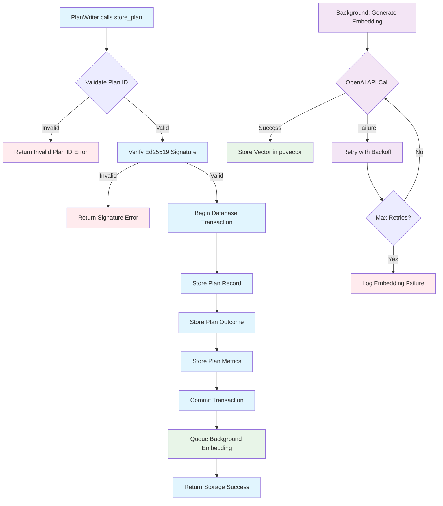
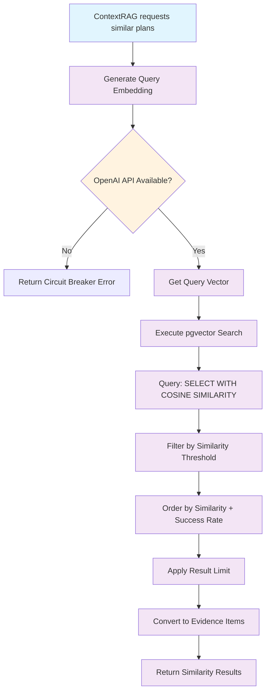
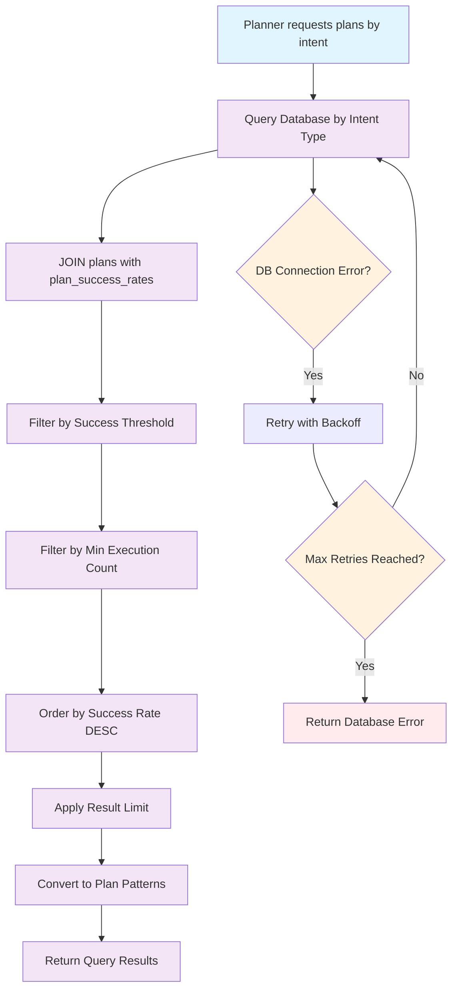
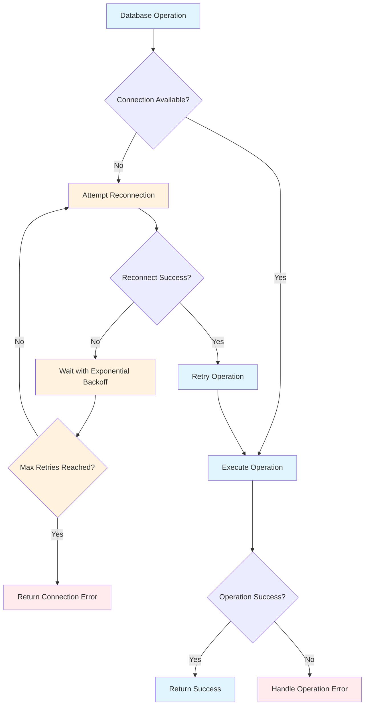
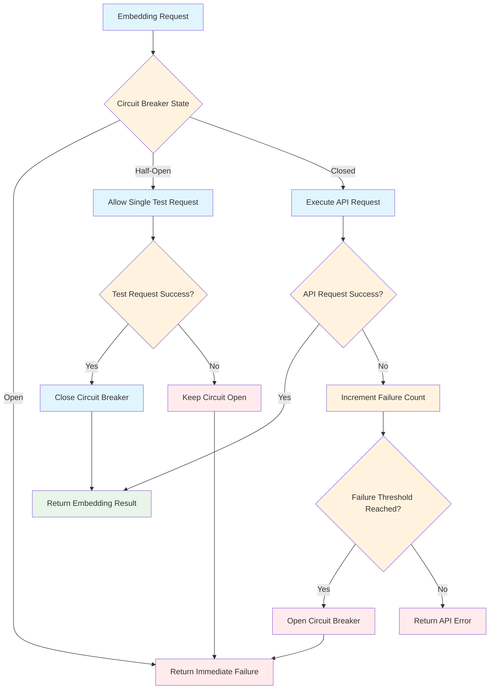
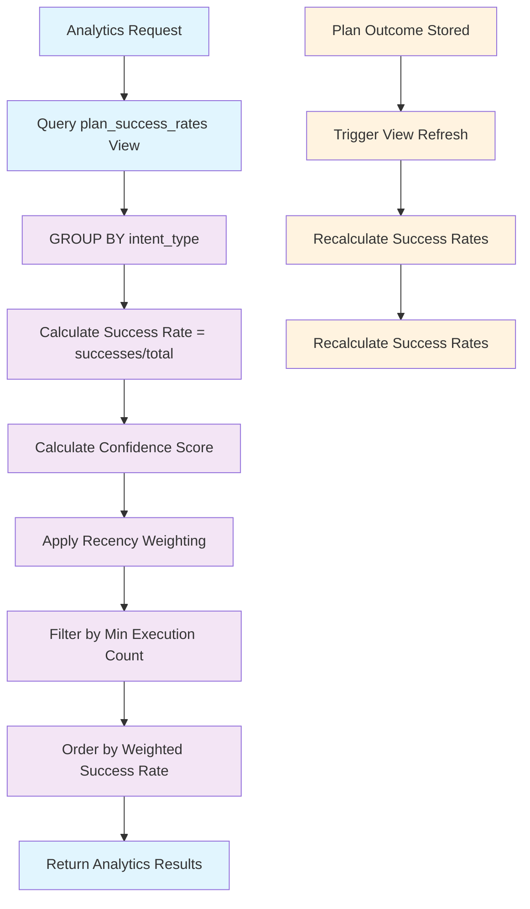
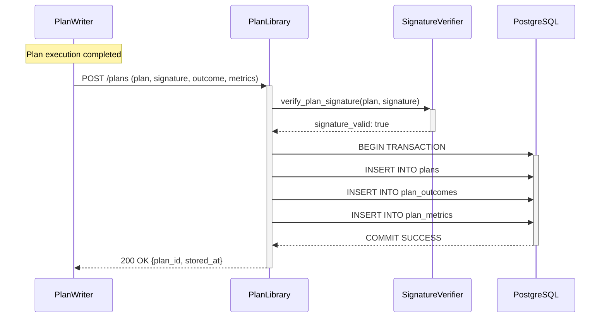
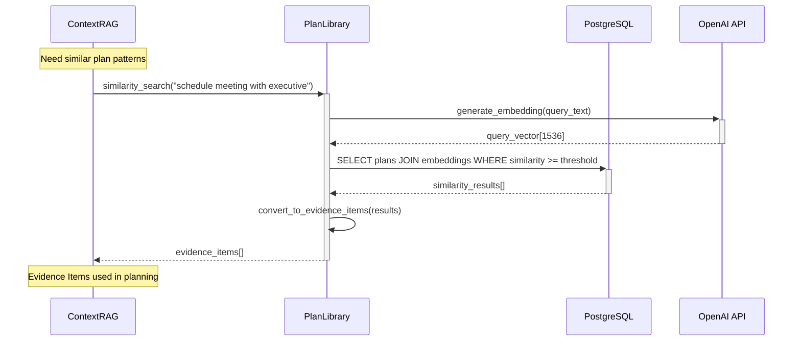

# PlanLibrary Flow Diagrams

This document contains the flow diagrams for PlanLibrary component operations.

## Plan Storage Flow (Happy Path)

## Vector Similarity Search Flow

## Intent-Based Query Flow

## Error Handling Flows

### Database Connection Failure

### OpenAI API Circuit Breaker

## Analytics Flow

### Success Rate Calculation

## Component Integration Flow

### PlanWriter → PlanLibrary Integration

### ContextRAG → PlanLibrary Query

---

## Flow Diagram Legend

- **Blue boxes**: Normal operations and entry points
- **Orange diamonds**: Decision points and conditions
- **Purple boxes**: Data processing and transformations
- **Green boxes**: Successful outcomes and storage operations
- **Red boxes**: Error conditions and failures

## Performance Annotations

- **Plan Storage Flow**: Target <200ms p95 latency
- **Vector Search Flow**: Target <100ms p95 latency  
- **Intent Query Flow**: Target <150ms p95 latency
- **Background Embedding**: Async, up to 2s for OpenAI API call