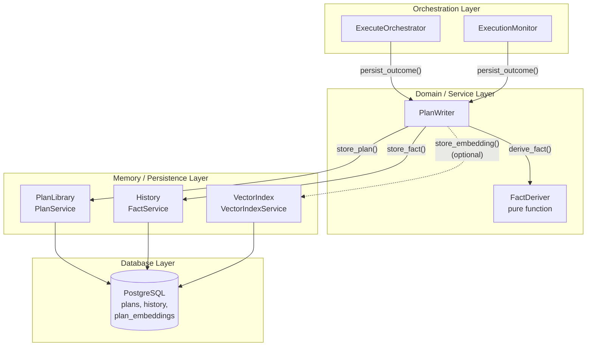
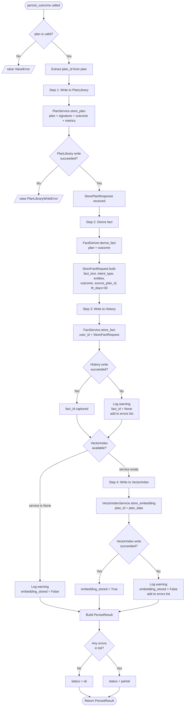
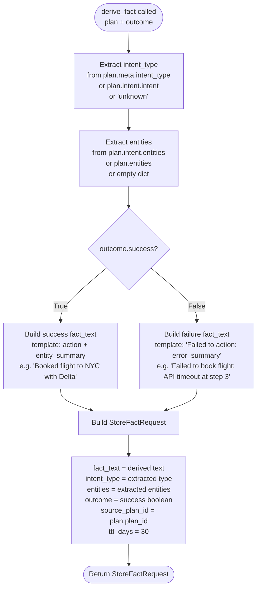
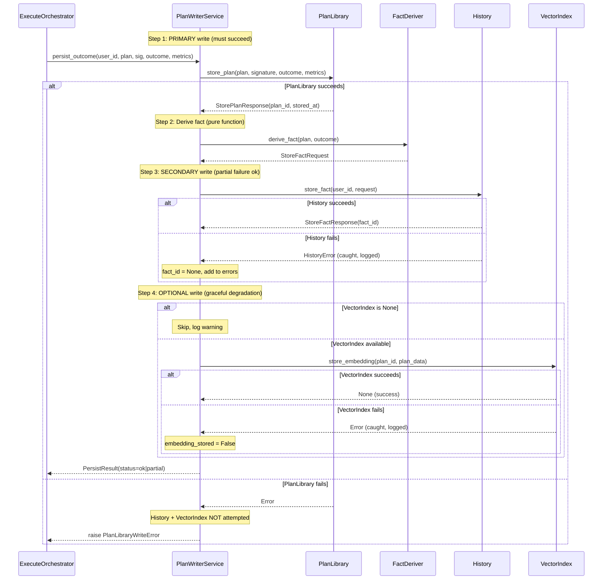
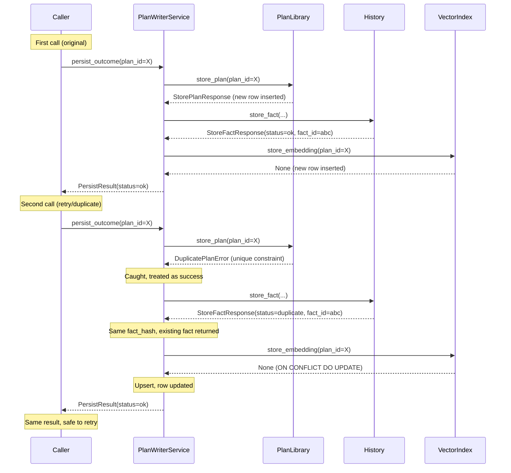
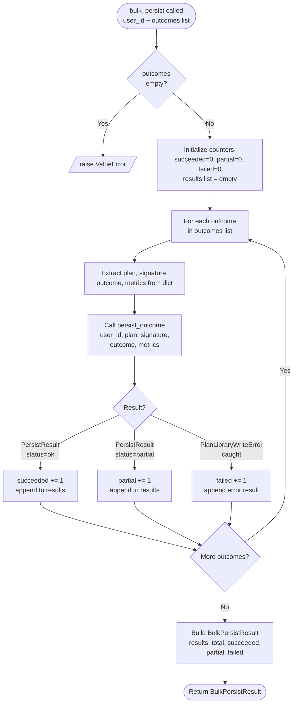
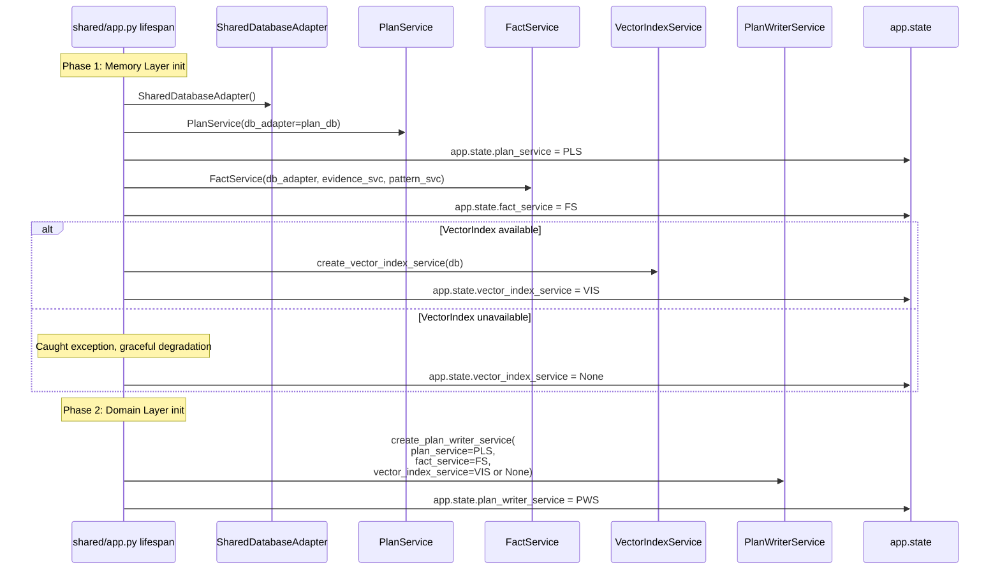
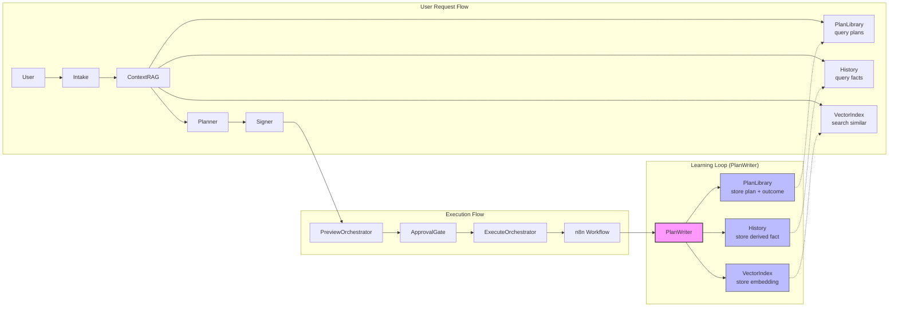
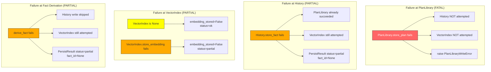

# PlanWriter -- Flow Diagrams

**Component**: `components/PlanWriter/`
**Reference**: `components/PlanWriter/LLD.md`
**Created**: 2026-03-19

---

## 1. Component Context Diagram

Shows PlanWriter's position in the system: upstream consumers and downstream dependencies.



---

## 2. persist_outcome() -- Happy Path Flow

Complete successful execution of `persist_outcome()` with all three downstream writes succeeding.



---

## 3. persist_outcome() -- Error Handling Decision Tree

Shows the fault isolation and error propagation logic.

```mermaid
flowchart TD
    START([persist_outcome]) --> V{Validate<br/>input}
    V -- invalid --> VE[/raise ValueError/]
    V -- valid --> PL

    PL[PlanLibrary.store_plan] --> PLR{Result?}
    PLR -- success --> FACT
    PLR -- DuplicatePlanError --> DUP[Treat as success<br/>plan already stored]
    PLR -- other error --> FATAL[/raise PlanLibraryWriteError/<br/>History + VectorIndex<br/>NOT attempted]
    DUP --> FACT

    FACT[derive_fact] --> FACTR{Result?}
    FACTR -- success --> HIST
    FACTR -- error --> FACTFAIL[Log error<br/>skip History write<br/>add to errors]
    FACTFAIL --> VI

    HIST[FactService.store_fact] --> HISTR{Result?}
    HISTR -- ok/duplicate --> HISTOK[fact_id captured]
    HISTR -- error --> HISTFAIL[Log warning<br/>fact_id = None<br/>add to errors]
    HISTOK --> VI
    HISTFAIL --> VI

    VI{VectorIndex<br/>service?}
    VI -- None --> SKIP[Skip embedding<br/>embedding_stored = False]
    VI -- exists --> VSTORE[VectorIndexService.store_embedding]
    VSTORE --> VSTORER{Result?}
    VSTORER -- success --> VIOK[embedding_stored = True]
    VSTORER -- error --> VIFAIL[Log warning<br/>embedding_stored = False<br/>add to errors]

    SKIP --> BUILD
    VIOK --> BUILD
    VIFAIL --> BUILD

    BUILD[Build PersistResult] --> STATUS{errors list<br/>empty?}
    STATUS -- yes --> OK[status = ok]
    STATUS -- no --> PARTIAL[status = partial]
    OK --> RET([Return PersistResult])
    PARTIAL --> RET
```

---

## 4. Fact Derivation Flow

Shows how `derive_fact()` transforms plan + outcome into a `StoreFactRequest`.



---

## 5. Write Ordering and Dependency

Shows why writes must happen in a specific order and what happens on failure at each step.



---

## 6. Idempotency Flow

Shows how duplicate `persist_outcome()` calls are handled safely.



---

## 7. bulk_persist() Flow

Shows how bulk persistence processes multiple outcomes.



---

## 8. DI Wiring Diagram

Shows how PlanWriterService is initialized and wired during application startup.



---

## 9. System-Level Data Flow

Shows PlanWriter's role in the end-to-end flow from user request to learning loop closure.



---

## 10. Failure Modes Summary


