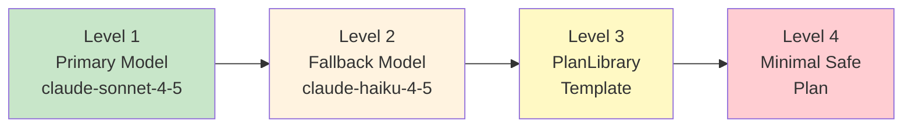

# Planner — Flow Diagrams

## 1. Main Generation Flow (Happy Path + Fallback Hierarchy)

```mermaid
flowchart TD
    A[Caller: generate_plan&#40;intent&#41;] --> B[ContextRAG.gather_evidence&#40;intent&#41;]
    B --> C{ContextResult empty?}
    C -- No --> D[PluginRegistry.list_catalog&#40;&#41;]
    C -- Yes --> D2[Set context_degraded=true]
    D2 --> D

    D --> E[PromptBuilder.build&#40;intent, evidence, catalog&#41;]
    E --> F{Primary circuit breaker state?}

    F -- CLOSED / HALF_OPEN --> G[Primary LLM call<br/>&#40;claude-sonnet-4-5, temp=0&#41;]
    F -- OPEN --> H[Skip to fallback]

    G -- Success --> I[Validate 3-layer pipeline]
    G -- Failure --> J[Record failure in primary CB]
    J --> H

    H --> K{Fallback circuit breaker state?}
    K -- CLOSED / HALF_OPEN --> L[Fallback LLM call<br/>&#40;claude-haiku-4-5, temp=0&#41;]
    K -- OPEN --> M[Skip to PlanLibrary]

    L -- Success --> I
    L -- Failure --> N[Record failure in fallback CB]
    N --> M

    M --> O[PlanLibrary.get_plans_by_intent&#40;&#41;]
    O --> P{Templates found?}
    P -- Yes --> Q[Instantiate best template<br/>&#40;Level 3&#41;]
    P -- No --> R[Generate minimal safe plan<br/>&#40;Level 4&#41;]

    Q --> I
    R --> I

    I --> S{Validation passed?}
    S -- Yes --> T[Compute canonical hash<br/>&#40;SHA-256&#41;]
    S -- No --> U[Retry with error feedback<br/>&#40;once&#41;]
    U --> V{Retry succeeded?}
    V -- Yes --> T
    V -- No --> W[Raise PlanValidationError]

    T --> X[Signer.sign_plan&#40;plan_dict&#41;]
    X --> Y[Return PlannerResult<br/>&#40;plan + signature + metadata&#41;]

    style A fill:#e1f5fe
    style Y fill:#c8e6c9
    style W fill:#ffcdd2
    style G fill:#fff3e0
    style L fill:#fff3e0
    style Q fill:#fff9c4
    style R fill:#fff9c4
```

## 2. 3-Layer Validation Pipeline

```mermaid
flowchart TD
    A[Raw LLM output<br/>&#40;string&#41;] --> B[Layer 1: JSON Parse]
    B -- Valid JSON --> C[Layer 2: Pydantic Validation<br/>Plan.model_validate&#40;&#41;]
    B -- Parse error --> E1[PlanValidationError<br/>layer=json_parse]

    C -- Valid schema --> D[Layer 3: Business Rules]
    C -- Schema error --> E2[PlanValidationError<br/>layer=schema]

    D --> D1{Steps 1..N sequential?}
    D1 -- Yes --> D2{All tool_ids in catalog?}
    D1 -- No --> E3[PlanValidationError<br/>rule=step_numbering]

    D2 -- Yes --> D3{graph acyclic?<br/>&#40;after refs valid&#41;}
    D2 -- No --> E4[PlanValidationError<br/>rule=unknown_tool]

    D3 -- Yes --> D4{MAX_STEPS ≤ 50?}
    D3 -- No --> E5[PlanValidationError<br/>rule=cyclic_graph]

    D4 -- Yes --> D5{MAX_PARALLEL ≤ 10?}
    D4 -- No --> E6[PlanValidationError<br/>rule=max_steps]

    D5 -- Yes --> D6{Booker steps have<br/>gate_id?}
    D5 -- No --> E7[PlanValidationError<br/>rule=max_parallel]

    D6 -- Yes --> F[Validation PASSED<br/>Return Plan]
    D6 -- No --> E8[PlanValidationError<br/>rule=missing_gate]

    style A fill:#e1f5fe
    style F fill:#c8e6c9
    style E1 fill:#ffcdd2
    style E2 fill:#ffcdd2
    style E3 fill:#ffcdd2
    style E4 fill:#ffcdd2
    style E5 fill:#ffcdd2
    style E6 fill:#ffcdd2
    style E7 fill:#ffcdd2
    style E8 fill:#ffcdd2
```

## 3. Circuit Breaker State Machine

```mermaid
stateDiagram-v2
    [*] --> CLOSED

    CLOSED --> CLOSED: Success &#40;reset counter&#41;
    CLOSED --> OPEN: failure_count >= 5

    OPEN --> OPEN: Request arrives &#40;fail fast&#41;
    OPEN --> HALF_OPEN: timeout_s elapsed &#40;60s&#41;

    HALF_OPEN --> CLOSED: success_count >= 2
    HALF_OPEN --> OPEN: Any failure
```

## 4. Fallback Hierarchy Levels

## 5. Error Handling Flow

```mermaid
flowchart TD
    A[generate_plan&#40;intent&#41;] --> B{ContextRAG<br/>available?}
    B -- Yes --> C[gather_evidence]
    B -- No --> C2[empty ContextResult<br/>context_degraded=true]
    C --> D{PluginRegistry<br/>available?}
    C2 --> D

    D -- Yes --> E[list_catalog]
    D -- Error --> E2[empty catalog<br/>→ Level 4 minimal plan]

    E --> F[LLM generation<br/>&#40;with fallbacks&#41;]
    E2 --> G[Build minimal plan]

    F --> H{Validation<br/>passed?}
    H -- Yes --> I[Sign plan]
    H -- No + retries left --> J[Retry with<br/>error feedback]
    H -- No + no retries --> K[PlanValidationError]
    J --> H

    I --> L{Signer<br/>available?}
    L -- Yes --> M[Return PlannerResult]
    L -- Key missing --> N[SigningKeyNotConfiguredError<br/>&#40;fatal — startup failure&#41;]

    G --> I

    style M fill:#c8e6c9
    style K fill:#ffcdd2
    style N fill:#ffcdd2
    style C2 fill:#fff9c4
    style E2 fill:#fff9c4
```

