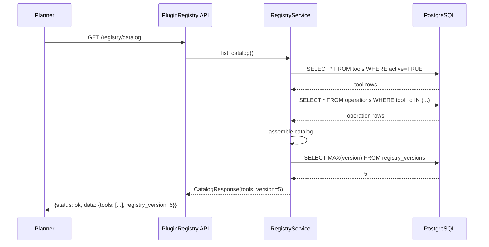
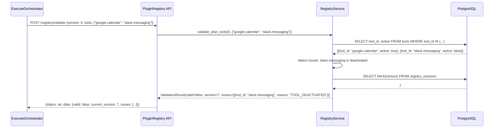
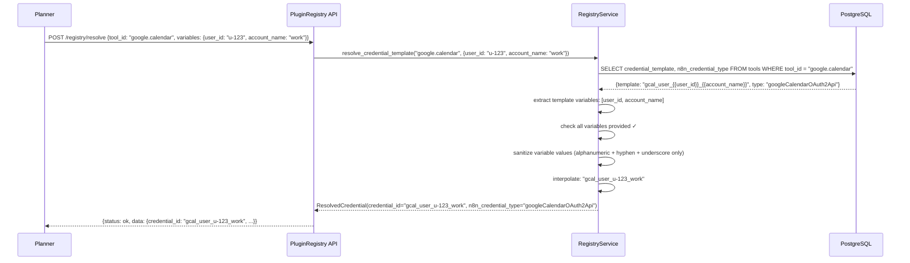
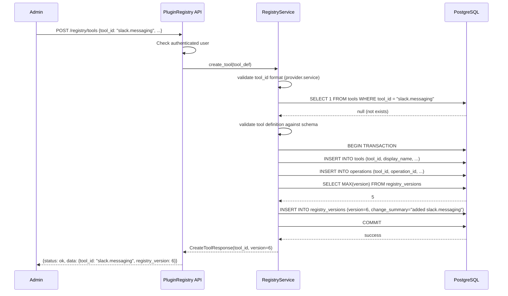

# Low-Level Design: PluginRegistry

**Component**: PluginRegistry
**Feature Branch**: `feat/pluginregistry`
**Created**: 2026-03-05
**Status**: Draft
**Conforms to**: GLOBAL_SPEC.md v2.2, Project_HLD.md v4.6

---

## 1. Purpose & Scope

### 1.1 Component Purpose

PluginRegistry is an **internal backend component** that serves as the **source of truth** for all available external tools (Google Calendar, Slack, email, etc.), their operations, credential ID templates, and n8n node bindings. It provides:

- A versioned catalog of tools and operations for Planner and WorkflowBuilder
- Credential ID template resolution (pure string interpolation, no secrets)
- Pre-execution validation to ensure plans reference only active tools
- Admin CRUD for managing the tool catalog

PluginRegistry is **NOT user-facing** — it does not handle Intents or participate in the Preview/Execute workflow. It is called directly by other components (Planner, WorkflowBuilder, PreviewOrchestrator, ExecuteOrchestrator) as a catalog service.

### 1.2 Responsibilities

**In Scope:**
- Store/retrieve tool definitions with operations and metadata
- Credential ID template resolution (pure string interpolation — `{{user_id}}`, `{{account_name}}`)
- Registry versioning (monotonically increasing integer)
- Pre-execution validation (verify referenced tools are still active)
- Admin CRUD for tools and operations (create, update, deactivate)
- Schema validation for all tool/operation definitions before persistence
- *(Post-MVP: Redis caching of catalog if query latency becomes an issue)*

**Out of Scope:**
- Credential storage or management (n8n Secrets Vault — GLOBAL_SPEC §8)
- Credential rotation or refresh (n8n credential manager)
- Tool execution (WorkflowBuilder + n8n)
- User-facing Preview/Execute model (internal component)
- Dynamic tool discovery from n8n (MVP uses static, admin-managed registry)
- Rate limiting or quota tracking (n8n + provider APIs)
- User-to-tool integration mapping (UserIntegrations table — SHARED_INFRASTRUCTURE §1.3)

### 1.3 Conformance to GLOBAL_SPEC

This component conforms to GLOBAL_SPEC.md v2.2 with the following **clarifications**:

- **Preview/Execute Model**: DOES NOT APPLY to PluginRegistry operations. The Preview/Execute model from GLOBAL_SPEC §1 applies to **plans** (Intent → Plan → Preview → Execute), not to internal component operations. PluginRegistry executes all operations directly.
- **Deterministic Planning**: PluginRegistry provides the **Registry vR** input for the Planner's deterministic tuple (GLOBAL_SPEC §2.0): `Plan = f(Intent vN, Evidence vK, Registry vR, Policy vC)`. The `registry_version` integer is included in plans and signed by Signer.
- **Credential Isolation (NON-NEGOTIABLE)**: PluginRegistry stores credential ID templates only — NEVER actual credential values, tokens, or secrets (GLOBAL_SPEC §8).
- **Safety Model**: PluginRegistry provides pre-execution validation to verify tool availability before plan execution. Tamper detection is handled by Signer (Ed25519 signature covers `registry_version`).

---

## 2. Architecture

### 2.1 Component Structure

```
components/PluginRegistry/
├── SPEC.md                              # Requirements (see specs/006-pluginregistry/spec.md)
├── LLD.md                               # This file
├── diagrams/
│   └── flow.md                          # Mermaid sequence diagrams
├── api/
│   ├── __init__.py
│   └── routes.py                        # FastAPI endpoints (CRUD, catalog, validation)
├── service/
│   ├── __init__.py
│   └── registry_service.py             # Business logic (tool mgmt, versioning, template resolution)
├── domain/
│   ├── __init__.py
│   └── models.py                        # Pydantic models (Tool, Operation, RegistryVersion)
├── adapters/
│   ├── __init__.py
│   ├── db.py                            # SQLAlchemy async adapter (tools, operations, registry_versions)
├── schemas/
│   ├── tool_definition.schema.json      # JSON schema for tool entry validation
│   ├── operation.schema.json            # JSON schema for operation metadata
│   └── validation_result.schema.json    # JSON schema for pre-execution validation response
└── tests/
    ├── __init__.py
    ├── test_unit_registry.py            # Unit tests for tool CRUD and versioning
    ├── test_unit_template.py            # Unit tests for credential template resolution
    ├── test_unit_validation.py          # Unit tests for pre-execution validation
    ├── test_integration.py              # Integration tests with PostgreSQL
    └── test_contract.py                 # Contract tests (schema compliance, credential isolation)
```

### 2.2 External Dependencies

#### Database Schema Dependencies

**Tools Table** (owned by PluginRegistry):
```sql
CREATE TABLE tools (
    tool_id VARCHAR(128) PRIMARY KEY,        -- e.g., "google.calendar"
    display_name VARCHAR(255) NOT NULL,
    credential_template VARCHAR(512) NOT NULL, -- e.g., "gcal_user_{{user_id}}_{{account_name}}"
    n8n_credential_type VARCHAR(128) NOT NULL, -- e.g., "googleCalendarOAuth2Api"
    active BOOLEAN NOT NULL DEFAULT TRUE,
    created_at TIMESTAMP NOT NULL DEFAULT NOW(),
    updated_at TIMESTAMP NOT NULL DEFAULT NOW()
);

CREATE INDEX idx_tools_active ON tools(tool_id) WHERE active = TRUE;
```

**Operations Table** (owned by PluginRegistry):
```sql
CREATE TABLE operations (
    id UUID PRIMARY KEY DEFAULT gen_random_uuid(),
    operation_id VARCHAR(128) NOT NULL,         -- e.g., "create_event"
    tool_id VARCHAR(128) NOT NULL REFERENCES tools(tool_id),
    n8n_node VARCHAR(255) NOT NULL,             -- e.g., "Google Calendar"
    previewable BOOLEAN NOT NULL DEFAULT FALSE,
    idempotent BOOLEAN NOT NULL DEFAULT FALSE,
    scopes TEXT[] NOT NULL DEFAULT '{}',         -- e.g., {"calendar.write"}
    compensation VARCHAR(128),                   -- e.g., "delete_event" (nullable)
    created_at TIMESTAMP NOT NULL DEFAULT NOW(),

    UNIQUE (tool_id, operation_id)
);

CREATE INDEX idx_operations_tool ON operations(tool_id);
```

**Registry Versions Table** (owned by PluginRegistry):
```sql
CREATE TABLE registry_versions (
    version INTEGER PRIMARY KEY,                -- monotonically increasing
    created_at TIMESTAMP NOT NULL DEFAULT NOW(),
    change_summary VARCHAR(512) NOT NULL        -- e.g., "added slack.messaging"
);
```

#### Global Dependencies (Must Be Implemented First)

See [SHARED_INFRASTRUCTURE.md](../../docs/architecture/SHARED_INFRASTRUCTURE.md) for implementation details.

**Users Table** (global identity foundation):
- **Owner**: Auth/Registration component
- **Purpose**: PluginRegistry does not directly reference `users` table, but UserIntegrations (which PluginRegistry queries for pre-execution validation) references it
- **Location**: Shared database schema

**Auth Middleware** (global authentication layer):
- **Owner**: Shared infrastructure (Phase 1 MVP: header-based, Phase 2: JWT)
- **Operation**: Extracts `user_id` and role from request context
- **Purpose**: PluginRegistry reads `request.state.user_id` for logging; admin endpoints require admin role
- **Location**: `shared/middleware/auth.py`
- **Interface**:
  - `request.state.user_id: UUID`
  - `request.state.context_tier: int`
  - `request.state.email: str`

**UserIntegrations Table** (shared infrastructure):
- **Owner**: Shared infrastructure (co-owned with PluginRegistry)
- **Purpose**: Pre-execution validation checks that users have active integrations for referenced tools
- **Location**: Shared database schema (SHARED_INFRASTRUCTURE §1.3)

#### Infrastructure Dependencies

- **PostgreSQL 16**: Primary datastore for tools, operations, and version history
- **SQLAlchemy 2.0**: Async ORM for database operations
- **Pydantic v2**: Data validation and serialization
- **FastAPI**: HTTP endpoints for internal service communication
- **Alembic**: Database migrations

---

## 3. Interfaces

### 3.1 API Endpoints (FastAPI)

PluginRegistry exposes internal HTTP endpoints for other components:

#### GET /registry/tools/{tool_id}

**Purpose**: Retrieve a single tool definition with all operations
**Consumer**: Planner, WorkflowBuilder

**Request**:
```http
GET /registry/tools/google.calendar
X-Plan-ID: plan-abc (optional, for correlation)
```

**Response (Success)**:
```json
{
  "status": "ok",
  "data": {
    "tool_id": "google.calendar",
    "display_name": "Google Calendar",
    "credential_template": "gcal_user_{{user_id}}_{{account_name}}",
    "n8n_credential_type": "googleCalendarOAuth2Api",
    "active": true,
    "operations": {
      "list_free_busy": {
        "operation_id": "list_free_busy",
        "n8n_node": "Google Calendar",
        "previewable": true,
        "idempotent": true,
        "scopes": ["calendar.read"],
        "compensation": null
      },
      "create_event": {
        "operation_id": "create_event",
        "n8n_node": "Google Calendar",
        "previewable": false,
        "idempotent": true,
        "scopes": ["calendar.write"],
        "compensation": "delete_event"
      }
    }
  }
}
```

**Response (Error)**:
```json
{
  "status": "error",
  "error_code": "TOOL_NOT_FOUND",
  "message": "Tool with id 'google.calendar' not found",
  "details": { "tool_id": "google.calendar" }
}
```

#### GET /registry/catalog

**Purpose**: Retrieve the full catalog of active tools
**Consumer**: Planner (for plan generation)

**Request**:
```http
GET /registry/catalog?page=1&page_size=50
X-Plan-ID: plan-abc (optional)
```

**Response (Success)**:
```json
{
  "status": "ok",
  "data": {
    "tools": [
      {
        "tool_id": "google.calendar",
        "display_name": "Google Calendar",
        "credential_template": "gcal_user_{{user_id}}_{{account_name}}",
        "n8n_credential_type": "googleCalendarOAuth2Api",
        "active": true,
        "operations": { "...": "..." }
      }
    ],
    "registry_version": 5,
    "total": 12,
    "page": 1,
    "page_size": 50
  }
}
```

#### GET /registry/version

**Purpose**: Retrieve the current registry version (integer)
**Consumer**: Planner (to record `registry_version` in plans)

**Response**:
```json
{
  "status": "ok",
  "data": {
    "registry_version": 5
  }
}
```

#### POST /registry/validate

**Purpose**: Pre-execution validation — verify all referenced tools are still active
**Consumer**: PreviewOrchestrator, ExecuteOrchestrator (before executing a plan)

**Request**:
```json
{
  "plan_registry_version": 5,
  "referenced_tool_ids": ["google.calendar", "slack.messaging"]
}
```

**Response (Pass)**:
```json
{
  "status": "ok",
  "data": {
    "valid": true,
    "current_version": 7
  }
}
```

**Response (Fail)**:
```json
{
  "status": "ok",
  "data": {
    "valid": false,
    "current_version": 7,
    "issues": [
      { "tool_id": "slack.messaging", "reason": "TOOL_DEACTIVATED" }
    ]
  }
}
```

#### POST /registry/resolve

**Purpose**: Resolve a credential ID template with user-specific variables
**Consumer**: Planner (to embed resolved credential IDs in plans)

**Request**:
```json
{
  "tool_id": "google.calendar",
  "variables": {
    "user_id": "u-123",
    "account_name": "work"
  }
}
```

**Response (Success)**:
```json
{
  "status": "ok",
  "data": {
    "credential_id": "gcal_user_u-123_work",
    "tool_id": "google.calendar",
    "n8n_credential_type": "googleCalendarOAuth2Api"
  }
}
```

**Response (Error)**:
```json
{
  "status": "error",
  "error_code": "TEMPLATE_RESOLUTION_ERROR",
  "message": "Missing variable 'account_name' in credential template",
  "details": {
    "tool_id": "google.calendar",
    "template": "gcal_user_{{user_id}}_{{account_name}}",
    "missing_variables": ["account_name"]
  }
}
```

#### POST /registry/tools

**Purpose**: Register a new tool
**Auth**: Any authenticated user (MVP). Admin role check deferred to post-MVP.

**Request**:
```json
{
  "tool_id": "slack.messaging",
  "display_name": "Slack Messaging",
  "credential_template": "slack_user_{{user_id}}_{{account_name}}",
  "n8n_credential_type": "slackOAuth2Api",
  "operations": {
    "send_message": {
      "n8n_node": "Slack",
      "previewable": true,
      "idempotent": false,
      "scopes": ["chat:write"],
      "compensation": null
    }
  }
}
```

**Response (Success)**:
```json
{
  "status": "ok",
  "data": {
    "tool_id": "slack.messaging",
    "registry_version": 6,
    "created_at": "2026-03-05T10:30:00Z"
  }
}
```

#### PUT /registry/tools/{tool_id}

**Purpose**: Update an existing tool (add/modify operations, change metadata)
**Auth**: Any authenticated user (MVP). Admin role check deferred to post-MVP.

#### DELETE /registry/tools/{tool_id}

**Purpose**: Deactivate a tool (soft-delete: sets `active = false`)
**Auth**: Any authenticated user (MVP). Admin role check deferred to post-MVP.

**Response**:
```json
{
  "status": "ok",
  "data": {
    "tool_id": "slack.messaging",
    "active": false,
    "registry_version": 7,
    "deactivated_at": "2026-03-05T11:00:00Z"
  }
}
```

### 3.2 Service Layer Signatures

#### RegistryService

```python
class RegistryService:
    async def get_tool(
        self,
        tool_id: str,
        plan_id: str | None = None
    ) -> ToolDefinition:
        """
        Retrieve a single tool definition with all operations.

        Args:
            tool_id: Tool identifier (format: provider.service)
            plan_id: Optional plan ID for log correlation

        Returns:
            ToolDefinition with operations map

        Raises:
            ToolNotFoundError: tool_id does not exist or is inactive
        """
        pass

    async def list_catalog(
        self,
        page: int = 1,
        page_size: int = 50,
        plan_id: str | None = None
    ) -> CatalogResponse:
        """
        Retrieve paginated catalog of active tools.

        Returns:
            CatalogResponse with tools list, registry_version, pagination

        Raises:
            (none — returns empty list if no tools)
        """
        pass

    async def get_version(self) -> int:
        """
        Retrieve current registry version (monotonic integer).

        Returns:
            Current version integer (0 if no entries)
        """
        pass

    async def validate_plan_tools(
        self,
        plan_registry_version: int,
        referenced_tool_ids: list[str]
    ) -> ValidationResult:
        """
        Pre-execution validation: verify all referenced tools are active.

        Args:
            plan_registry_version: Version recorded when plan was created
            referenced_tool_ids: Tool IDs used in the plan

        Returns:
            ValidationResult (valid=True/False, issues list)
        """
        pass

    async def resolve_credential_template(
        self,
        tool_id: str,
        variables: dict[str, str]
    ) -> ResolvedCredential:
        """
        Resolve credential ID template with user-specific variables.

        Pure string interpolation — no side effects, no credential fetching.

        Args:
            tool_id: Tool whose template to resolve
            variables: Map of template variables (user_id, account_name, etc.)

        Returns:
            ResolvedCredential with credential_id, n8n_credential_type

        Raises:
            ToolNotFoundError: tool_id does not exist
            TemplateResolutionError: missing required variables
        """
        pass

    async def create_tool(
        self,
        tool_def: CreateToolRequest
    ) -> CreateToolResponse:
        """
        Register a new tool in the catalog.

        Validates against tool schema, persists, and increments version.

        Raises:
            ToolAlreadyExistsError: tool_id already exists
            SchemaValidationError: definition fails schema validation
        """
        pass

    async def update_tool(
        self,
        tool_id: str,
        updates: UpdateToolRequest
    ) -> UpdateToolResponse:
        """
        Update an existing tool (metadata or operations).

        Increments registry version on success.

        Raises:
            ToolNotFoundError: tool_id does not exist
            SchemaValidationError: updates fail schema validation
        """
        pass

    async def deactivate_tool(
        self,
        tool_id: str
    ) -> DeactivateToolResponse:
        """
        Soft-delete a tool (sets active=false).

        Increments registry version. Tool remains in DB for audit.

        Raises:
            ToolNotFoundError: tool_id does not exist
        """
        pass

    async def verify_scopes(
        self,
        tool_id: str,
        operation_id: str,
        required_scopes: list[str]
    ) -> ScopeVerificationResult:
        """
        Verify that a tool operation supports the required scopes.

        Returns:
            ScopeVerificationResult (supported=True/False, missing scopes)

        Raises:
            ToolNotFoundError: tool_id does not exist
        """
        pass
```

### 3.3 Consumer Contracts

How other components interact with PluginRegistry:

**Planner** (primary consumer):
1. `GET /registry/catalog` — Retrieve full tool catalog as deterministic input
2. `GET /registry/version` — Record `registry_version` in plan
3. `POST /registry/resolve` — Resolve credential templates for plan steps. Variables (`user_id`, `account_name`) come from ContextRAG evidence (which queries `user_integrations`)

**ContextRAG** (account resolution):
1. Queries `user_integrations` table to find available accounts for a user + tool
2. Returns available accounts as Evidence items for Planner
3. If Intent contains `account_hint` (from Intake), ContextRAG matches it against available accounts

**WorkflowBuilder**:
1. `GET /registry/tools/{tool_id}` — Get `n8n_node` binding for workflow generation

**PreviewOrchestrator / ExecuteOrchestrator**:
1. `POST /registry/validate` — Pre-execution validation before running a plan

**Admin / Bootstrap** (any authenticated user in MVP):
1. `POST /registry/tools` — Register new tools
2. `PUT /registry/tools/{tool_id}` — Update tool configuration
3. `DELETE /registry/tools/{tool_id}` — Deactivate broken tools

---

## 4. Data Flow & Sequences

### 4.1 Planner Requests Catalog (Happy Path)



### 4.2 Pre-Execution Validation (Tool Deactivated)



### 4.3 Credential Template Resolution



### 4.4 Admin Creates Tool (Version Increment)



---

## 5. Data Contracts

### 5.1 Tool Definition (Full)

```json
{
  "tool_id": "google.calendar",
  "display_name": "Google Calendar",
  "credential_template": "gcal_user_{{user_id}}_{{account_name}}",
  "n8n_credential_type": "googleCalendarOAuth2Api",
  "active": true,
  "operations": {
    "list_free_busy": {
      "operation_id": "list_free_busy",
      "n8n_node": "Google Calendar",
      "previewable": true,
      "idempotent": true,
      "scopes": ["calendar.read"],
      "compensation": null
    },
    "create_event": {
      "operation_id": "create_event",
      "n8n_node": "Google Calendar",
      "previewable": false,
      "idempotent": true,
      "scopes": ["calendar.write"],
      "compensation": "delete_event"
    },
    "delete_event": {
      "operation_id": "delete_event",
      "n8n_node": "Google Calendar",
      "previewable": false,
      "idempotent": true,
      "scopes": ["calendar.write"],
      "compensation": null
    }
  }
}
```

### 5.2 Resolved Credential (Output)

```json
{
  "credential_id": "gcal_user_u-123_work",
  "tool_id": "google.calendar",
  "n8n_credential_type": "googleCalendarOAuth2Api"
}
```

**Security constraints**:
- `credential_id` is an opaque string reference — the actual secret is resolved by n8n at execution time
- PluginRegistry NEVER returns, stores, or logs actual credential values

### 5.3 Validation Result (Output)

```json
{
  "valid": true,
  "current_version": 7
}
```

Or on failure:
```json
{
  "valid": false,
  "current_version": 7,
  "issues": [
    { "tool_id": "slack.messaging", "reason": "TOOL_DEACTIVATED" },
    { "tool_id": "jira.issues", "reason": "TOOL_NOT_FOUND" }
  ]
}
```

### 5.4 Database Models (Pydantic)

```python
from pydantic import BaseModel, Field
from datetime import datetime
import re

# --- Domain Models ---

class OperationModel(BaseModel):
    """A single operation (capability) of a tool."""
    operation_id: str = Field(pattern=r"^[a-z][a-z0-9_]{1,126}$")
    n8n_node: str
    previewable: bool = False
    idempotent: bool = False
    scopes: list[str] = []
    compensation: str | None = None


class ToolModel(BaseModel):
    """A registered external integration tool."""
    tool_id: str = Field(pattern=r"^[a-z][a-z0-9]*\.[a-z][a-z0-9_]*$")
    display_name: str = Field(min_length=1, max_length=255)
    credential_template: str = Field(max_length=512)
    n8n_credential_type: str = Field(max_length=128)
    active: bool = True
    operations: dict[str, OperationModel] = {}
    created_at: datetime | None = None
    updated_at: datetime | None = None


class RegistryVersionModel(BaseModel):
    """A version counter entry for the registry."""
    version: int = Field(ge=0)
    created_at: datetime
    change_summary: str = Field(max_length=512)


# --- Request/Response Models ---

class CreateToolRequest(BaseModel):
    """Request to create a new tool."""
    tool_id: str = Field(pattern=r"^[a-z][a-z0-9]*\.[a-z][a-z0-9_]*$")
    display_name: str = Field(min_length=1, max_length=255)
    credential_template: str = Field(max_length=512)
    n8n_credential_type: str = Field(max_length=128)
    operations: dict[str, OperationModel]


class UpdateToolRequest(BaseModel):
    """Request to update an existing tool."""
    display_name: str | None = None
    credential_template: str | None = None
    n8n_credential_type: str | None = None
    operations: dict[str, OperationModel] | None = None


class ResolveCredentialRequest(BaseModel):
    """Request to resolve a credential template."""
    tool_id: str
    variables: dict[str, str]


class ValidatePlanToolsRequest(BaseModel):
    """Request for pre-execution validation."""
    plan_registry_version: int
    referenced_tool_ids: list[str]


class CatalogResponse(BaseModel):
    """Paginated catalog response."""
    tools: list[ToolModel]
    registry_version: int
    total: int
    page: int
    page_size: int


class ResolvedCredential(BaseModel):
    """Resolved credential ID output."""
    credential_id: str
    tool_id: str
    n8n_credential_type: str


class ValidationResult(BaseModel):
    """Pre-execution validation result."""
    valid: bool
    current_version: int
    issues: list[dict] = []


class CreateToolResponse(BaseModel):
    """Response after creating a tool."""
    tool_id: str
    registry_version: int
    created_at: datetime


class DeactivateToolResponse(BaseModel):
    """Response after deactivating a tool."""
    tool_id: str
    active: bool = False
    registry_version: int
    deactivated_at: datetime
```

---

## 6. Adapters

### 6.1 Database Adapter (PostgreSQL)

**File**: `adapters/db.py`

**Responsibilities**:
- Execute async SQL queries via SQLAlchemy 2.0
- Manage database connections (connection pooling)
- Handle transactions (commit/rollback) for write operations
- Enforce version monotonicity

**Key Methods**:
```python
class RegistryDatabaseAdapter:
    async def get_tool(
        self, tool_id: str
    ) -> ToolRow | None:
        """Retrieve tool with all operations from database."""
        pass

    async def list_active_tools(
        self, page: int = 1, page_size: int = 50
    ) -> tuple[list[ToolRow], int]:
        """Retrieve paginated active tools. Returns (tools, total_count)."""
        pass

    async def get_tools_by_ids(
        self, tool_ids: list[str]
    ) -> list[ToolRow]:
        """Retrieve specific tools by IDs (for validation)."""
        pass

    async def create_tool(
        self, tool: ToolModel
    ) -> None:
        """Insert tool and operations in a transaction."""
        pass

    async def update_tool(
        self, tool_id: str, updates: UpdateToolRequest
    ) -> None:
        """Update tool metadata and/or operations."""
        pass

    async def deactivate_tool(
        self, tool_id: str
    ) -> None:
        """Set tool active=false, updated_at=NOW()."""
        pass

    async def tool_exists(
        self, tool_id: str
    ) -> bool:
        """Check if tool_id exists in the tools table."""
        pass

    async def get_current_version(self) -> int:
        """Get MAX(version) from registry_versions. Returns 0 if empty."""
        pass

    async def increment_version(
        self, change_summary: str
    ) -> int:
        """Insert new version row, return new version number."""
        pass
```

**Transactions**: All write operations (create, update, deactivate) are wrapped in a single async transaction that includes the version increment. If any step fails, the entire transaction rolls back.

**Idempotency**: Tool creation checks for existing `tool_id` before INSERT. Deactivation is idempotent (deactivating an already-inactive tool is a no-op).

---

## 7. Safety & Observability

### 7.1 Credential Isolation (NON-NEGOTIABLE)

**Invariant**: PluginRegistry NEVER stores, returns, or logs actual credential values (OAuth tokens, API keys, secrets).

**What PluginRegistry stores**:
- Credential ID **templates** (e.g., `gcal_user_{{user_id}}_{{account_name}}`)
- Resolved credential **IDs** (e.g., `gcal_user_u-123_work`) — opaque strings

**What PluginRegistry does NOT store**:
- OAuth tokens, refresh tokens, API keys, passwords, secrets

**Enforcement**:
- Template resolution is pure string interpolation — no network calls, no secret fetching
- Contract tests verify no credential values in API responses
- Log audit tests verify no credential values in structured logs

### 7.2 Template Variable Sanitization

**Security concern**: Credential template variables could contain special characters that produce unexpected credential IDs.

**Implementation**:
```python
SAFE_PATTERN = re.compile(r"^[a-zA-Z0-9_-]+$")

def sanitize_variable(name: str, value: str) -> str:
    """Sanitize template variable to prevent injection."""
    if not SAFE_PATTERN.match(value):
        raise TemplateResolutionError(
            f"Variable '{name}' contains invalid characters. "
            f"Only alphanumeric, hyphen, and underscore allowed."
        )
    return value
```

**Rejected values**: `../`, `{{}}`, `;DROP TABLE`, spaces, slashes, special characters.

### 7.3 Structured Logging

**Log Format** (JSON):
```json
{
  "timestamp": "2026-03-05T10:30:00Z",
  "level": "INFO",
  "service": "pluginregistry",
  "operation": "get_tool",
  "tool_id": "google.calendar",
  "plan_id": "plan-abc",
  "latency_ms": 12,
  "status": "success"
}
```

**PII Protection**:
- **NEVER log credential values** (only credential ID templates and resolved IDs)
- **NEVER log n8n vault contents**
- User IDs logged as UUIDs (not emails/names)
- Admin user IDs logged for write operations (audit trail)

**Correlation**:
- Include `plan_id` if provided by caller
- Include `request_id` for tracing across components

### 7.4 Error Handling

**Error Codes** (from SPEC FR-001):
- `TOOL_ID_REQUIRED`: tool_id missing from request
- `INVALID_TOOL_ID_FORMAT`: tool_id does not match `provider.service` format
- `TOOL_ALREADY_EXISTS`: attempting to create a tool with existing tool_id
- `TOOL_NOT_FOUND`: tool_id does not exist in the registry
- `SCHEMA_VALIDATION_ERROR`: tool definition fails JSON schema validation
- `TEMPLATE_RESOLUTION_ERROR`: missing required variables in credential template
- `SCOPE_NOT_SUPPORTED`: tool operation does not support requested scope
- `TOOL_DEACTIVATED`: tool exists but has been deactivated

**Error Response Format**:
```json
{
  "status": "error",
  "error_code": "TOOL_NOT_FOUND",
  "message": "Tool with id 'google.calendar' not found",
  "details": { "tool_id": "google.calendar" }
}
```

### 7.5 Admin Authorization (Deferred)

**MVP**: Write operations (POST, PUT, DELETE) require only standard authentication (any authenticated user). Since this is a self-hosted, single-tenant system with trusted users, role-based access control is deferred.

**Post-MVP**: Add `is_admin` column to the users table and enforce admin role for write operations. The first registered user (system deployer) gets admin automatically. Auth middleware will populate `request.state.is_admin` from the database.

---

## 8. Non-Functional Requirements

### 8.1 Latency Targets

| Operation | Target (p95) | Expected |
|-----------|-------------|----------|
| GET single tool | < 30ms | ~5-15ms |
| GET full catalog | < 100ms | ~20-50ms |
| GET version | < 10ms | ~2-5ms |
| POST validate | < 50ms | ~10-30ms |
| POST resolve | < 10ms | ~1-3ms (pure computation) |
| POST create tool | < 200ms | ~50-100ms (DB write) |

**Optimizations**:
- Small catalog size (~10-20 tools) keeps queries fast without caching
- PostgreSQL partial index on `tools(tool_id) WHERE active = TRUE`
- Connection pooling (5 connections local, 10 production)
- Template resolution is pure computation (no I/O for resolve itself)

### 8.2 Availability

**Target**: 99.9% uptime for read operations

**Strategies**:
- Health check endpoint: `GET /registry/health`
- Circuit breaker on database connection failures

### 8.3 Throughput

**Target**: 1000 reads/sec, 10 writes/day (read-heavy workload)

**Optimizations**:
- Small catalog keeps PostgreSQL queries fast
- Async I/O (SQLAlchemy async) for concurrent request handling
- Database indexes for fast lookups
- Pagination for catalog queries (50 tools per page default)

### 8.4 Data Consistency

**Version Monotonicity**:
- All write operations wrapped in database transactions
- Version increment is part of the write transaction (atomic)
- Concurrent admin writes: last-write-wins with optimistic locking via `updated_at`

**Strong Consistency**:
- All reads go directly to PostgreSQL (no caching layer)
- Version increment is part of the write transaction (atomic)

### 8.5 Testing Strategy

1. **`test_unit_registry.py`** — Core registry logic:
   - Tool CRUD operations (create, get, update, deactivate)
   - Version incrementing on writes
   - Tool ID format validation
   - Schema validation enforcement
   - Compensation reference validation
   - Pagination logic

2. **`test_unit_template.py`** — Credential template resolution:
   - Happy path interpolation
   - Missing variable detection
   - Variable sanitization (injection prevention)
   - Edge cases (empty variables, long values)

3. **`test_unit_validation.py`** — Pre-execution validation:
   - All tools active → valid
   - Deactivated tool → invalid with TOOL_DEACTIVATED
   - Missing tool → invalid with TOOL_NOT_FOUND
   - Mixed results (some active, some deactivated)

4. **`test_integration.py`** — Database integration:
   - PostgreSQL CRUD operations
   - Transaction atomicity (version increment + tool write)
   - Concurrent write handling
   - Transaction atomicity verification

5. **`test_contract.py`** — Schema compliance and security:
   - Tool definition conforms to `tool_definition.schema.json`
   - Operation metadata conforms to `operation.schema.json`
   - Validation result conforms to `validation_result.schema.json`
   - Credential isolation: no credential values in responses
   - Credential isolation: no credential values in logs

---

## 9. Risks & Mitigations

### 10.1 Plan Executes Against Stale Registry

**Risk**: Registry changes between plan creation and execution. A tool is deactivated after a plan references it.

**Mitigation**:
- Pre-execution validation checks all referenced tools are still active
- Plans have short TTL (900s per GLOBAL_SPEC §2.3)
- Signer signature covers `registry_version` — tampering detected

### 10.2 Template Injection

**Risk**: Malicious variable values could produce unexpected credential IDs that reference another user's credentials.

**Mitigation**:
- Strict sanitization: only alphanumeric + hyphen + underscore allowed
- Reject all other characters with `TEMPLATE_RESOLUTION_ERROR`
- Template resolution is pure string interpolation — no file access, no network calls

### 10.3 Registry Unavailability Blocks Planning

**Risk**: Planner cannot generate plans without registry access.

**Mitigation**:
- Circuit breaker on database failures
- Registry has 99.9% availability target
- Post-MVP: Add Redis caching if latency becomes an issue under load

### 10.4 Schema Evolution Breaks Existing Tools

**Risk**: Updating the tool definition schema could invalidate existing tool entries in the database.

**Mitigation**:
- Schema changes are additive only (new optional fields)
- Breaking changes require ADR and migration plan (SPEC FR-009)
- Alembic migrations for database schema changes

### 10.5 Concurrent Admin Updates

**Risk**: Two admins updating the same tool simultaneously — race condition on version increment.

**Mitigation**:
- Database transactions ensure atomic version increment
- Last-write-wins with optimistic locking via `updated_at`
- Admin writes are infrequent (~10/day) so collision probability is negligible

---

## 11. Open Questions

### 11.1 Tool Categories/Tags

**Question**: Should the registry support tool "categories" or "tags" for grouping (e.g., "communication", "productivity")?

**Proposed Answer**: Not in MVP; add as optional metadata field in v2 if Planner needs filtering by category.

**Decision Required By**: Before v2 planning

### 11.2 n8n Node Type Changes

**Question**: How should we handle n8n node type changes (e.g., n8n renames "Google Calendar" node)?

**Proposed Answer**: Admin updates the `n8n_node` field in the registry. WorkflowBuilder always uses the current registry value. This triggers a version increment.

**Decision Required By**: Before n8n upgrades

### 11.3 Compensation Referential Integrity

**Question**: Should PluginRegistry validate that `compensation` operation names reference existing operations on the same tool?

**Proposed Answer**: Yes — enforce referential integrity within tool at schema validation time. If `compensation: "delete_event"` is specified, verify `delete_event` exists as an operation on the same tool.

**Decision Required By**: Before implementation

### 11.4 Scope Drift Detection

**Question**: Should pre-execution validation also check that required scopes haven't changed since plan creation?

**Proposed Answer**: MVP validates tool existence and active status only. Scope drift detection deferred to v2 (low risk — scope changes require admin action which triggers version increment).

**Decision Required By**: Before v2 planning

---

## 12. Implementation Prerequisites

### 12.1 Must Implement First (Blocking Dependencies)

PluginRegistry **cannot be implemented** until these global dependencies are in place:

1. **Database & Users Table** (2-3 hours)
   - [ ] PostgreSQL 16 installed and running
   - [ ] Database created: `personal_agent`
   - [ ] Users table created (SHARED_INFRASTRUCTURE §1.2)
   - [ ] Test user created for development

2. **Auth Middleware (MVP)** (2-3 hours)
   - [ ] Header-based auth middleware implemented (`shared/middleware/auth.py`)
   - [ ] Provides `request.state.user_id`
   - [ ] Admin role check capability
   - [ ] Basic tests written

3. **Shared Database Adapter** (1-2 hours)
   - [ ] Connection pooling configured (`shared/database/adapter.py`)
   - [ ] Error handler decorator available (`shared/database/error_handler.py`)

**Total Estimated Time**: 5-8 hours

### 12.2 PluginRegistry Implementation Phases

Once global dependencies are ready, implement PluginRegistry in this order:

**Phase 1: Database & Adapters** (4-6 hours)
- [ ] Create `tools`, `operations`, `registry_versions` table migrations (Alembic)
- [ ] Implement `RegistryDatabaseAdapter` (SQLAlchemy async)
- [ ] Write adapter integration tests

**Phase 2: Domain Models & Service Layer** (6-8 hours)
- [ ] Implement Pydantic domain models (`domain/models.py`)
- [ ] Implement `RegistryService` class
- [ ] Implement credential template resolution logic
- [ ] Implement pre-execution validation logic
- [ ] Implement version incrementing logic
- [ ] Write service unit tests

**Phase 3: API Layer** (4-6 hours)
- [ ] Implement FastAPI routes (`api/routes.py`)
- [ ] Implement admin auth dependency (`api/dependencies.py`)
- [ ] Add Pydantic request/response models
- [ ] Wire up RegistryService
- [ ] Add error handling and structured logging
- [ ] Write API integration tests

**Phase 4: Schema Validation & Contract Testing** (3-4 hours)
- [ ] Create JSON schemas (`tool_definition.schema.json`, `operation.schema.json`, `validation_result.schema.json`)
- [ ] Implement schema validation in service layer
- [ ] Write contract tests (schema compliance, credential isolation)
- [ ] Seed initial tool definitions for development

**Total PluginRegistry Time**: 17-24 hours

---

## 13. Conformance Checklist

- [x] Conforms to GLOBAL_SPEC.md v2.2 (Deterministic Planning §2.0, Credential Isolation §8)
- [x] Conforms to Project_HLD.md v4.6 (Deployment model, idempotency scoping)
- [x] Component-first structure (SPEC.md, LLD.md, schemas/, tests/, api/, service/, domain/, adapters/)
- [x] Database schema documented (tools, operations, registry_versions tables)
- [x] Interfaces defined (API endpoints, service layer signatures, consumer contracts)
- [x] Data contracts specified (ToolDefinition, ResolvedCredential, ValidationResult)
- [x] Sequences documented (catalog request, pre-execution validation, template resolution, admin create)
- [x] Safety requirements (credential isolation, template sanitization, admin auth)
- [x] Observability requirements (structured logging, no credential values in logs, plan_id correlation)
- [x] NFRs specified (latency targets, availability, throughput, caching)
- [x] Caching deferred to post-MVP (direct PostgreSQL queries for MVP)
- [x] Risks identified and mitigated
- [x] Open questions documented
- [x] Dependencies clearly identified (global vs component-specific)
- [x] Implementation prerequisites documented with phase breakdown

---

## 14. References

- [SPEC.md](../../specs/006-pluginregistry/spec.md) — Requirements and user stories
- [GLOBAL_SPEC.md](../../docs/architecture/GLOBAL_SPEC.md) v2.2 — Universal contracts
- [Project_HLD.md](../../docs/architecture/Project_HLD.md) v4.6 — System architecture
- [SHARED_INFRASTRUCTURE.md](../../docs/architecture/SHARED_INFRASTRUCTURE.md) v1.0.0 — Global dependencies and shared services
- [MODULAR_ARCHITECTURE.md](../../docs/architecture/MODULAR_ARCHITECTURE.md) — Layered component tree
- [PYTHON_GUIDE.md](../../docs/dev/PYTHON_GUIDE.md) — Python development standards
- [constitution.md](../../.specify/memory/constitution.md) v1.0.0 — Development principles
- [flow.md](./diagrams/flow.md) — Mermaid sequence diagrams

---

**Version**: 1.0.0
**Last Updated**: 2026-03-05
**Status**: Draft (pending approval)
