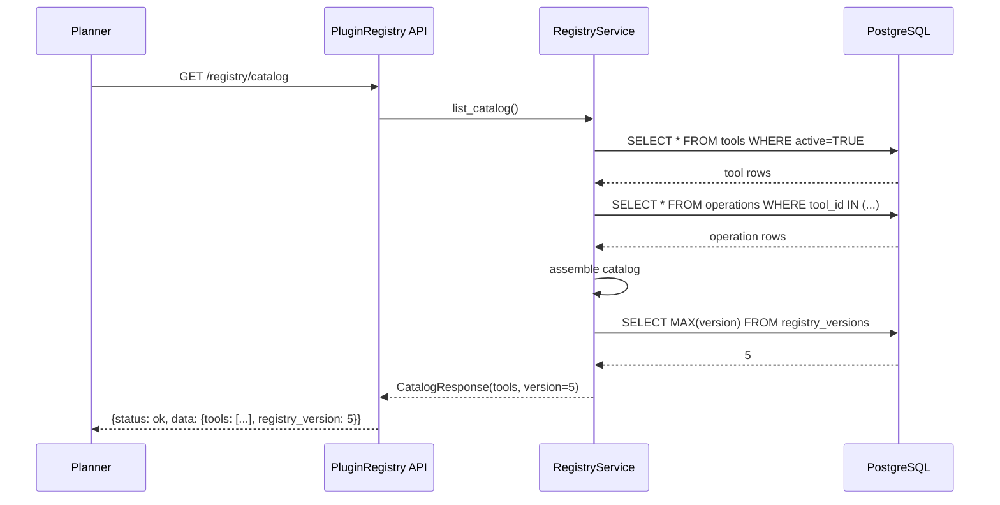
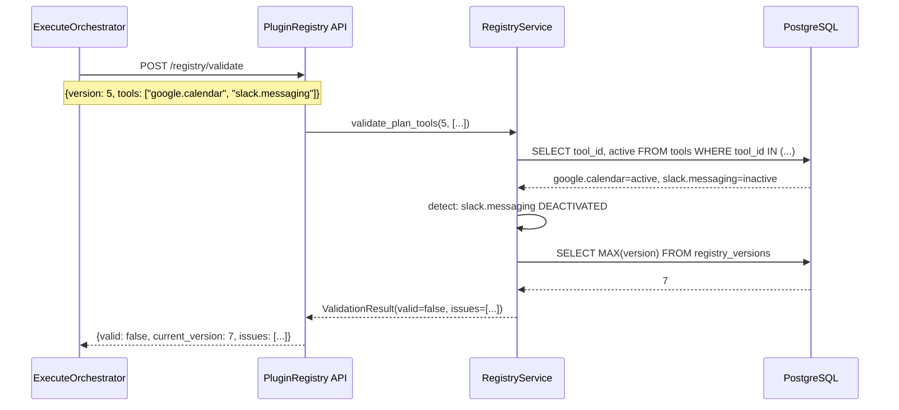
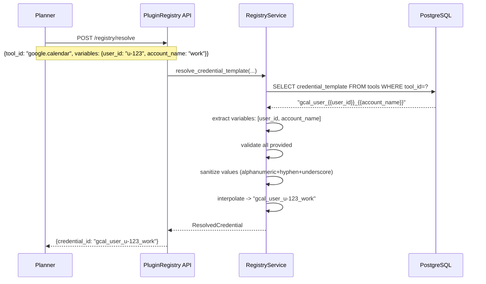
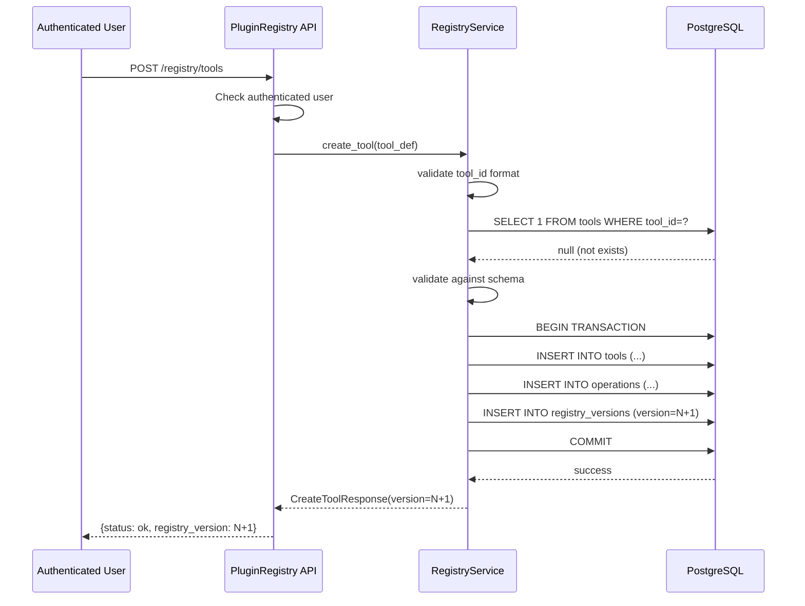
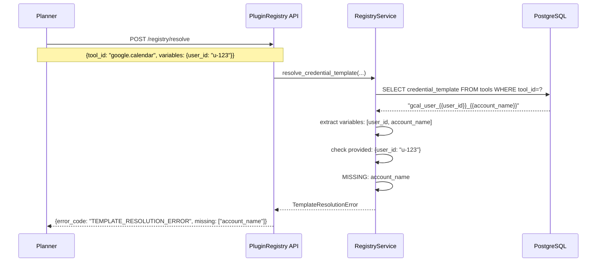
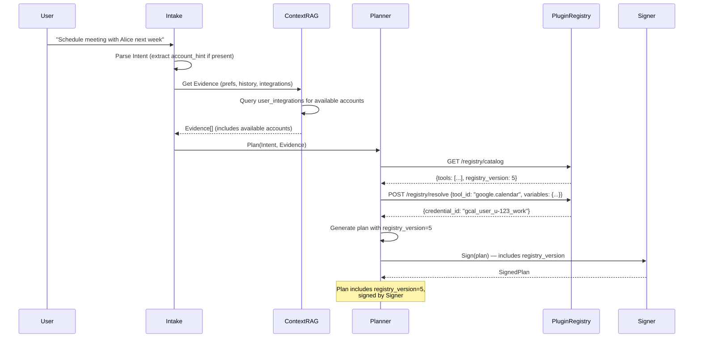
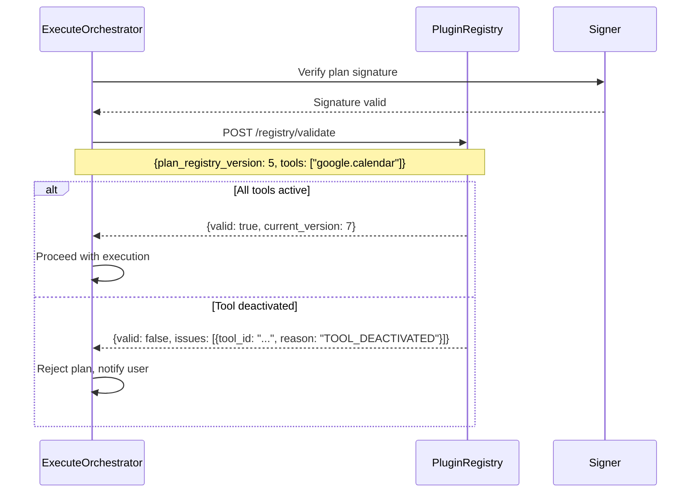

# PluginRegistry — Flow Diagrams

## 1. Planner Requests Catalog (Happy Path)

## 2. Pre-Execution Validation (Tool Deactivated)

## 3. Credential Template Resolution

## 4. Create Tool (Version Increment)

## 5. Template Resolution Failure (Missing Variable)

## 6. End-to-End: Planning with Registry

## 7. End-to-End: Pre-Execution Validation

