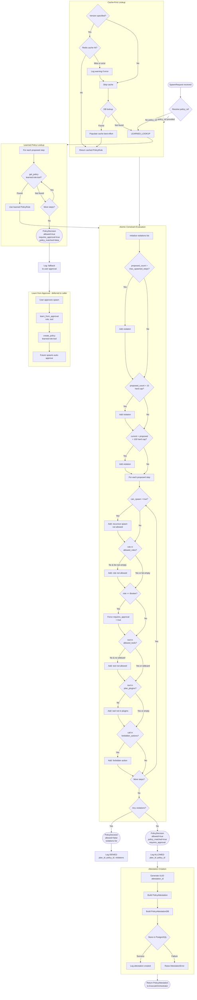

```mermaid
flowchart TD
    START([SpawnRequest received]) --> RESOLVE_POLICY{Resolve policy_ref}

    RESOLVE_POLICY -->|No policy_ref| LEARNED_LOOKUP
    RESOLVE_POLICY -->|policy_ref provided| CACHE_LOOKUP

    subgraph CACHE_LOOKUP [Cache-First Lookup]
        direction TB
        CL1{Version specified?}
        CL1 -->|Yes| CL2{Redis cache hit?}
        CL1 -->|No| CL4[Skip cache]
        CL2 -->|Hit| CL5[Return cached PolicyRule]
        CL2 -->|Miss or error| CL3[Log warning if error]
        CL3 --> CL4
        CL4 --> CL6{DB lookup}
        CL6 -->|Found| CL7[Populate cache best-effort]
        CL6 -->|Not found| LEARNED_LOOKUP
        CL7 --> CL5
    end

    CACHE_LOOKUP --> CONSTRAINTS

    subgraph LEARNED_LOOKUP_BOX [Learned Policy Lookup]
        direction TB
        LL1[For each proposed step] --> LL2{get_policy\nlearned:role:tool?}
        LL2 -->|Found| LL3[Use learned PolicyRule]
        LL2 -->|Not found| LL4{More steps?}
        LL4 -->|Yes| LL2
        LL4 -->|No| USER_APPROVAL
    end

    LEARNED_LOOKUP --> LEARNED_LOOKUP_BOX
    LL3 --> CONSTRAINTS

    USER_APPROVAL([PolicyDecision\nallowed=true\nrequires_approval=true\npolicy_matched=false]) --> LOG_FALLBACK[Log: fallback\nto user approval]

    subgraph CONSTRAINTS [Atomic Constraint Evaluation]
        direction TB
        V0[Initialize violations list] --> V1

        V1{proposed_count >\nmax_spawned_steps?}
        V1 -->|Yes| V1V[Add violation]
        V1 -->|No| V2
        V1V --> V2

        V2{proposed_count > 10\nhard cap?}
        V2 -->|Yes| V2V[Add violation]
        V2 -->|No| V3
        V2V --> V3

        V3{current + proposed\n> 100 hard cap?}
        V3 -->|Yes| V3V[Add violation]
        V3 -->|No| V4
        V3V --> V4

        V4[For each proposed step] --> V5

        V5{can_spawn = true?}
        V5 -->|Yes| V5V[Add: recursive spawn\nnot allowed]
        V5 -->|No| V6
        V5V --> V6

        V6{role in\nallowed_roles?}
        V6 -->|No & list non-empty| V6V[Add: role not allowed]
        V6 -->|Yes or list empty| V7
        V6V --> V7

        V7{role == Booker?}
        V7 -->|Yes| V7F[Force requires_approval\n= true]
        V7 -->|No| V8
        V7F --> V8

        V8{tool in\nallowed_tools?}
        V8 -->|No & no wildcard| V8V[Add: tool not allowed]
        V8 -->|Yes or wildcard| V9
        V8V --> V9

        V9{tool in\nplan_plugins?}
        V9 -->|No| V9V[Add: tool not in plugins]
        V9 -->|Yes or empty| V10
        V9V --> V10

        V10{call in\nforbidden_actions?}
        V10 -->|Yes| V10V[Add: forbidden action]
        V10 -->|No| V11
        V10V --> V11

        V11{More steps?}
        V11 -->|Yes| V5
        V11 -->|No| VCHECK
    end

    VCHECK{Any violations?}
    VCHECK -->|Yes| DENIED
    VCHECK -->|No| ALLOWED

    DENIED([PolicyDecision\nallowed=false\nviolations list]) --> LOG_DENY[Log DENIED\nplan_id, policy_id, violations]
    ALLOWED([PolicyDecision\nallowed=true\npolicy_matched=true\nrequires_approval]) --> LOG_ALLOW[Log ALLOWED\nplan_id, policy_id]

    LOG_FALLBACK --> LEARN_PATH

    subgraph LEARN_PATH [Learn from Approval - deferred to caller]
        direction TB
        LP1[User approves spawn] --> LP2[learn_from_approval\nrole, tool]
        LP2 --> LP3[create_policy\nlearned:role:tool]
        LP3 --> LP4[Future spawns auto-approve]
    end

    LOG_ALLOW --> ATTESTATION

    subgraph ATTESTATION [Attestation Creation]
        direction TB
        A1[Generate ULID attestation_id] --> A2[Build PolicyAttestation]
        A2 --> A3[Build PolicyAttestationDB]
        A3 --> A4{Store in PostgreSQL}
        A4 -->|Success| A5[Log attestation created]
        A4 -->|Failure| A6[Raise AttestationError]
    end

    ATTESTATION --> DONE([Return PolicyAttestation\nto ExecuteOrchestrator])
```
