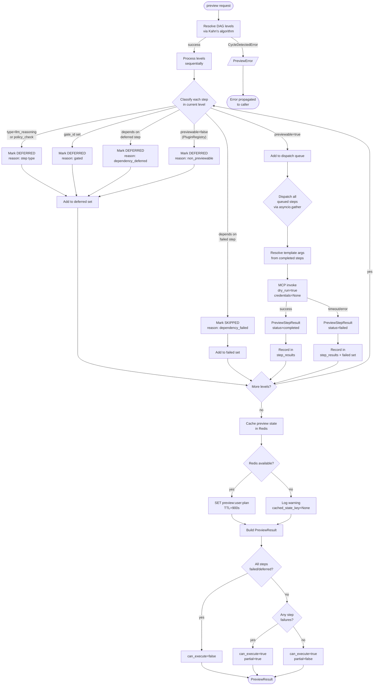
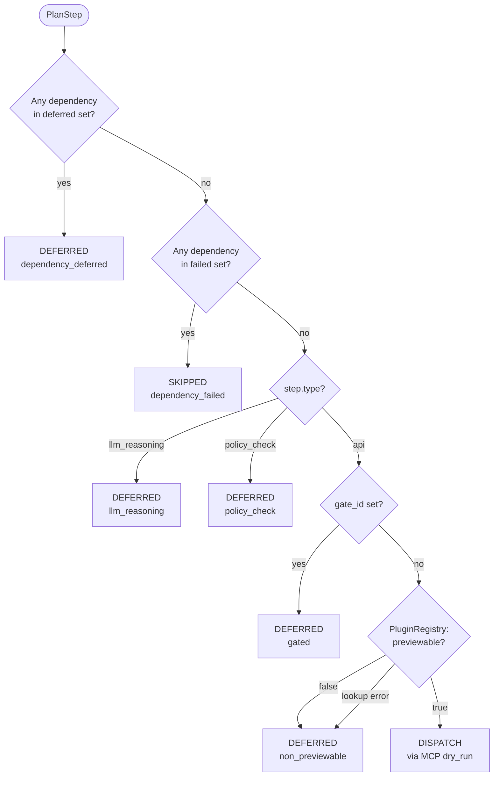
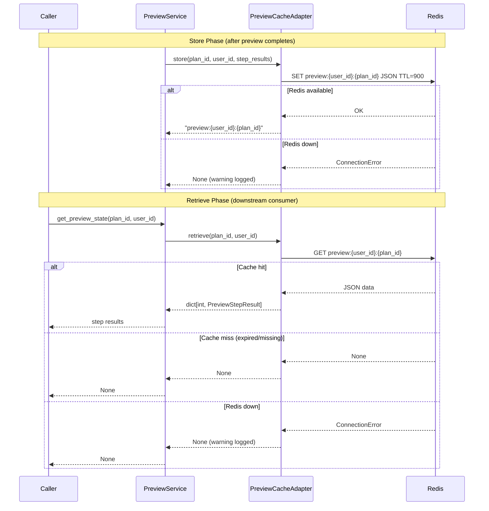
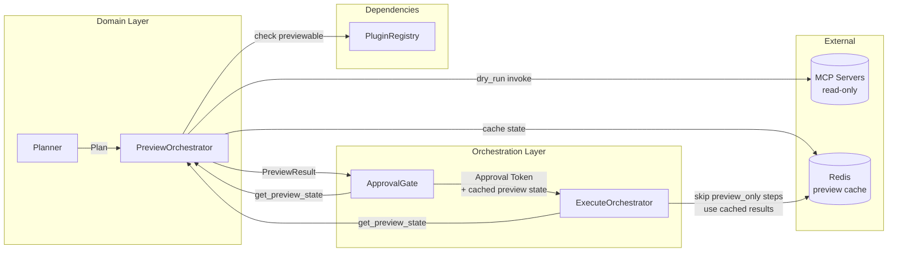

# PreviewOrchestrator — Flow Diagrams

## 1. Main Preview Flow

## 2. Step Classification Decision Tree

## 3. Cache Interaction Flow

## 4. Integration Flow (End-to-End Context)

## 5. Parallel Execution Within a Level

```mermaid
gantt
    title Preview Level Execution (Steps 1-3 parallel)
    dateFormat X
    axisFormat %L ms

    section Step 1 (Fetcher)
    Check previewable     :a1, 0, 5
    Resolve templates     :a2, after a1, 2
    MCP invoke (dry_run)  :a3, after a2, 120
    Record result         :a4, after a3, 1

    section Step 2 (Fetcher)
    Check previewable     :b1, 0, 5
    Resolve templates     :b2, after b1, 2
    MCP invoke (dry_run)  :b3, after b2, 95
    Record result         :b4, after b3, 1

    section Step 3 (Analyzer)
    Check previewable     :c1, 0, 5
    Resolve templates     :c2, after c1, 2
    MCP invoke (dry_run)  :c3, after c2, 150
    Record result         :c4, after c3, 1

    section Level total
    asyncio.gather        :d1, 0, 160
```

