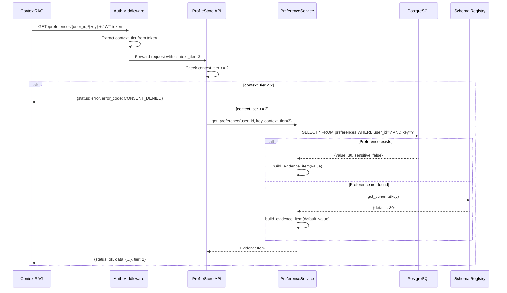
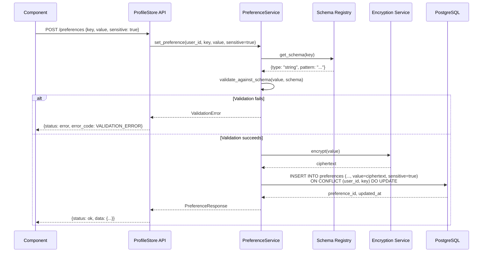
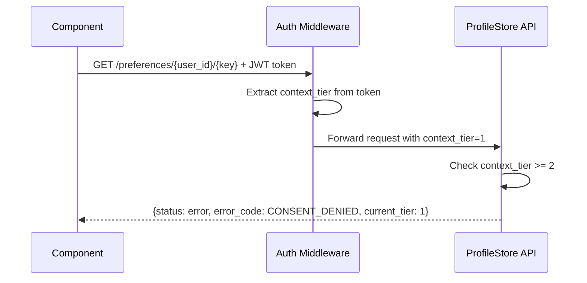

# Low-Level Design: ProfileStore

**Component**: ProfileStore
**Feature Branch**: `003-title-profilestore-description`
**Created**: 2025-12-17
**Status**: Draft
**Conforms to**: GLOBAL_SPEC.md v2, Project_HLD.md v4.0

---

## 1. Purpose & Scope

### 1.1 Component Purpose

ProfileStore is an **internal backend component** that provides **Tier 2 data source** (stable user preferences) for ContextRAG and other components. It stores, retrieves, and manages:

- User preferences (meeting duration, work hours, notification settings)
- Sensitive encrypted data (passport numbers, health info, emergency contacts)

ProfileStore is **NOT user-facing** - it does not handle Intents or participate in the Preview/Execute workflow. It is called directly by other components (ContextRAG, PlanWriter) as a data access layer.

### 1.2 Responsibilities

**In Scope:**
- Store/retrieve user preferences with schema validation
- Encrypt/decrypt sensitive preferences (AES-256)
- Enforce consent tier boundaries (deny access when `context_tier < 2` from auth context)
- Return preference data in Evidence Item format (GLOBAL_SPEC §2.2)

**Out of Scope:**
- Session data / Tier 1 (owned by Intake via Redis)
- Historical interactions / Tier 3 (owned by History component)
- Live signals / Tier 4 (fetched from external APIs on-demand)
- User authentication and consent management (handled by Auth/Registration component)
- User registration (API layer responsibility)

### 1.3 Conformance to GLOBAL_SPEC

This component conforms to GLOBAL_SPEC.md v2 with the following **clarifications**:

- **Preview/Execute Model**: DOES NOT APPLY to ProfileStore operations. The Preview/Execute model from GLOBAL_SPEC §1 applies to **plans** (Intent → Plan → Preview → Execute), not to internal component operations. ProfileStore executes all operations directly.
- **Context Tier**: ProfileStore is the **Tier 2 data source** (GLOBAL_SPEC §7). It stores stable user preferences only. Consent tier (`context_tier`) is owned by Auth/Registration and provided via auth context.
- **Evidence Format**: ProfileStore returns preference data in Evidence Item format (GLOBAL_SPEC §2.2) for ContextRAG integration.
- **Safety Model**: ProfileStore enforces consent tier boundaries (Tier 2 data requires Tier 2+ consent) but does NOT use Preview/Execute wrappers.

---

## 2. Architecture

### 2.1 Component Structure

```
components/ProfileStore/
├── SPEC.md                         # Requirements (this component's behavior contract)
├── LLD.md                          # This file
├── diagrams/
│   └── flow.mmd                    # Mermaid flowchart (key operations)
├── api/
│   └── routes.py                   # FastAPI endpoints (GET/SET/DELETE operations)
├── service/
│   └── preference_service.py       # Business logic for preferences
├── domain/
│   └── models.py                   # Pydantic models (request/response validation)
├── adapters/
│   ├── db.py                       # SQLAlchemy database adapter (async)
│   ├── encryption.py               # AES-256 encryption/decryption for sensitive data
│   └── schema_registry.py          # Client for Preference Schema Registry
├── schemas/
│   └── preference.schema.json      # JSON schema for preference values
└── tests/
    ├── test_preferences.py         # All preference logic tests (unit + integration with PostgreSQL)
    └── test_contract.py            # Contract tests (GLOBAL_SPEC Evidence Item compliance + consent enforcement)
```

### 2.2 External Dependencies

#### Database Schema Dependencies

ProfileStore does **not** own or access the `users` table. Consent tier information (`context_tier`) is provided by **Auth middleware** in the authenticated request context.

**Preferences Table** (owned by ProfileStore):
```sql
CREATE TABLE preferences (
  preference_id UUID PRIMARY KEY DEFAULT gen_random_uuid(),
  user_id UUID NOT NULL REFERENCES users(user_id) ON DELETE CASCADE,
  key VARCHAR(64) NOT NULL,
  value JSONB NOT NULL,
  sensitive BOOLEAN NOT NULL DEFAULT FALSE,
  updated_at TIMESTAMP NOT NULL DEFAULT NOW(),
  deleted_at TIMESTAMP NULL,
  UNIQUE(user_id, key) WHERE deleted_at IS NULL,
  INDEX idx_preferences_user_id (user_id) WHERE deleted_at IS NULL
);
```

#### Global Dependencies (Must Be Implemented First)

See [SHARED_INFRASTRUCTURE.md](../../docs/architecture/SHARED_INFRASTRUCTURE.md) for implementation details.

**Users Table** (global identity foundation):
- **Owner**: Auth/Registration component (to be implemented)
- **Purpose**: ProfileStore references `users.user_id` for foreign key constraint
- **Status**: Must implement before ProfileStore
- **Location**: Shared database schema

**Auth Middleware** (global authentication layer):
- **Owner**: Shared infrastructure (Phase 1 MVP: header-based, Phase 2: JWT)
- **Operation**: Extracts `context_tier` from request and adds to `request.state`
- **Purpose**: ProfileStore reads `request.state.context_tier` to enforce Tier 2 boundary
- **Status**: Must implement before ProfileStore
- **Location**: `shared/middleware/auth.py`
- **Interface**:
  - `request.state.user_id: UUID`
  - `request.state.context_tier: int`
  - `request.state.email: str`

**Encryption Service** (global security utility):
- **Owner**: Shared infrastructure
- **Operation**: `encrypt(plaintext) → ciphertext`, `decrypt(ciphertext) → plaintext`
- **Algorithm**: AES-256-GCM
- **Purpose**: ProfileStore uses this for sensitive preferences
- **Status**: Must implement before ProfileStore
- **Location**: `shared/security/encryption.py`

**Evidence Item Schema** (global contract):
- **Owner**: Shared schemas
- **Purpose**: ProfileStore returns preferences in Evidence Item format (GLOBAL_SPEC §2.2)
- **Status**: Must implement before ProfileStore
- **Location**: `shared/schemas/evidence.py`

#### Component-Specific Dependencies (ProfileStore Implements These)

**Preference Schema Registry** (embedded in ProfileStore for MVP):
- **Owner**: ProfileStore
- **Operation**: `getSchema(preference_key) → JSON Schema`
- **Purpose**: Validate preference values before storage
- **Implementation**: File-based schemas in `components/ProfileStore/schemas/`
- **Status**: Implement as part of ProfileStore
- **Future**: Extract to separate service when other components need schemas

#### Infrastructure Dependencies

- **PostgreSQL 16**: Primary datastore for preferences table
- **SQLAlchemy 2.0**: Async ORM for database operations
- **Pydantic v2**: Data validation and serialization
- **Alembic**: Database migrations

---

## 3. Interfaces

### 3.1 API Endpoints (FastAPI)

ProfileStore exposes internal HTTP endpoints for other components:

#### GET /preferences/{user_id}/{preference_key}

**Purpose**: Retrieve a single preference value
**Consent Check**: Requires `context_tier >= 2` (from auth context)

**Request**:
```http
GET /preferences/user-123/meeting_duration_min
Authorization: Bearer <token> (includes context_tier in claims)
X-Plan-ID: plan-abc (optional, for correlation)
```

**Response (Success)**:
```json
{
  "status": "ok",
  "data": {
    "type": "preference",
    "key": "meeting_duration_min",
    "value": 30,
    "confidence": 1.0,
    "source_ref": "profilestore:prefs/meeting_duration_min",
    "ttl_days": null,
    "tier": 2
  },
  "tier": 2,
  "sensitive": false
}
```

**Response (Error - No Consent)**:
```json
{
  "status": "error",
  "error_code": "CONSENT_DENIED",
  "message": "User has not granted Tier 2 consent",
  "details": {
    "user_id": "user-123",
    "required_tier": 2,
    "current_tier": 1
  }
}
```

#### POST /preferences/{user_id}

**Purpose**: Create or update a preference (upsert)
**Idempotency**: Safe to retry with same `user_id + preference_key + value`

**Request**:
```json
{
  "user_id": "user-123",
  "preference_key": "work_hours",
  "preference_value": "10-6",
  "sensitive": false
}
```

**Response (Success)**:
```json
{
  "status": "ok",
  "data": {
    "preference_id": "pref-xyz789",
    "user_id": "user-123",
    "preference_key": "work_hours",
    "preference_value": "10-6",
    "updated_at": "2025-12-17T10:30:00Z"
  },
  "tier": 2,
  "sensitive": false
}
```

#### DELETE /preferences/{user_id}/{preference_key}

**Purpose**: Delete a preference (reset to schema default)
**Compensation**: Not supported (cannot restore without backup)

**Response**:
```json
{
  "status": "ok",
  "message": "Preference deleted",
  "data": {
    "user_id": "user-123",
    "preference_key": "work_hours",
    "deleted_at": "2025-12-17T10:35:00Z"
  }
}
```


### 3.2 Service Layer Signatures

#### PreferenceService

```python
class PreferenceService:
    async def get_preference(
        self,
        user_id: UUID,
        preference_key: str,
        context_tier: int,
        plan_id: str | None = None
    ) -> EvidenceItem:
        """
        Retrieve a preference value for a user.

        Args:
            context_tier: User's consent tier from auth context

        Returns:
            EvidenceItem (GLOBAL_SPEC §2.2 format)

        Raises:
            UserNotFoundError: user_id does not exist
            ConsentDeniedError: context_tier < 2
            UnknownPreferenceError: preference_key not in schema registry
        """
        pass

    async def set_preference(
        self,
        user_id: UUID,
        preference_key: str,
        preference_value: Any,
        sensitive: bool = False,
        plan_id: str | None = None
    ) -> PreferenceResponse:
        """
        Create or update a preference (upsert).

        Returns:
            PreferenceResponse with preference_id, updated_at

        Raises:
            UserNotFoundError: user_id does not exist
            UnknownPreferenceError: preference_key not in schema registry
            ValidationError: preference_value fails schema validation
        """
        pass

    async def delete_preference(
        self,
        user_id: UUID,
        preference_key: str
    ) -> DeleteResponse:
        """Delete a preference (reset to schema default)."""
        pass
```


---

## 4. Data Flow & Sequences

### 4.1 GET Preference (Happy Path)



### 4.2 SET Preference (Sensitive Data)



### 4.3 GET Preference (Consent Denied)



---

## 5. Data Contracts

### 5.1 Evidence Item (Output for ContextRAG)

Conforms to GLOBAL_SPEC §2.2:

```json
{
  "type": "preference",
  "key": "meeting_duration_min",
  "value": 30,
  "confidence": 1.0,
  "source_ref": "profilestore:prefs/meeting_duration_min",
  "ttl_days": null,
  "tier": 2
}
```

**Fields**:
- `type`: Always `"preference"` for ProfileStore
- `key`: Preference key (e.g., `"work_hours"`)
- `value`: Preference value (decrypted if sensitive)
- `confidence`: Always `1.0` (ProfileStore data is authoritative)
- `source_ref`: Reference to preference source (`"profilestore:prefs/{key}"`)
- `ttl_days`: Always `null` (preferences do not expire)
- `tier`: Always `2` (ProfileStore is Tier 2 data source)

### 5.2 Preference Schema (Example)

Schema stored in Preference Schema Registry:

```json
{
  "meeting_duration_min": {
    "type": "integer",
    "minimum": 15,
    "maximum": 480,
    "default": 30,
    "description": "Default meeting duration in minutes",
    "sensitive": false
  },
  "passport_number": {
    "type": "string",
    "pattern": "^[A-Z0-9]{6,9}$",
    "default": null,
    "description": "User's passport number",
    "sensitive": true
  }
}
```

### 5.3 Database Models (Pydantic)

```python
from pydantic import BaseModel, UUID4
from datetime import datetime

class PreferenceDB(BaseModel):
    preference_id: UUID4
    user_id: UUID4
    key: str
    value: Any  # JSONB, validated against schema
    sensitive: bool
    updated_at: datetime
    deleted_at: datetime | None = None

```

---

## 6. Adapters

### 6.1 Database Adapter (PostgreSQL)

**File**: `adapters/db.py`

**Responsibilities**:
- Execute async SQL queries via SQLAlchemy 2.0
- Manage database connections (connection pooling)
- Handle transactions (commit/rollback)

**Key Methods**:
```python
class DatabaseAdapter:
    async def get_preference(
        self, user_id: UUID, key: str
    ) -> PreferenceDB | None:
        """Retrieve preference from database."""
        pass

    async def upsert_preference(
        self, user_id: UUID, key: str, value: Any, sensitive: bool
    ) -> PreferenceDB:
        """Insert or update preference (upsert)."""
        pass

    async def delete_preference(
        self, user_id: UUID, key: str
    ) -> None:
        """Delete preference from database."""
        pass
```

**Idempotency**: Upsert operations use `ON CONFLICT (user_id, key) DO UPDATE` to ensure idempotency.

**Transactions**: All write operations wrapped in async transactions for atomicity.

### 6.2 Encryption Adapter (AES-256-GCM)

**File**: `adapters/encryption.py`

**Responsibilities**:
- Encrypt sensitive preference values before storage
- Decrypt sensitive preference values after retrieval
- Key rotation support (via key versioning)

**Key Methods**:
```python
class EncryptionAdapter:
    def encrypt(self, plaintext: str) -> str:
        """Encrypt plaintext using AES-256-GCM. Returns base64-encoded ciphertext."""
        pass

    def decrypt(self, ciphertext: str) -> str:
        """Decrypt ciphertext using AES-256-GCM. Returns plaintext."""
        pass
```

**Key Management**:
- Single encryption key stored in environment variable `ENCRYPTION_KEY` (not in code/database)
- Ciphertext format: `{iv}:{ciphertext}:{tag}` (base64-encoded)
- Key rotation not required for single-user personal agent

### 6.3 Schema Registry Adapter

**File**: `adapters/schema_registry.py`

**Responsibilities**:
- Fetch JSON schemas for preference keys
- Cache schemas locally (5-min TTL)
- Fallback behavior if registry unavailable

**Key Methods**:
```python
class SchemaRegistryAdapter:
    async def get_schema(self, preference_key: str) -> dict:
        """
        Fetch JSON schema for a preference key.

        Returns:
            JSON schema dict

        Raises:
            UnknownPreferenceError: key not found in registry
        """
        pass

    async def validate_value(
        self, preference_key: str, value: Any
    ) -> bool:
        """Validate a value against its schema."""
        pass
```


---

## 7. Safety & Observability

### 7.1 Consent Enforcement

**Decision Rule** (from SPEC Decision Rule #3):
```
IF operation requires consent tier N AND context_tier < N (from auth context)
  → Return CONSENT_DENIED error with tier details
```

**Implementation**:
1. Auth middleware extracts `context_tier` from JWT token and adds to request context
2. Every `GET /preferences` call reads `context_tier` from request context
3. If `context_tier < 2` → return `CONSENT_DENIED` error (HTTP 403) before database query
4. Consent is **cumulative**: `context_tier = 3` grants access to Tiers 1+2+3

**Bypass Prevention**:
- Consent check in **API layer** (before service layer)
- Integration tests verify consent enforcement with different `context_tier` values
- No database access without consent check

### 7.2 Sensitive Data Encryption

**Encryption Flow**:
1. Client sets `sensitive: true` in request
2. `PreferenceService` calls `EncryptionAdapter.encrypt(value)`
3. Encrypted ciphertext stored in database
4. On retrieval, `PreferenceService` calls `EncryptionAdapter.decrypt(ciphertext)`

**Encryption Details**:
- Ciphertext format: `{iv}:{ciphertext}:{tag}` (base64-encoded)
- IV (Initialization Vector) generated randomly for each encryption operation
- Authentication tag ensures data integrity and authenticity

### 7.3 Structured Logging

**Log Format** (JSON):
```json
{
  "timestamp": "2025-12-17T10:30:00Z",
  "level": "INFO",
  "service": "profilestore",
  "operation": "get_preference",
  "user_id": "user-123",
  "preference_key": "meeting_duration_min",
  "plan_id": "plan-abc",
  "latency_ms": 45,
  "status": "success"
}
```

**PII Protection**:
- **NEVER log preference values** (only keys)
- **NEVER log ciphertext** (only metadata)
- **NEVER log encryption keys**
- User IDs logged as UUIDs (not emails/names)

**Correlation**:
- Include `plan_id` if provided by caller
- Include `request_id` for tracing across components

### 7.4 Error Handling

**Error Codes** (from SPEC FR-001):
- `USER_NOT_FOUND`: user_id does not exist in users table
- `CONSENT_DENIED`: user has not granted required tier consent
- `VALIDATION_ERROR`: preference value fails schema validation
- `UNKNOWN_PREFERENCE`: preference key not in schema registry
- `USER_ID_REQUIRED`: user_id missing from request

**Error Response Format**:
```json
{
  "status": "error",
  "error_code": "CONSENT_DENIED",
  "message": "User has not granted Tier 2 consent",
  "details": {
    "user_id": "user-123",
    "required_tier": 2,
    "current_tier": 1
  }
}
```

### 7.5 Idempotency

**SET Preference** (upsert):
- Idempotency key: `user_id + preference_key`
- Same preference update → same result (no duplicate rows)
- Implementation: `ON CONFLICT (user_id, key) DO UPDATE SET value = EXCLUDED.value, updated_at = NOW()`
- Retrying with same value is safe (no-op)
- Retrying with different value is safe (updates to latest value)

**DELETE Preference**:
- Idempotent (deleting non-existent preference returns success)

### 7.6 Compensation

**SET Preference** (update):
- Store previous value before update
- Compensation operation: `restore_preference(user_id, key, old_value)`
- Registered in Plugin Registry as `compensation: "restore_preference"`

**DELETE Preference**:
- No compensation (cannot restore without backup)
- Registered in Plugin Registry as `compensation: null`

---

## 8. Non-Functional Requirements

**Deployment Configuration**: See [DEPLOYMENT.md](../../DEPLOYMENT.md) for environment setup, database configuration, and cloud migration guidance.

### 8.1 Latency Targets

| Operation | Target (p95) | Local Expected | Cloud Expected |
|-----------|-------------|----------------|----------------|
| GET Preference | < 50ms | ~5-10ms | ~30-50ms |
| SET Preference | < 100ms | ~10-20ms | ~50-100ms |

**Optimizations**:
- `context_tier` read from auth context (zero latency overhead)
- Database connection pooling (5 connections local, 10 cloud)
- Partial index: `preferences(user_id, key) WHERE deleted_at IS NULL`

### 8.2 Availability

**Target**: 99.9% uptime (cloud production deployment)

**Strategies**:
- Managed PostgreSQL service (AWS RDS, Google Cloud SQL, Supabase)
- Automated backups with point-in-time recovery
- Circuit breaker for Schema Registry (fallback to cached schemas)
- Health check endpoint: `GET /health`

**Note**: Local development uses best-effort availability (PostgreSQL restart = ~5 seconds downtime)

### 8.3 Throughput

**Target**: 1000 req/sec per user (cloud production, multi-user ready)

**Local Development**: 50-100 req/sec (sufficient for single user)

**Optimizations**:
- Connection pooling prevents connection exhaustion
- Async I/O (SQLAlchemy async) for concurrent request handling
- Database indexes for fast lookups

### 8.4 Data Consistency

**Atomicity**:
- All SET operations wrapped in database transactions
- No partial writes (preference value + metadata updated together)

**Strong Consistency**:
- All reads/writes directly to PostgreSQL (no caching layer)
- Consent tier from auth token is always current (no staleness)

### 8.5 Testing Strategy

**Simplified test structure** (single-user personal agent):

1. **`test_preferences.py`** — All core functionality tests:
   - Unit tests: preference service logic, encryption/decryption, schema validation
   - Integration tests: PostgreSQL interactions, auth context enforcement
   - Database setup/teardown with test fixtures
   - Coverage: GET/SET/DELETE operations, error cases, edge cases

2. **`test_contract.py`** — Compliance and boundaries:
   - Evidence Item format validation (GLOBAL_SPEC §2.2)
   - Context tier boundary enforcement (Tier 2 access control)
   - Auth middleware contract verification
   - Schema registry integration contract

**Rationale**: For single-user scale, combining unit and integration tests reduces overhead while maintaining quality. Contract tests remain separate to verify external interface compliance.

---

## 9. Risks & Mitigations

### 9.1 Auth Middleware Dependency

**Risk**: ProfileStore depends on Auth middleware to provide `context_tier` in request context. If auth is misconfigured, consent enforcement breaks.

**Mitigation**:
- `test_preferences.py` verifies `context_tier` is present in all authenticated requests
- ProfileStore returns 401 error if `context_tier` missing (fail-secure)
- `test_contract.py` verifies consent enforcement and auth context behavior

### 9.2 Schema Registry Unavailable

**Risk**: Preference Schema Registry down → cannot validate new preferences.

**Mitigation**:
- Cache schemas locally (5-min TTL)
- Circuit breaker: if registry unavailable, reject new writes but allow cached schema validation
- Fallback: return `SERVICE_UNAVAILABLE` error instead of crashing

### 9.3 Encryption Key Loss

**Risk**: Losing encryption key → cannot decrypt sensitive preferences.

**Mitigation**:
- Store key in environment variable with secure backup (external password manager)
- Document key backup procedure in deployment guide
- For production: use secret manager (AWS Secrets Manager, HashiCorp Vault)

### 9.4 Concurrent Updates (Race Condition)

**Risk**: Two components updating same preference simultaneously → last-write-wins.

**Mitigation**:
- Document last-write-wins behavior in SPEC (Edge Case)
- Use `updated_at` timestamp for conflict detection
- No optimistic locking (complexity not justified for preferences)

### 9.5 PII Leakage in Logs

**Risk**: Accidentally logging preference values (especially sensitive ones).

**Mitigation**:
- Structured logging framework with explicit PII filters
- Automated log scanning for PII patterns (CI check)
- Manual code review for all logging statements
- Success Criteria SC-005: Zero PII leakage (verified via log audits)

---

## 10. Open Questions

### 10.1 Preference Schema Registry Location

**Question**: Should the Preference Schema Registry be:
- (A) A separate lightweight component/service?
- (B) Part of ProfileStore (embedded schemas)?
- (C) A static JSON file in `shared/schemas/preferences/`?

**Proposed Answer**: (A) Separate component for reusability. Other components (ContextRAG, PlanWriter) may also need to validate preferences.

**Decision Required By**: Before LLD approval

### 10.2 Auth Context Contract

**Question**: What is the exact contract for `context_tier` in request context? Is it always present? What happens if JWT is expired?

**Current Assumption**: Auth middleware always provides `context_tier` for authenticated requests. If missing, request is unauthenticated.

**Implications**:
- ProfileStore must handle missing `context_tier` gracefully (return 401)
- Contract tests must verify Auth middleware behavior
- Documentation must specify JWT claim structure

**Decision Required By**: Before implementation starts

### 10.3 Compensation for DELETE

**Question**: Should we support compensation for `DELETE_PREFERENCE`?

**Options**:
- (A) No compensation (current SPEC decision)
- (B) Store deleted preferences in `deleted_preferences` table for 30 days
- (C) Require caller to implement compensation via backups

**Proposed Answer**: (A) No compensation. DELETE is rare; complexity not justified.

**Decision Required By**: Before LLD approval

---

## 11. Implementation Prerequisites

### 11.1 Must Implement First (Blocking Dependencies)

ProfileStore **cannot be implemented** until these global dependencies are in place:

1. **Database & Users Table** (2-3 hours)
   - [ ] PostgreSQL 16 installed and running
   - [ ] Database created: `personal_agent`
   - [ ] Users table created (see [SHARED_INFRASTRUCTURE.md](../../docs/architecture/SHARED_INFRASTRUCTURE.md) §1.2)
   - [ ] Test user created for development

2. **Auth Middleware (MVP)** (2-3 hours)
   - [ ] Header-based auth middleware implemented (`shared/middleware/auth.py`)
   - [ ] Provides `request.state.user_id` and `request.state.context_tier`
   - [ ] Added to FastAPI app
   - [ ] Basic tests written

3. **Encryption Service** (2-3 hours)
   - [ ] Encryption service implemented (`shared/security/encryption.py`)
   - [ ] Encryption key generated and stored in `.env`
   - [ ] Encrypt/decrypt roundtrip tests passing

4. **Evidence Item Schema** (1 hour)
   - [ ] Pydantic model created (`shared/schemas/evidence.py`)
   - [ ] Validation tests passing

**Total Estimated Time**: 7-10 hours

**Implementation Order**: See [SHARED_INFRASTRUCTURE.md](../../docs/architecture/SHARED_INFRASTRUCTURE.md) §7 for detailed implementation phases.

---

### 11.2 ProfileStore Implementation Phases

Once global dependencies are ready, implement ProfileStore in this order:

**Phase 1: Database & Adapters** (4-6 hours)
- [ ] Create `preferences` table migration (Alembic)
- [ ] Implement `DatabaseAdapter` (SQLAlchemy async)
- [ ] Implement `SchemaRegistryAdapter` (file-based, embedded)
- [ ] Create 3-5 example preference schemas
- [ ] Write adapter integration tests

**Phase 2: Service Layer** (6-8 hours)
- [ ] Implement `PreferenceService` class
- [ ] Integrate all adapters (Database, Encryption, SchemaRegistry)
- [ ] Implement consent tier enforcement
- [ ] Implement Evidence Item formatting
- [ ] Write service unit tests

**Phase 3: API Layer** (4-6 hours)
- [ ] Implement FastAPI routes (`routes.py`)
- [ ] Add Pydantic request/response models
- [ ] Wire up PreferenceService
- [ ] Add error handling and structured logging
- [ ] Write API integration tests

**Phase 4: Contract Testing** (3-4 hours)
- [ ] Evidence Item format validation (GLOBAL_SPEC §2.2)
- [ ] Context tier enforcement tests
- [ ] Consent denial scenarios
- [ ] End-to-end GET/SET/DELETE flows

**Total ProfileStore Time**: 17-24 hours

---

## 12. Conformance Checklist

- [x] Conforms to GLOBAL_SPEC.md v2 (Evidence Item format §2.2, Context Tier §7)
- [x] Component-first structure (SPEC.md, LLD.md, schemas/, tests/)
- [x] Database schema documented (users table dependency, preferences table)
- [x] Interfaces defined (API endpoints, service layer signatures)
- [x] Data contracts specified (Evidence Item, Preference Schema)
- [x] Sequences documented (GET/SET preference, consent operations)
- [x] Safety requirements (consent enforcement, encryption, PII protection)
- [x] Observability requirements (structured logging, no PII in logs)
- [x] NFRs specified (latency targets, availability, throughput)
- [x] Risks identified and mitigated
- [x] Open questions documented
- [x] Dependencies clearly identified (global vs component-specific)
- [x] Implementation prerequisites documented

---

## 13. References

- [SPEC.md](./SPEC.md) — Requirements and user stories
- [GLOBAL_SPEC.md](../../docs/architecture/GLOBAL_SPEC.md) v2 — Universal contracts
- [Project_HLD.md](../../docs/architecture/Project_HLD.md) v4.0 — System architecture
- [SHARED_INFRASTRUCTURE.md](../../docs/architecture/SHARED_INFRASTRUCTURE.md) v1.0.0 — Global dependencies and shared services
- [DEPLOYMENT.md](../../DEPLOYMENT.md) v1.0.0 — Deployment and infrastructure guide
- [constitution.md](../../.specify/memory/constitution.md) v1.0.0 — Development principles
- [flow.mmd](./diagrams/flow.mmd) — Mermaid flowchart (key operations)

---

**Version**: 1.0.0
**Last Updated**: 2025-12-17
**Status**: Draft (pending approval)
