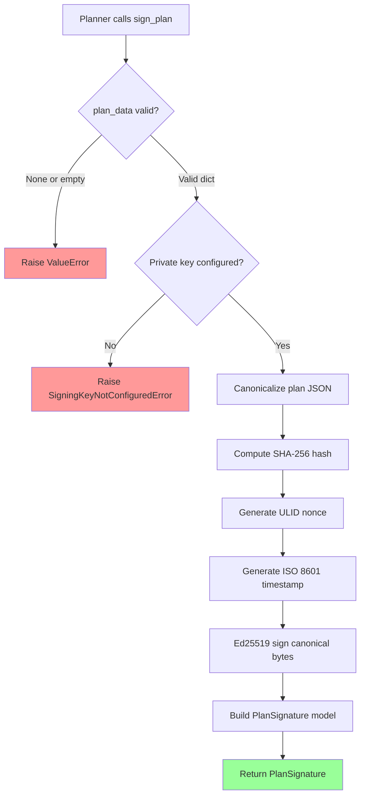
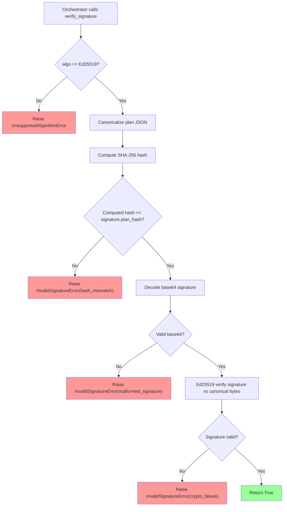
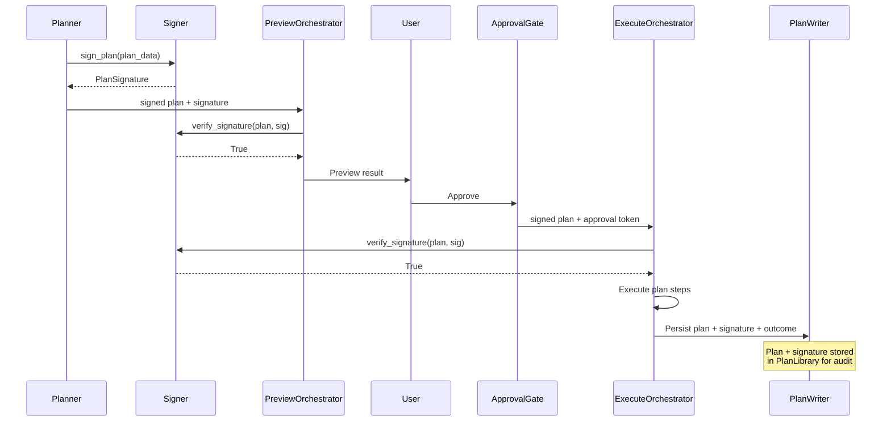
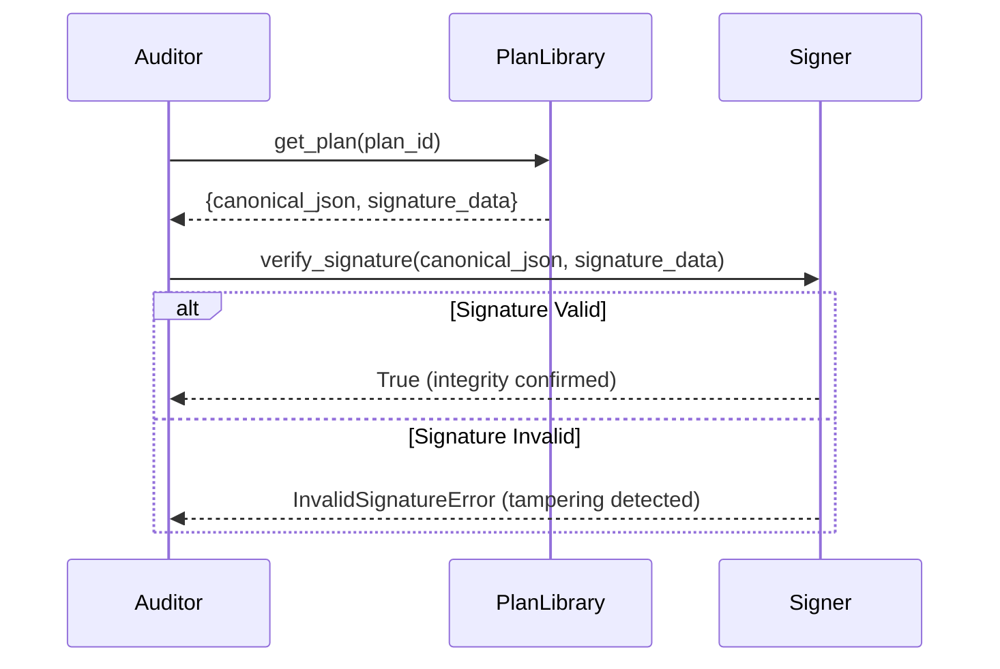
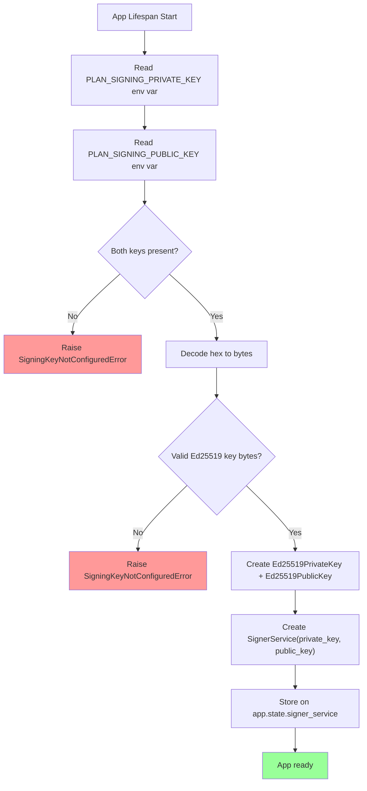

# Signer — Flow Diagrams

## Sign Plan Flow

```mermaid
flowchart TD
    A[Planner calls sign_plan] --> B{plan_data valid?}
    B -- "None or empty" --> C[Raise ValueError]
    B -- "Valid dict" --> D{Private key configured?}
    D -- No --> E[Raise SigningKeyNotConfiguredError]
    D -- Yes --> F[Canonicalize plan JSON]
    F --> G[Compute SHA-256 hash]
    G --> H[Generate ULID nonce]
    H --> I[Generate ISO 8601 timestamp]
    I --> J[Ed25519 sign canonical bytes]
    J --> K[Build PlanSignature model]
    K --> L[Return PlanSignature]

    style C fill:#f99
    style E fill:#f99
    style L fill:#9f9
```

## Verify Signature Flow

```mermaid
flowchart TD
    A[Orchestrator calls verify_signature] --> B{algo == Ed25519?}
    B -- No --> C[Raise UnsupportedAlgorithmError]
    B -- Yes --> D[Canonicalize plan JSON]
    D --> E[Compute SHA-256 hash]
    E --> F{Computed hash == signature.plan_hash?}
    F -- No --> G["Raise InvalidSignatureError(hash_mismatch)"]
    F -- Yes --> H[Decode base64 signature]
    H --> I{Valid base64?}
    I -- No --> J["Raise InvalidSignatureError(malformed_signature)"]
    I -- Yes --> K[Ed25519 verify signature vs canonical bytes]
    K --> L{Signature valid?}
    L -- No --> M["Raise InvalidSignatureError(crypto_failure)"]
    L -- Yes --> N[Return True]

    style C fill:#f99
    style G fill:#f99
    style J fill:#f99
    style M fill:#f99
    style N fill:#9f9
```

## End-to-End Plan Pipeline

```mermaid
sequenceDiagram
    participant P as Planner
    participant S as Signer
    participant PO as PreviewOrchestrator
    participant U as User
    participant AG as ApprovalGate
    participant EO as ExecuteOrchestrator
    participant PW as PlanWriter

    P->>S: sign_plan(plan_data)
    S-->>P: PlanSignature

    P->>PO: signed plan + signature
    PO->>S: verify_signature(plan, sig)
    S-->>PO: True

    PO->>U: Preview result
    U->>AG: Approve

    AG->>EO: signed plan + approval token
    EO->>S: verify_signature(plan, sig)
    S-->>EO: True

    EO->>EO: Execute plan steps
    EO->>PW: Persist plan + signature + outcome

    Note over PW: Plan + signature stored<br/>in PlanLibrary for audit
```

## Audit Verification Flow

```mermaid
sequenceDiagram
    participant A as Auditor
    participant PL as PlanLibrary
    participant S as Signer

    A->>PL: get_plan(plan_id)
    PL-->>A: {canonical_json, signature_data}

    A->>S: verify_signature(canonical_json, signature_data)

    alt Signature Valid
        S-->>A: True (integrity confirmed)
    else Signature Invalid
        S-->>A: InvalidSignatureError (tampering detected)
    end
```

## Application Startup

```mermaid
flowchart TD
    A[App Lifespan Start] --> B[Read PLAN_SIGNING_PRIVATE_KEY env var]
    B --> C[Read PLAN_SIGNING_PUBLIC_KEY env var]
    C --> D{Both keys present?}
    D -- No --> E[Raise SigningKeyNotConfiguredError]
    D -- Yes --> F[Decode hex to bytes]
    F --> G{Valid Ed25519 key bytes?}
    G -- No --> H[Raise SigningKeyNotConfiguredError]
    G -- Yes --> I[Create Ed25519PrivateKey + Ed25519PublicKey]
    I --> J["Create SignerService(private_key, public_key)"]
    J --> K[Store on app.state.signer_service]
    K --> L[App ready]

    style E fill:#f99
    style H fill:#f99
    style L fill:#9f9
```
