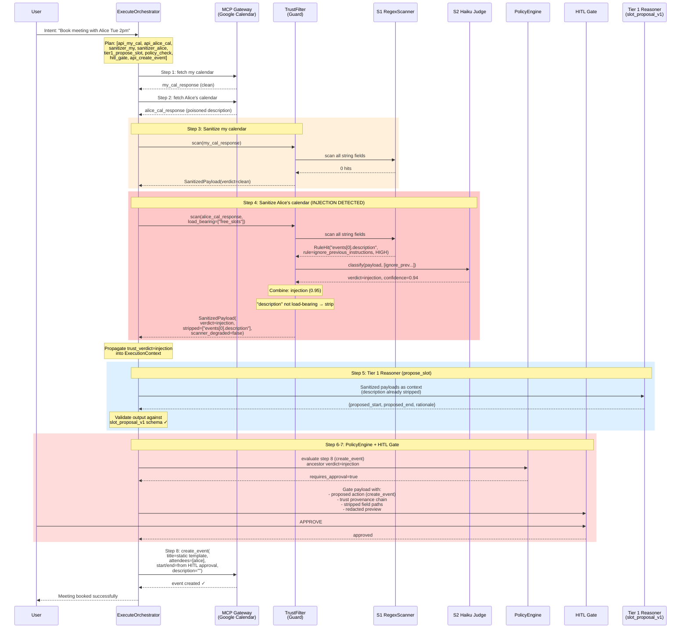
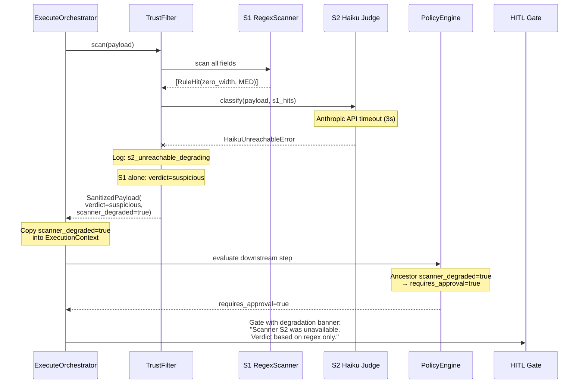
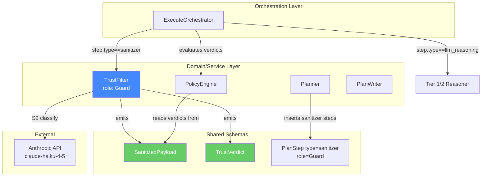
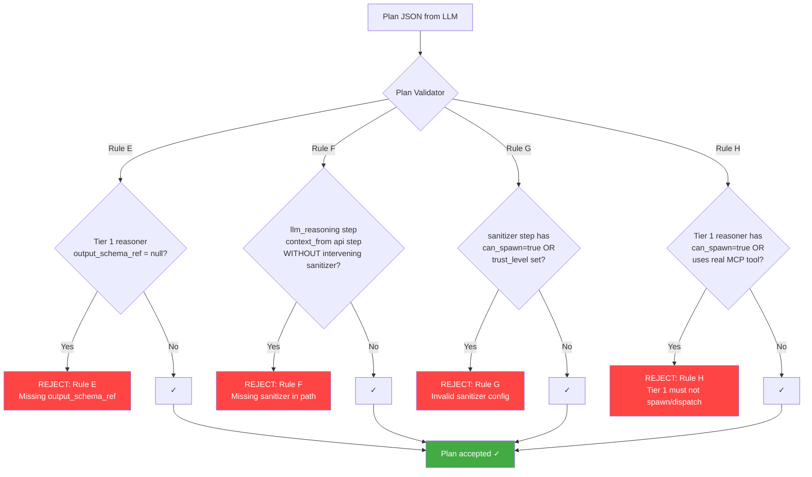

# TrustFilter — Flow Diagrams

## 1. Internal Pipeline (S1 → S2 → S3)

```mermaid
flowchart TD
    A[MCP Tool Response<br/>raw JSON payload] --> B{Payload Limits OK?}
    B -->|No: > 1MB| E1[PayloadTooLargeError<br/>step fails hard]
    B -->|No: not JSON| E2[MalformedInputError<br/>step fails hard]
    B -->|Yes| C[TreeWalker<br/>walk JSON tree]
    C -->|depth > 32| E3[PayloadDepthExceededError<br/>step fails hard]
    C -->|yields path,string pairs| D[S1: RegexScanner<br/>scan every string field]
    D --> F{S1 hits found?}
    F -->|No hits| G[Return SanitizedPayload<br/>verdict=clean<br/>confidence=0.99<br/>skip S2]
    F -->|Yes: hits found| H{S2 reachable?}
    H -->|Yes| I[S2: Haiku Judge<br/>classify payload<br/>tools=[] temp=0]
    H -->|No: timeout/error| J[Degrade to S1-only<br/>scanner_degraded=true]
    I --> K[Combine Verdicts<br/>pick more paranoid]
    J --> K
    D -->|S1 exception| K2[Degrade: treat as 0 hits<br/>S2 carries load]
    K2 --> H
    K --> L{Final verdict?}
    L -->|clean| G2[Return SanitizedPayload<br/>verdict=clean<br/>nothing stripped]
    L -->|suspicious<br/>strict_mode=false| G3[Return SanitizedPayload<br/>verdict=suspicious<br/>nothing stripped<br/>downstream HITL decides]
    L -->|suspicious<br/>strict_mode=true| M[Select fields to strip]
    L -->|injection| M
    M --> N{Load-bearing<br/>field flagged?}
    N -->|Yes| E4[LoadBearingFlaggedError<br/>step fails hard]
    N -->|No| O[S3: Strip flagged fields<br/>replace with redacted marker]
    O --> P[Return SanitizedPayload<br/>original_shape preserved<br/>stripped_fields populated<br/>trust_verdict set]

    style E1 fill:#f44,color:white
    style E2 fill:#f44,color:white
    style E3 fill:#f44,color:white
    style E4 fill:#f44,color:white
    style G fill:#4a4,color:white
    style G2 fill:#4a4,color:white
    style G3 fill:#fa0,color:white
    style P fill:#48f,color:white
    style J fill:#fa0,color:white
```

## 2. End-to-End: Poisoned Calendar Meeting Booking

This diagram shows User Story 1 — booking a meeting when Alice's calendar has a prompt-injection payload.



## 3. S2 Degradation Flow



## 4. Component Integration Context



## 5. Plan Validator Trust Boundary Rules


