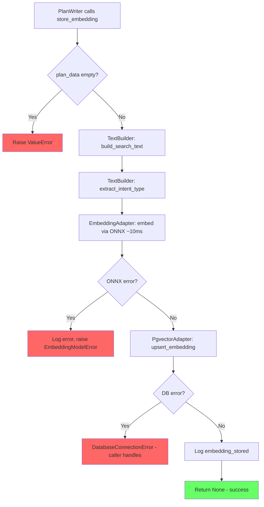
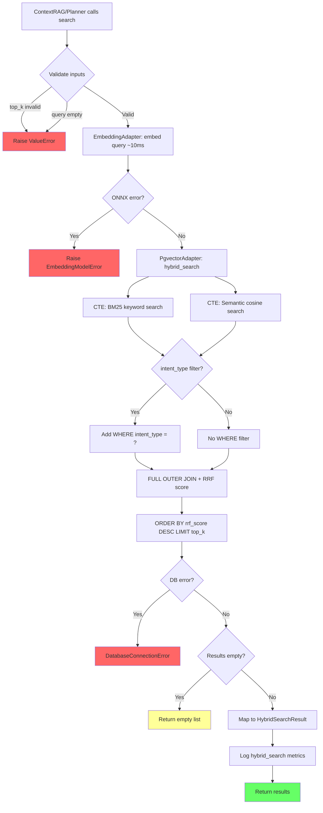
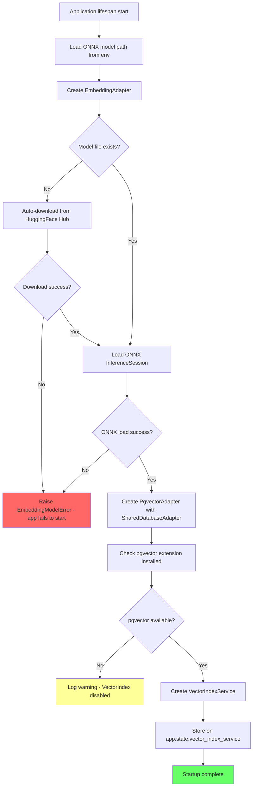
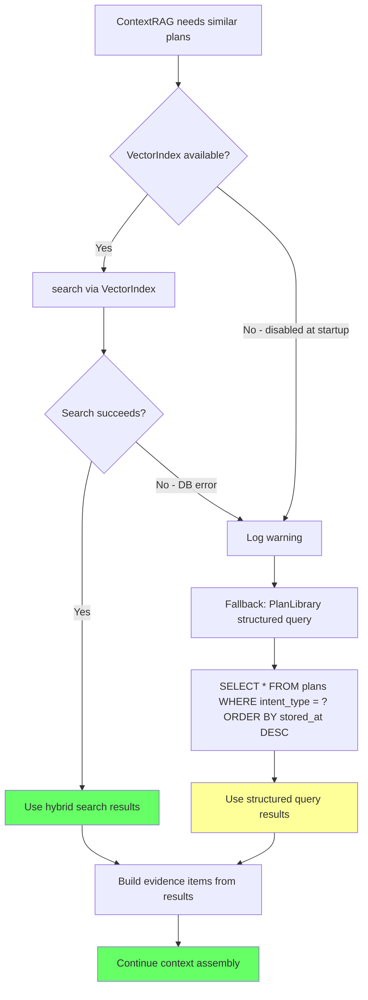
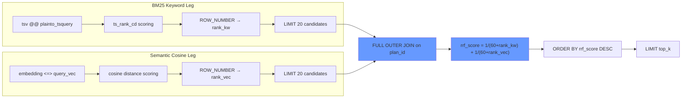
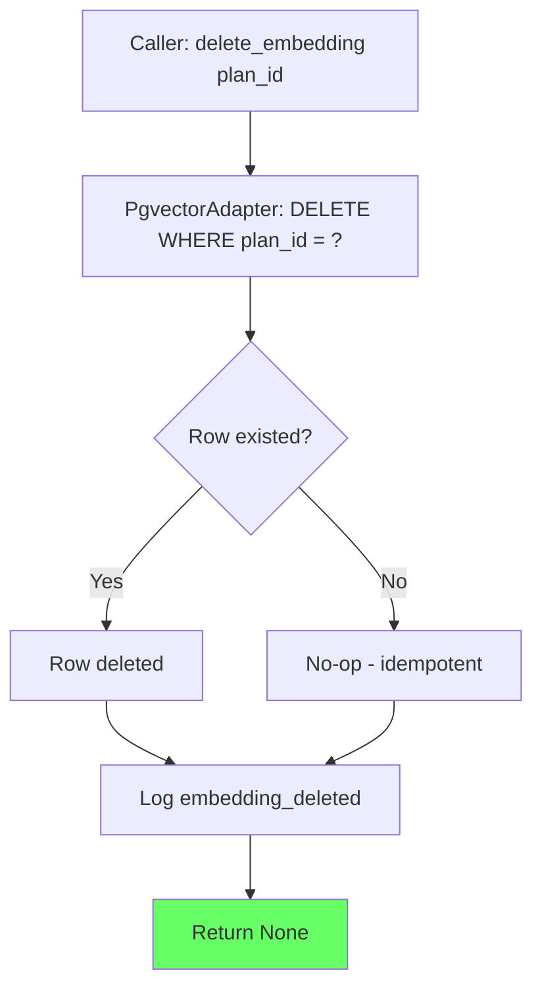

# VectorIndex — Flow Diagrams

## 1. Store Embedding Flow

## 2. Hybrid Search Flow (RRF)

## 3. Application Startup Flow

## 4. Graceful Degradation Flow

## 5. RRF Score Fusion Detail

## 6. Delete Embedding Flow

