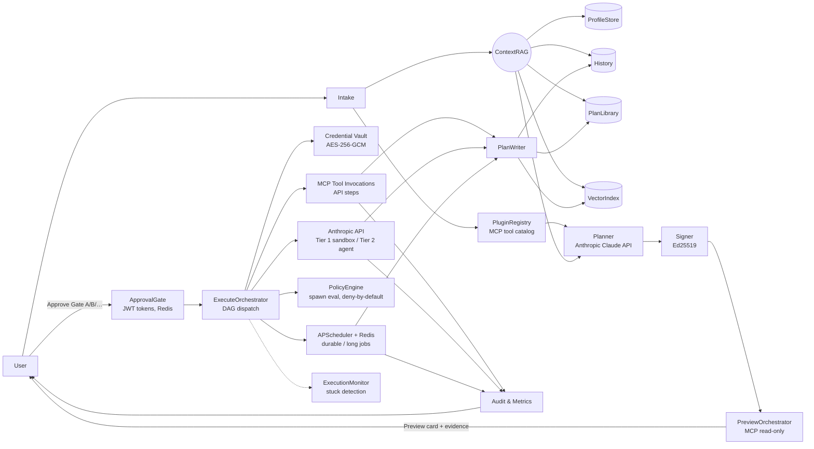

```mermaid
flowchart LR
  %% ── Interface Layer ──
  U[User] --> IN[Intake]

  %% ── Memory Layer ──
  IN --> RAG((ContextRAG))
  RAG --> PS[(ProfileStore)]
  RAG --> HIST[(History)]
  RAG --> PLIB[(PlanLibrary)]
  RAG --> VI[(VectorIndex)]

  %% ── Domain Layer: Planning ──
  IN --> REG[PluginRegistry\nMCP tool catalog]
  REG --> PLAN[Planner\nAnthropic Claude API]
  RAG --> PLAN
  PLAN --> SIG[Signer\nEd25519]

  %% ── Orchestration Layer: Preview ──
  SIG --> PREV[PreviewOrchestrator\nMCP read-only]
  PREV -->|Preview card + evidence| U

  %% ── Orchestration Layer: Approve ──
  U -->|Approve Gate A/B/…| GATE[ApprovalGate\nJWT tokens, Redis]

  %% ── Orchestration Layer: Execute ──
  GATE --> EXE[ExecuteOrchestrator\nDAG dispatch]
  EXE --> CRED[Credential Vault\nAES-256-GCM]
  EXE --> MCP[MCP Tool Invocations\nAPI steps]
  EXE --> LLM[Anthropic API\nTier 1 sandbox / Tier 2 agent]
  EXE --> PE[PolicyEngine\nspawn eval, deny-by-default]
  EXE --> SCHED[APScheduler + Redis\ndurable / long jobs]

  %% ── Orchestration Layer: Monitor ──
  EXE -.-> MON[ExecutionMonitor\nstuck detection]

  %% ── Write-back ──
  MCP --> PW[PlanWriter]
  LLM --> PW
  SCHED --> PW
  PW --> PLIB
  PW --> HIST
  PW --> VI

  %% ── Platform Layer ──
  MCP --> AUD[Audit & Metrics]
  LLM --> AUD
  SCHED --> AUD
  AUD --> U
```
